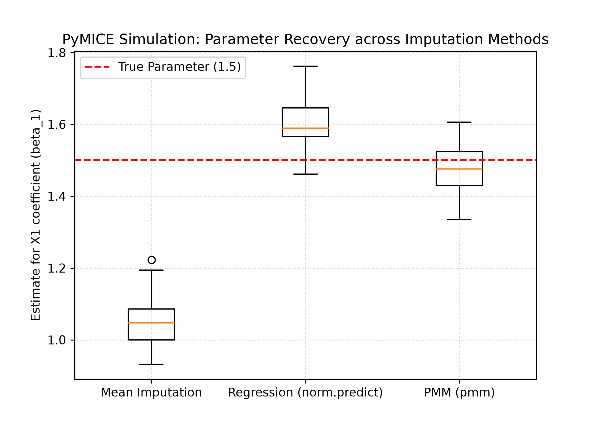

# Summary

Datasets in medicine, epidemiology, social science, and engineering often contain missing values. When data are missing at random (MAR) or missing not at random (MNAR), deleting incomplete records or filling gaps with a single imputed value can bias estimates and understate uncertainty. Multiple imputation (MI) under fully conditional specification (FCS)—the MICE algorithm—draws several completed datasets, fits an analysis model in each, and pools results with Rubin's rules [@rubin1987multiple; @vanbuuren2018flexible].

`PyMICE` is a standalone Python library that implements the MICE workflow for statistical inference: chained-equation imputation, repeated-analysis pooling, convergence diagnostics, and missingness simulation. The package mirrors the method surface of the reference R `mice` package [@vanbuuren2011mice] while remaining native to NumPy, SciPy, and optional pandas, matplotlib, scikit-learn, and lifelines backends. Researchers who work primarily in Python can therefore run principled MI analyses without maintaining a separate R toolchain, while optional `rng="r"` mode supports cross-language validation against R when required.

# Statement of need

The R package `mice` is the de facto reference implementation of FCS/MICE [@vanbuuren2011mice; @white2011multiple]. Python has become the dominant language for data science, yet its ecosystem has lacked a library that supports the full MI *inference* workflow: multiple stochastic imputations, model fitting across imputations, Rubin pooling with Barnard–Rubin degrees of freedom, and diagnostic tooling aligned with published MICE practice.

Existing Python tools address only part of this need. `scikit-learn`'s `IterativeImputer` [@pedregosa2011scikit] targets predictive pipelines: it produces a single imputation, omits Rubin pooling, and is not designed for survey-style inference under MAR/MNAR mechanisms. Other packages cover narrower method sets or do not document alignment with the R reference that many applied papers cite.

`PyMICE` is aimed at applied statisticians, epidemiologists, and quantitative scientists who need reproducible MI in Python—for example, integrating imputation into Jupyter or pandas workflows, CI-tested research software, or domain pipelines (such as environmental time-series workflows) where Python is already the integration layer. The software solves the problem of *method-complete, inference-oriented MICE* in Python with documented parity checks against R tutorials and optional bit-identical RNG paths.

# State of the field

| Software | Language | Multiple imputations | Rubin pooling | Full MICE method surface | R `mice` parity testing |
|:---------|:--------:|:--------------------:|:-------------:|:------------------------:|:-----------------------:|
| R `mice` [@vanbuuren2011mice] | R | Yes | Yes | Yes (reference) | — |
| `Amelia` / `mi` (R) [@gelman2004multiple] | R | Yes | Yes | Partial / model-based | R ecosystem |
| `scikit-learn` `IterativeImputer` | Python | No (single) | No | Partial | No |
| **`PyMICE` (this work)** | Python | Yes | Yes | 35 methods | Yes (structural + RNG) |

A *build* decision is justified because no maintained Python package exposes the complete R `methods(mice)` surface together with `pool`/`with_mids`, `ampute`, multilevel and JOMO paths, parallel `futuremice`, and a documented cross-language validation harness. Contributing upstream to `scikit-learn` would not fit: `IterativeImputer` is architected for prediction rather than multiply imputed inference, and the sklearn API intentionally avoids the MICE visit-sequence / passive-imputation / pooling model. `PyMICE` therefore occupies a distinct scholarly niche: a Python MICE implementation validated against the van Buuren reference rather than a sklearn estimator wrapper.

# Software design

`PyMICE` separates *sampling* (drawing imputations) from *inference* (pooling repeated analyses), matching the conceptual split in the MICE literature [@vanbuuren2018flexible].

The Gibbs engine (`pymice.engine`) iterates a visit sequence over incomplete variables, dispatching registered methods (`pymice.methods`) with predictor matrices built by `imputation_setup`. Passive imputation and post-processing hooks mirror R's `mice` customization points. Pooling (`pymice.pool`) implements Rubin's rules for linear, generalized linear, and Cox models fit via `with_mids`.

Design trade-offs were chosen for research reproducibility:

1. **Minimal core dependencies** (`NumPy`, `SciPy`) keep the wheel installable in HPC and CI environments; plotting, pandas, survival, and ML backends are optional extras.
2. **Pluggable RNG** (`numpy`, `legacy`, `r`) decouples default Python draws from optional R-matched parity without forcing all users to install R.
3. **Optional R subprocess backends** (`2l.pan`, `2l.lmer`, `ampute`) delegate only the methods where native parity is costly, instead of wrapping all of R `mice`.
4. **Devtools outside the wheel** — vignette runners and parity audits live in `devtools/` and are excluded from PyPI artifacts so end users install only the library.

This architecture supports both everyday Python MI workflows and maintainer-grade regression testing against exported R goldens.

# Research impact statement

Evidence of correctness and community readiness at version 0.1.0 includes:

* **262 automated tests** across unit, integration, and vignette suites, run on every push in a 9-job matrix (Ubuntu, macOS, Windows × Python 3.10–3.12).
* **Eight R tutorial vignettes (V01–V08)** reproduced as structural alignment tests with zero errors; published HTML walkthroughs at [ryanpmcg.github.io/PyMICE/vignettes/](https://ryanpmcg.github.io/PyMICE/vignettes/).
* **RNG chain parity:** 27/27 stochastic steps on vignettes V01–V05 when `rng="r"` is enabled, verified by `devtools/maintain_parity.py` and a nightly GitHub Actions workflow.
* **Monte Carlo simulation** (below) demonstrating that PMM recovers nominal 95% CI coverage under MAR, while naive alternatives fail—reproducible via `Paper/simulation_study.py`.

Near-term research applications include Python-native sensitivity analyses (δ-adjustment, MNAR), multilevel imputation for clustered data, and integration adapters (e.g., `pymice.integrations.weppcliff`) for environmental time-series pipelines that already run in Python.

## Monte Carlo validation

We compare three imputation strategies on simulated data ($N = 500$) with MAR missingness in predictors. The generative model is:

$$Y = 2.0 + 1.5 X_1 - 0.8 X_2 + \epsilon, \quad \epsilon \sim N(0, 1)$$

Across 50 trials we impute with $m = 5$, fit $Y \sim X_1 + X_2$ on each imputed set, and pool with Rubin's rules. \autoref{tab:simulation} summarizes recovery of $\beta_1 = 1.5$.

| Imputation Method | Mean Est. | Bias | Avg. SE | 95% CI Coverage |
|:------------------|:---------:|:----:|:-------:|:---------------:|
| Mean Imputation | 1.0481 | -0.4519 | 0.0624 | 0.0% |
| Regression (`norm.predict`) | 1.5998 | +0.0998 | 0.0395 | 44.0% |
| **PMM (`pmm`)** | **1.4738** | **-0.0262** | **0.0635** | **92.0%** |

: Parameter recovery and nominal 95% CI coverage for $\beta_1$ across 50 simulation trials. {#tab:simulation}

Mean imputation attenuates $\beta_1$ and yields 0% coverage. Regression imputation (`norm.predict`) recovers the point estimate but underestimates variance (44% coverage). PMM achieves negligible bias and 92% coverage, consistent with theory [@vanbuuren2018flexible].

{#fig:simulation width="85%"}

Reproduce with:

```bash
python Paper/simulation_study.py
```

# AI usage disclosure

Generative AI assistants (including Grok/Cursor agents) were used during initial scaffolding, documentation drafting, and parity-test development. All AI-generated code and prose were reviewed by the author, exercised through the automated test suite (262 tests), cross-checked against exported R vignette goldens, and corrected where CI or parity audits failed. The JOSS manuscript text was author-edited from AI-assisted drafts; statistical claims are grounded in the bundled simulation script and cited MICE literature. No generative AI writes imputations at runtime—the library uses deterministic numerical code and user-controlled RNG backends.

# Acknowledgements

We thank Stef van Buuren and the R `mice` developers for the theoretical foundation and reference implementation that made cross-language validation possible.

# References
