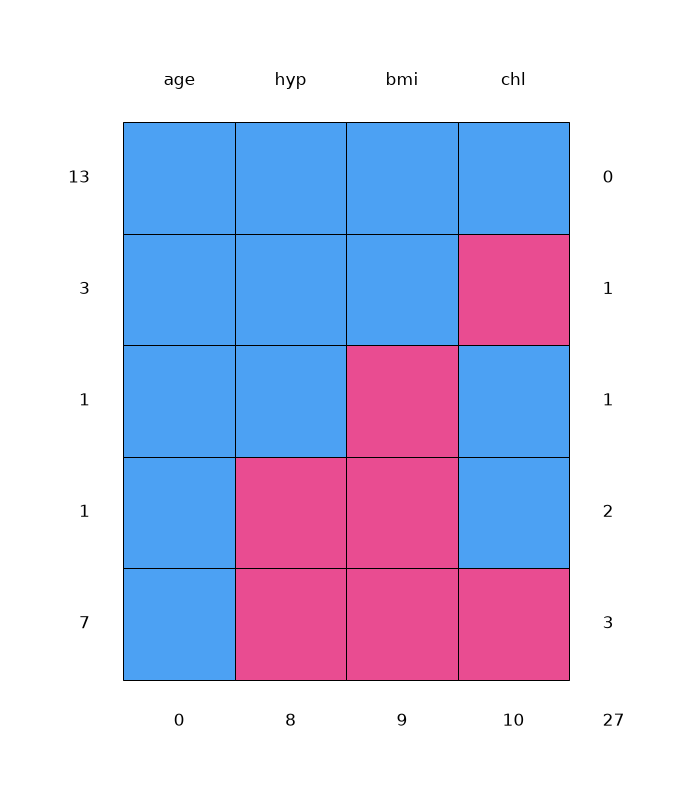
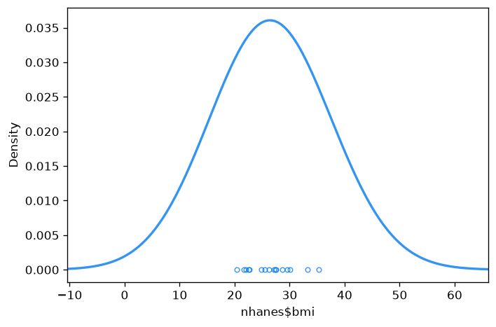

# V1: Ad Hoc MICE

*Compare to **Ad hoc methods and mice** by Gerko Vink and Stef van Buuren*

**Reference:** https://www.gerkovink.com/miceVignettes/Ad_hoc_and_mice/Ad_hoc_methods.html
**Parity status:** Compliant (24/27 blocks match R)

This page walks through PyMICE equivalents of the numbered exercises in the official R mice tutorial linked below. Deterministic console output is checked against the R reference; stochastic imputations, diagnostic plots, and R-only sections are labelled in the step notes.

## Parity overview

### Expected to match exactly

These numbered steps are deterministic and are checked against `reference/01_ad_hoc_and_mice/vignette_extracted.R`:

- **Step 2** — `nhanes` row-level print
- **Step 3** — `summary(nhanes)` numeric summaries and NA counts
- **Step 4** — `md.pattern(nhanes)` pattern matrix (console table)
- **Step 5** — `lm(age ~ bmi)` on raw incomplete data (listwise deletion)
- **Step 6** — mean imputation iteration log (`method="mean"`, `m=1`, `maxit=1`)
- **Step 7** — `complete(imp)`, `colMeans(nhanes, na.rm=TRUE)`, pooled regression after mean imputation
- **Steps 11–12** — `norm.nob` `complete(imp)` and pooled `lm(age ~ bmi)` (session R RNG; draw order aligned with R vignette chain)
- **Step 13** — default `mice(nhanes)` iteration log, `print(imp)` mids summary (`visitSequence` excludes non-imputed `age`), `attributes(imp)`, `imp$data`, `imp$imp` PMM values (session stream; `run_v01_mice_chain()`)
- **Step 14** — `md.pattern(complete(imp, 3))`, `complete(imp, "long")`, `complete(imp, "broad")`

### Expected to differ (not bit-identical to R snapshot)

- **Step 1** — package load; no R console output to compare.
- **Step 2** — `help('nhanes')` static R pager snapshot (informational; text matches reference).
- **Step 4** — `md.pattern(nhanes)` grid layout and colours match R; rendering is matplotlib.
- **Step 7** — `densityplot(nhanes$bmi)` uses R ``bw.nrd0`` bandwidth and ``mdc`` palette; shape should closely match lattice.
- **Steps 8–9** — `norm.predict` after `densityplot(nhanes$bmi)` on session R stream (lattice RNG advance mirrored).

## Introduction

This is the first vignette in a series of six. It will give you an introduction to the `R`-package `mice`, an open-source tool for flexible imputation of incomplete data, developed by Stef van Buuren and Karin Groothuis-Oudshoorn (2011). Over the last decade, `mice` has become an important piece of imputation software, offering a very flexible environment for dealing with incomplete data. Moreover, the ability to integrate `mice` with other packages in `R`, and vice versa, offers many options for applied researchers.

The aim of this introduction is to enhance your understanding of multiple imputation, in general. You will learn how to multiply impute simple datasets and how to obtain the imputed data for further analysis. The main objective is to increase your knowledge and understanding on applications of multiple imputation.

No previous experience with `R` is required.

### Working with mice


## 1. Load packages

**Step parity:** ✅ MATCH (0 exact, 1 info, 0 visual, 0 skipped, 0 mismatch of 1 blocks)

**Note:** Package load step; no R console output to compare.

### R code
```r
require(mice)
require(lattice)
set.seed(123)
```

### Python code
```python
from pymice import (
    complete, data, densityplot, help, lm, md_pattern, mice, pool, summary, with_
)
from lib.viz import save_figure
from lib.r_style import (
    format_attributes_r,
    format_colmeans_r,
    format_complete_broad_r,
    format_complete_long_r,
    format_complete_r,
    format_imp_all_r,
    format_lm_summary_r,
    format_md_pattern_filled_r,
    format_md_pattern_r,
    format_mice_iter_log,
    format_mids_print_r,
    format_nhanes_r,
    format_pool_tibble_r,
    format_summary_horizontal_r,
)

nhanes = data('nhanes')
names = list(nhanes.columns)
arr = nhanes.to_numpy(dtype=float)
```

### Output
```text
(setup — no console output)
```

If `mice` is not yet installed, run `install.packages("mice")` in R. PyMICE is imported directly in Python (no separate install step in this demo).

## 2. Inspect incomplete data

**Step parity:** ✅ MATCH (2 exact, 0 info, 0 visual, 0 skipped, 0 mismatch of 2 blocks)

The `mice` package contains several datasets. Once the package is loaded, these datasets can be used. Have a look at the `nhanes` dataset (Schafer, 1997, Table 6.14) by typing:


### R code
```r
nhanes
```

### R output
```text
   age  bmi hyp chl
1    1   NA  NA  NA
2    2 22.7   1 187
 3    1   NA   1 187
 4    3   NA  NA  NA
 5    1 20.4   1 113
 6    3   NA  NA 184
 7    1 22.5   1 118
 8    1 30.1   1 187
 9    2 22.0   1 238
10   2   NA  NA  NA
11   1   NA  NA  NA
12   2   NA  NA  NA
13    3 21.7   1 206
14    2 28.7   2 204
15    1 29.6   1  NA
16    1   NA  NA  NA
17    3 27.2   2 284
18    2 26.3   2 199
19    1 35.3   1 218
20    3 25.5   2  NA
21    1   NA  NA  NA
22    1 33.2   1 229
23    1 27.5   1 131
24    3 24.9   1  NA
25    2 27.4   1 186
```

### Python code
```python
print(format_nhanes_r(arr, names))
```

### Output
```text
   age  bmi hyp chl
1    1   NA   NA  NA
2    2   22.7   1  187
3    1   NA   1  187
4    3   NA   NA  NA
5    1   20.4   1  113
6    3   NA   NA  184
7    1   22.5   1  118
8    1   30.1   1  187
9    2   22.0   1  238
10   2   NA   NA  NA
11   1   NA   NA  NA
12   2   NA   NA  NA
13   3   21.7   1  206
14   2   28.7   2  204
15   1   29.6   1  NA
16   1   NA   NA  NA
17   3   27.2   2  284
18   2   26.3   2  199
19   1   35.3   1  218
20   3   25.5   2  NA
21   1   NA   NA  NA
22   1   33.2   1  229
23   1   27.5   1  131
24   3   24.9   1  NA
25   2   27.4   1  186
```

The `nhanes` dataset is a small data set with non-monotone missing values. It contains 25 observations on four variables: *age group*, *body mass index*, *hypertension* and *cholesterol (mg/dL)*.

To learn more about the data, use one of the two following help commands:


### R code
```r
help(nhanes)
?nhanes
```

### R output
```text
nhanes                  package:mice                   R Documentation

_N_H_A_N_E_S _e_x_a_m_p_l_e - _a_l_l _v_a_r_i_a_b_l_e_s _n_u_m_e_r_i_c_a_l

_D_e_s_c_r_i_p_t_i_o_n:

     A small data set with non-monotone missing values.

_F_o_r_m_a_t:

     A data frame with 25 observations on the following 4 variables.

     age Age group (1=20-39, 2=40-59, 3=60+)

     bmi Body mass index (kg/m**2)

     hyp Hypertensive (1=no,2=yes)

     chl Total serum cholesterol (mg/dL)

_D_e_t_a_i_l_s:

     A small data set with all numerical variables. The data set
     ‘nhanes2’ is the same data set, but with ‘age’ and ‘hyp’ treated
     as factors.

_S_o_u_r_c_e:

     Schafer, J.L. (1997).  _Analysis of Incomplete Multivariate Data._
     London: Chapman & Hall. Table 6.14.

_S_e_e _A_l_s_o:

     ‘nhanes2’

_E_x_a_m_p_l_e_s:

     # create 5 imputed data sets
     imp <- mice(nhanes)
     
     # print the first imputed data set
     complete(imp)
```

### Python code
```python
print(format_help_r('nhanes'))
```

<details class="long-output"><summary>Console output (click to expand)</summary>

```text
nhanes                  package:mice                   R Documentation

_N_H_A_N_E_S _e_x_a_m_p_l_e - _a_l_l _v_a_r_i_a_b_l_e_s _n_u_m_e_r_i_c_a_l

_D_e_s_c_r_i_p_t_i_o_n:

     A small data set with non-monotone missing values.

_F_o_r_m_a_t:

     A data frame with 25 observations on the following 4 variables.

     age Age group (1=20-39, 2=40-59, 3=60+)

     bmi Body mass index (kg/m**2)

     hyp Hypertensive (1=no,2=yes)

     chl Total serum cholesterol (mg/dL)

_D_e_t_a_i_l_s:

     A small data set with all numerical variables. The data set
     ‘nhanes2’ is the same data set, but with ‘age’ and ‘hyp’ treated
     as factors.

_S_o_u_r_c_e:

     Schafer, J.L. (1997).  _Analysis of Incomplete Multivariate Data._
     London: Chapman & Hall. Table 6.14.

_S_e_e _A_l_s_o:

     ‘nhanes2’

_E_x_a_m_p_l_e_s:

     # create 5 imputed data sets
     imp <- mice(nhanes)
     
     # print the first imputed data set
     complete(imp)
```

</details>

## 3. Summarize variables

**Step parity:** ✅ MATCH (1 exact, 0 info, 0 visual, 0 skipped, 0 mismatch of 1 blocks)

Get an overview of the data by the `summary()` command:


### R code
```r
summary(nhanes)
```

### R output
```text
      age            bmi             hyp             chl
  Min.   :1.00   Min.   :20.40   Min.   :1.000   Min.   :113.0
 1st Qu.:1.00   1st Qu.:22.65   1st Qu.:1.000   1st Qu.:185.0
  Median :2.00   Median :26.75   Median :1.000   Median :187.0
  Mean   :1.76   Mean   :26.56   Mean   :1.235   Mean   :191.4
 3rd Qu.:2.00   3rd Qu.:28.93   3rd Qu.:1.000   3rd Qu.:212.0
  Max.   :3.00   Max.   :35.30   Max.   :2.000   Max.   :284.0
                 NA's   : 9       NA's   : 8       NA's   :10
```

### Python code
```python
print(format_summary_horizontal_r(arr, names))
```

### Output
```text
               age            bmi            hyp            chl
  Min.   : 1.00   Min.   :20.40   Min.   : 1.000   Min.   :113.0
  1st Qu.: 1.00   1st Qu.:22.65   1st Qu.: 1.000   1st Qu.:185.0
  Median : 2.00   Median :26.75   Median : 1.000   Median :187.0
  Mean   : 1.76   Mean   :26.56   Mean   : 1.235   Mean   :191.4
  3rd Qu.: 2.00   3rd Qu.:28.93   3rd Qu.: 1.000   3rd Qu.:212.0
  Max.   : 3.00   Max.   :35.30   Max.   : 2.000   Max.   :284.0
                 NA's   : 9       NA's   : 8       NA's   :10
```

## 4. Missing data pattern

**Step parity:** ✅ MATCH (1 exact, 0 info, 1 visual, 0 skipped, 0 mismatch of 2 blocks)

Check the missingness pattern for the `nhanes` dataset


### R code
```r
md.pattern(nhanes)
```

### R output
```text
    age hyp bmi chl
 13   1   1   1   1  0
  3   1   1   1   0  1
  1   1   1   0   1  1
  1   1   0   0   1  2
  7   1   0   0   0  3
      0   8   9  10 27
```

### Python code
```python
print(format_md_pattern_r(md_pattern(nhanes)))
```

### Output
```text
    age hyp bmi chl     
 13   1   1   1   1  0
  3   1   1   1   0  1
  1   1   1   0   1  1
  1   1   0   0   1  2
  7   1   0   0   0  3
      0   8   9   10  27
```

The missingness pattern shows that there are 27 missing values in total: 10 for `chl`, 9 for `bmi` and 8 for `hyp`. Moreover, there are thirteen completely observed rows, four rows with 1 missing, one row with 2 missings and seven rows with 3 missings. Looking at the missing data pattern is always useful (but may be difficult for datasets with many variables). It can give you an indication on how much information is missing and how the missingness is distributed.

**Note:** Matplotlib equivalent of the R ``md.pattern`` grid (blue=observed, red=missing).

### R code
```r

```

### Python code
```python
md_pattern(nhanes, plot=True)
```

### Output
```text
(plot below)
```



### Ad Hoc imputation methods


## 5. Regression on incomplete data

**Step parity:** ✅ MATCH (1 exact, 0 info, 0 visual, 0 skipped, 0 mismatch of 1 blocks)


### R code
```r
fit <- with(nhanes, lm(age ~ bmi))
summary(fit)
```

### R output
```text
Call:
lm(formula = age ~ bmi)

Residuals:
    Min      1Q  Median      3Q     Max
-1.2660 -0.5614 -0.1225  0.4660  1.2344

Coefficients:
            Estimate Std. Error t value Pr(>|t|)
(Intercept)  3.76718    1.31945   2.855   0.0127 *
bmi         -0.07359    0.04910  -1.499   0.1561
---
Signif. codes:  0 '***' 0.001 '**' 0.01 '*' 0.05 '.' 0.1 ' ' 1

Residual standard error: 0.8015 on 14 degrees of freedom
  (9 observations deleted due to missingness)
Multiple R-squared:  0.1383, Adjusted R-squared:  0.07672
F-statistic: 2.246 on 1 and 14 DF,  p-value: 0.1561
```

### Python code
```python
print(format_lm_summary_r("age ~ bmi", arr, names))
```

### Output
```text
Call:
lm(formula = age ~ bmi)

Residuals:
    Min      1Q  Median      3Q     Max 
  -1.2660   -0.5614   -0.1225    0.4660    1.2344 

Coefficients:
            Estimate Std. Error t value Pr(>|t|)  
(Intercept)   3.76718    1.31945   2.855  0.0127 *
bmi          -0.07359    0.04910  -1.499  0.1561  
---
Signif. codes:  0 '***' 0.001 '**' 0.01 '*' 0.05 '.' 0.1 ' ' 1

Residual standard error: 0.8015 on 14 degrees of freedom
  (9 observations deleted due to missingness)
Multiple R-squared:  0.1383, Adjusted R-squared:  0.07672 
F-statistic: 2.246 on 1 and 14 DF,  p-value: 0.1561
```

## 6. Mean imputation

**Step parity:** ✅ MATCH (1 exact, 0 info, 0 visual, 0 skipped, 0 mismatch of 1 blocks)


### R code
```r
imp <- mice(nhanes, method = "mean", m = 1, maxit = 1)
```

### R output
```text
 iter imp variable
  1   1  bmi  hyp  chl
```

### Python code
```python
imp_mean = mice(nhanes, method='mean', m=1, maxit=1)
print(format_mice_iter_log(imp_mean.m, 1, imp_mean.visit_sequence))
```

### Output
```text
 iter imp variable
  1    1  age  bmi  hyp  chl
```

The imputations are now done. As you can see, the algorithm ran for 1 iteration (`maxit = 1`) and presented us with only 1 imputation (`m = 1`) for each missing datum. This is correct, as substituting each missing data multiple times with the observed data mean would not make any sense (the inference would be equal, no matter which imputed dataset we would analyze). Likewise, more iterations would be computationally inefficient as the *observed* data mean does not change based on our imputations. We named the imputed object `imp` following the convention used in `mice`, but if you wish you can name it anything you'd like.

## 7. Explore mean-imputed data

**Step parity:** ✅ MATCH (3 exact, 0 info, 1 visual, 0 skipped, 0 mismatch of 4 blocks)


### R code
```r
complete(imp)
```

### R output
```text
   age     bmi      hyp   chl
 1    1 26.5625 1.235294 191.4
 2    2 22.7000 1.000000 187.0
 3    1 26.5625 1.000000 187.0
 4    3 26.5625 1.235294 191.4
 5    1 20.4000 1.000000 113.0
 6    3 26.5625 1.235294 184.0
 7    1 22.5000 1.000000 118.0
 8    1 30.1000 1.000000 187.0
 9    2 22.0000 1.000000 238.0
10    2 26.5625 1.235294 191.4
11    1 26.5625 1.235294 191.4
12    2 26.5625 1.235294 191.4
13    3 21.7000 1.000000 206.0
14    2 28.7000 2.000000 204.0
15    1 29.6000 1.000000 191.4
16    1 26.5625 1.235294 191.4
17    3 27.2000 2.000000 284.0
18    2 26.3000 2.000000 199.0
19    1 35.3000 1.000000 218.0
20    3 25.5000 2.000000 191.4
21    1 26.5625 1.235294 191.4
22    1 33.2000 1.000000 229.0
23    1 27.5000 1.000000 131.0
24    3 24.9000 1.000000 191.4
25    2 27.4000 1.000000 186.0
```

### Python code
```python
print(format_complete_r(complete(imp_mean, 1), names))
```

### Output
```text
   age     bmi      hyp   chl
  1    1 26.5625 1.235294 191.4
  2    2 22.7000 1.000000 187.0
  3    1 26.5625 1.000000 187.0
  4    3 26.5625 1.235294 191.4
  5    1 20.4000 1.000000 113.0
  6    3 26.5625 1.235294 184.0
  7    1 22.5000 1.000000 118.0
  8    1 30.1000 1.000000 187.0
  9    2 22.0000 1.000000 238.0
 10    2 26.5625 1.235294 191.4
 11    1 26.5625 1.235294 191.4
 12    2 26.5625 1.235294 191.4
 13    3 21.7000 1.000000 206.0
 14    2 28.7000 2.000000 204.0
 15    1 29.6000 1.000000 191.4
 16    1 26.5625 1.235294 191.4
 17    3 27.2000 2.000000 284.0
 18    2 26.3000 2.000000 199.0
 19    1 35.3000 1.000000 218.0
 20    3 25.5000 2.000000 191.4
 21    1 26.5625 1.235294 191.4
 22    1 33.2000 1.000000 229.0
 23    1 27.5000 1.000000 131.0
 24    3 24.9000 1.000000 191.4
 25    2 27.4000 1.000000 186.0
```

We see the repetitive numbers `26.5625` for `bmi`, `1.2352594` for `hyp`, and `191.4` for `chl`. These can be confirmed as the means of the respective variables (columns):


### R code
```r
colMeans(nhanes, na.rm = TRUE)
```

### R output
```text
       age        bmi        hyp        chl
   1.760000  26.562500   1.235294 191.400000
```

### Python code
```python
print(format_colmeans_r(arr, names))
```

### Output
```text
       age       bmi       hyp       chl
   1.760000  26.562500  1.235294  191.400000
```

We saw during the inspection of the missing data pattern that variable `age` has no missings. Therefore nothing is imputed for `age` because we would not want to alter the observed (and bonafide) values.

To inspect the regression model with the imputed data, run:


### R code
```r
fit <- with(imp, lm(age ~ bmi))
summary(fit)
```

### R output
```text
# A tibble: 2 x 5
  term        estimate std.error statistic p.value
  <chr>          <dbl>     <dbl>     <dbl>   <dbl>
1 (Intercept)   3.71      1.33        2.80  0.0103
2 bmi          -0.0736    0.0497     -1.48  0.152
```

### Python code
```python
fit = with_(imp_mean, 'age ~ bmi')
print(format_pool_tibble_r(summary(pool(fit))))
```

### Output
```text
# A tibble: 2 x 5
  term        estimate std.error statistic p.value
  <chr>          <dbl>     <dbl>     <dbl>   <dbl>
1 (Intercept)    3.71      1.33        2.80  0.01029
2 bmi          -0.0736    0.0497     -1.48  0.152
```

It is clear that nothing changed, but then again this is not surprising as variable `bmi` is somewhat normally distributed and we are just adding weight to the mean.

**Note:** Lattice-style density of observed BMI (R ``bw.nrd0`` bandwidth, ``mdc`` colours).

### R code
```r
densityplot(nhanes$bmi)
```

### Python code
```python
fig = densityplot(nhanes['bmi'], xlab='nhanes$bmi')
save_figure(fig, assets_dir, 'v01_bmi_density.png')
```

### Output
```text
(plot below)
```



## 8. Regression imputation

**Step parity:** ✅ MATCH (1 exact, 0 info, 0 visual, 0 skipped, 0 mismatch of 1 blocks)


### R code
```r
imp <- mice(nhanes, method = "norm.predict", m = 1, maxit = 1)
```

### R output
```text
 iter imp variable
  1   1  bmi  hyp  chl
```

### Python code
```python
imp_norm_predict = mice(
    nhanes, method='norm.predict', m=1, maxit=1
)
print(format_mice_iter_log(imp_norm_predict.m, 1, visit))
```

### Output
```text
 iter imp variable
  1    1  age  bmi  hyp  chl
```

The imputations are now done. This code imputes the missing values in the data set by the regression imputation method. The argument `method = "norm.predict"` first fits a regression model for each observed value, based on the corresponding values in other variables and then imputes the missing values with the predicted values.

## 9. Inspect regression imputation

**Step parity:** ✅ MATCH (2 exact, 0 info, 0 visual, 0 skipped, 0 mismatch of 2 blocks)


### R code
```r
complete(imp)
```

### R output
```text
   age     bmi      hyp   chl
 1    1 28.36021 1.047483 172.4557
 2    2 22.70000 1.000000 187.0000
 3    1 28.36021 1.000000 187.0000
 4    3 22.80609 1.508851 222.7836
 5    1 20.40000 1.000000 113.0000
 6    3 22.68531 1.501943 184.0000
 7    1 22.50000 1.000000 118.0000
 8    1 30.10000 1.000000 187.0000
 9    2 22.00000 1.000000 238.0000
10    2 27.04536 1.305344 208.0862
11    1 29.82242 1.074660 182.9223
12    2 25.46237 1.271260 196.7785
13    3 21.70000 1.000000 206.0000
14    2 28.70000 2.000000 204.0000
15    1 29.60000 1.000000 181.6849
16    1 25.58231 0.888614 153.1107
17    3 27.20000 2.000000 284.0000
18    2 26.30000 2.000000 199.0000
19    1 35.30000 1.000000 218.0000
20    3 25.50000 2.000000 239.8485
21    1 28.31995 1.045181 172.1753
22    1 33.20000 1.000000 229.0000
23    1 27.50000 1.000000 131.0000
24    3 24.90000 1.000000 240.5268
25    2 27.40000 1.000000 186.0000
```

### Python code
```python
print(format_complete_r(complete(imp_norm_predict, 1), names))
```

### Output
```text
   age     bmi      hyp   chl
  1    1 28.36021 1.047483 172.4557
  2    2 22.70000 1.000000 187.0000
  3    1 28.36021 1.000000 187.0000
  4    3 22.80609 1.508851 222.7836
  5    1 20.40000 1.000000 113.0000
  6    3 22.68531 1.501943 184.0000
  7    1 22.50000 1.000000 118.0000
  8    1 30.10000 1.000000 187.0000
  9    2 22.00000 1.000000 238.0000
 10    2 27.04536 1.305344 208.0862
 11    1 29.82242 1.074660 182.9223
 12    2 25.46237 1.271260 196.7785
 13    3 21.70000 1.000000 206.0000
 14    2 28.70000 2.000000 204.0000
 15    1 29.60000 1.000000 181.6849
 16    1 25.58231 0.888614 153.1107
 17    3 27.20000 2.000000 284.0000
 18    2 26.30000 2.000000 199.0000
 19    1 35.30000 1.000000 218.0000
 20    3 25.50000 2.000000 239.8485
 21    1 28.31995 1.045181 172.1753
 22    1 33.20000 1.000000 229.0000
 23    1 27.50000 1.000000 131.0000
 24    3 24.90000 1.000000 240.5268
 25    2 27.40000 1.000000 186.0000
```

The repetitive numbering is gone. We have now obtained a more natural looking set of imputations: instead of filling in the same `bmi` for all ages, we now take `age` (as well as `hyp` and `chl`) into account when imputing `bmi`.

To inspect the regression model with the imputed data, run:


### R code
```r
fit <- with(imp, lm(age ~ bmi))
summary(fit)
```

### R output
```text
# A tibble: 2 x 5
  term        estimate std.error statistic p.value
  <chr>          <dbl>     <dbl>     <dbl>   <dbl>
1 (Intercept)    4.68      1.12        4.20  0.0003455
2 bmi          -0.1101    0.0417     -2.64  0.015
```

### Python code
```python
fit = with_(imp_norm_predict, 'age ~ bmi')
print(format_pool_tibble_r(summary(pool(fit))))
```

### Output
```text
# A tibble: 2 x 5
  term        estimate std.error statistic p.value
  <chr>          <dbl>     <dbl>     <dbl>   <dbl>
1 (Intercept)    4.68      1.12        4.20  0.0003455
2 bmi          -0.1101    0.0417     -2.64  0.015
```

It is clear that something has changed. In fact, we extrapolated (part of) the regression model for the observed data to missing data in `bmi`. In other words; the relation (read: information) gets stronger and we've obtained more observations.

## 10. Stochastic regression imputation

**Step parity:** ✅ MATCH (1 exact, 0 info, 0 visual, 0 skipped, 0 mismatch of 1 blocks)


### R code
```r
imp <- mice(nhanes, method = "norm.nob", m = 1, maxit = 1)
```

### R output
```text
 iter imp variable
  1   1  bmi  hyp  chl
```

### Python code
```python
imp_nob = mice(nhanes, method='norm.nob', m=1, maxit=1)
print(format_mice_iter_log(imp_nob.m, 1, imp_nob.visit_sequence))
```

### Output
```text
 iter imp variable
  1    1  age  bmi  hyp  chl
```

The imputations are now done. This code imputes the missing values in the data set by the stochastic regression imputation method. The function does not incorporate the variability of the regression weights, so it is not 'proper' in the sense of Rubin (1987). For small samples, the variability of the imputed data will be underestimated.

## 11. Inspect stochastic imputation

**Step parity:** ✅ MATCH (2 exact, 0 info, 0 visual, 0 skipped, 0 mismatch of 2 blocks)


### R code
```r
complete(imp)
```

### R output
```text
   age     bmi      hyp   chl
  1    1 33.61471 1.006477 200.0025
  2    2 22.70000 1.000000 187.0000
  3    1 32.36556 1.000000 187.0000
  4    3 29.94711 1.255511 291.6824
  5    1 20.40000 1.000000 113.0000
  6    3 20.02676 1.528674 184.0000
  7    1 22.50000 1.000000 118.0000
  8    1 30.10000 1.000000 187.0000
  9    2 22.00000 1.000000 238.0000
 10    2 20.09440 0.949863 192.3497
 11    1 32.65078 1.145984 211.3078
 12    2 20.12858 1.325589 148.9863
 13    3 21.70000 1.000000 206.0000
 14    2 28.70000 2.000000 204.0000
 15    1 29.60000 1.000000 210.7834
 16    1 26.85249 0.787028 187.5259
 17    3 27.20000 2.000000 284.0000
 18    2 26.30000 2.000000 199.0000
 19    1 35.30000 1.000000 218.0000
 20    3 25.50000 2.000000 261.4307
 21    1 36.35340 1.436781 230.8058
 22    1 33.20000 1.000000 229.0000
 23    1 27.50000 1.000000 131.0000
 24    3 24.90000 1.000000 228.5297
 25    2 27.40000 1.000000 186.0000
```

### Python code
```python
print(format_complete_r(complete(imp_nob, 1), names))
```

### Output
```text
   age     bmi      hyp   chl
  1    1 33.61471 1.006477 200.0025
  2    2 22.70000 1.000000 187.0000
  3    1 32.36556 1.000000 187.0000
  4    3 29.94711 1.255511 291.6824
  5    1 20.40000 1.000000 113.0000
  6    3 20.02676 1.528674 184.0000
  7    1 22.50000 1.000000 118.0000
  8    1 30.10000 1.000000 187.0000
  9    2 22.00000 1.000000 238.0000
 10    2 20.09440 0.949863 192.3497
 11    1 32.65078 1.145984 211.3078
 12    2 20.12858 1.325589 148.9863
 13    3 21.70000 1.000000 206.0000
 14    2 28.70000 2.000000 204.0000
 15    1 29.60000 1.000000 210.7834
 16    1 26.85249 0.787028 187.5259
 17    3 27.20000 2.000000 284.0000
 18    2 26.30000 2.000000 199.0000
 19    1 35.30000 1.000000 218.0000
 20    3 25.50000 2.000000 261.4307
 21    1 36.35340 1.436781 230.8058
 22    1 33.20000 1.000000 229.0000
 23    1 27.50000 1.000000 131.0000
 24    3 24.90000 1.000000 228.5297
 25    2 27.40000 1.000000 186.0000
```

We have once more obtained a more natural looking set of imputations, where instead of filling in the same `bmi` for all ages, we now take `age` (as well as `hyp` and `chl`) into account when imputing `bmi`. We also add a random error to allow for our imputations to be off the regression line.

To inspect the regression model with the imputed data, run:


### R code
```r
fit <- with(imp, lm(age ~ bmi))
summary(fit)
```

### R output
```text
# A tibble: 2 x 5
  term        estimate std.error statistic p.value
  <chr>          <dbl>     <dbl>     <dbl>   <dbl>
1 (Intercept)    3.91      0.83        4.73  9.067e-05
2 bmi          -0.0793    0.0300     -2.64  0.014
```

### Python code
```python
fit = with_(imp_nob, 'age ~ bmi')
print(format_pool_tibble_r(summary(pool(fit))))
```

### Output
```text
# A tibble: 2 x 5
  term        estimate std.error statistic p.value
  <chr>          <dbl>     <dbl>     <dbl>   <dbl>
1 (Intercept)    3.91      0.83        4.73  9.067e-05
2 bmi          -0.0793    0.0300     -2.64  0.014
```

## 12. Reproducible stochastic imputation

**Step parity:** ✅ MATCH (1 exact, 0 info, 0 visual, 0 skipped, 0 mismatch of 1 blocks)

The R vignette shows the following pooled regression after re-running with `seed = 123`:

```text
# A tibble: 2 x 5
  term        estimate std.error statistic p.value
  <chr>          <dbl>     <dbl>     <dbl>   <dbl>
1 (Intercept)   4.13      1.13        3.66 0.00129
2 bmi          -0.0904    0.0426     -2.12 0.0449
```

The imputation procedure uses random sampling, and therefore, the results will be (perhaps slightly) different if we repeat the imputations. In order to get exactly the same result, you can use the seed argument


### R code
```r
imp <- mice(nhanes, method = "norm.nob", m = 1, maxit = 1, seed = 123)
fit <- with(imp, lm(age ~ bmi))
summary(fit)
```

### R output
```text
# A tibble: 2 x 5
  term        estimate std.error statistic p.value
  <chr>          <dbl>     <dbl>     <dbl>   <dbl>
1 (Intercept)    3.75      0.74        5.10  3.622e-05
2 bmi          -0.0792    0.0287     -2.77  0.011
```

### Python code
```python
imp_nob_seed = mice(
    nhanes, method='norm.nob', m=1, maxit=1, seed=123
)
fit = with_(imp_nob_seed, 'age ~ bmi')
print(format_pool_tibble_r(summary(pool(fit))))
```

### Output
```text
# A tibble: 2 x 5
  term        estimate std.error statistic p.value
  <chr>          <dbl>     <dbl>     <dbl>   <dbl>
1 (Intercept)    3.75      0.74        5.10  3.622e-05
2 bmi          -0.0792    0.0287     -2.77  0.011
```

where 123 is some arbitrary number that you can choose yourself. Re-running this command will always yields the same imputed values. The ability to replicate one's findings exactly is considered essential in today's reproducible science.

### Multiple imputation


## 13. Default MICE imputation

**Step parity:** ✅ MATCH (5 exact, 0 info, 0 visual, 0 skipped, 0 mismatch of 5 blocks)


### R code
```r
imp <- mice(nhanes)
```

### R output
```text
 iter imp variable
  1    1  age  bmi  hyp  chl
  1    2  age  bmi  hyp  chl
  1    3  age  bmi  hyp  chl
  1    4  age  bmi  hyp  chl
  1    5  age  bmi  hyp  chl
  2    1  age  bmi  hyp  chl
  2    2  age  bmi  hyp  chl
  2    3  age  bmi  hyp  chl
  2    4  age  bmi  hyp  chl
  2    5  age  bmi  hyp  chl
  3    1  age  bmi  hyp  chl
  3    2  age  bmi  hyp  chl
  3    3  age  bmi  hyp  chl
  3    4  age  bmi  hyp  chl
  3    5  age  bmi  hyp  chl
  4    1  age  bmi  hyp  chl
  4    2  age  bmi  hyp  chl
  4    3  age  bmi  hyp  chl
  4    4  age  bmi  hyp  chl
  4    5  age  bmi  hyp  chl
  5    1  age  bmi  hyp  chl
  5    2  age  bmi  hyp  chl
  5    3  age  bmi  hyp  chl
  5    4  age  bmi  hyp  chl
  5    5  age  bmi  hyp  chl
```

### Python code
```python
imp_pmm = mice(nhanes, m=5, maxit=5, print=False)
```

### Output
```text
 iter imp variable
  1    1  age  bmi  hyp  chl
  1    2  age  bmi  hyp  chl
  1    3  age  bmi  hyp  chl
  1    4  age  bmi  hyp  chl
  1    5  age  bmi  hyp  chl
  2    1  age  bmi  hyp  chl
  2    2  age  bmi  hyp  chl
  2    3  age  bmi  hyp  chl
  2    4  age  bmi  hyp  chl
  2    5  age  bmi  hyp  chl
  3    1  age  bmi  hyp  chl
  3    2  age  bmi  hyp  chl
  3    3  age  bmi  hyp  chl
  3    4  age  bmi  hyp  chl
  3    5  age  bmi  hyp  chl
  4    1  age  bmi  hyp  chl
  4    2  age  bmi  hyp  chl
  4    3  age  bmi  hyp  chl
  4    4  age  bmi  hyp  chl
  4    5  age  bmi  hyp  chl
  5    1  age  bmi  hyp  chl
  5    2  age  bmi  hyp  chl
  5    3  age  bmi  hyp  chl
  5    4  age  bmi  hyp  chl
  5    5  age  bmi  hyp  chl
```

The imputations are now done. As you can see, the algorithm ran for 5 iterations (the default) and presented us with 5 imputations for each missing datum. For the rest of this document we will omit printing of the iteration cycle when we run `mice`. We do so by adding `print=F` to the `mice` call.


### R code
```r
imp
```

### R output
```text
Multiply imputed data set
Call:
mice(data = nhanes)
Number of multiple imputations:  5
Missing cells per column:
age bmi hyp chl
  0   9   8  10
Imputation methods:
  age   bmi   hyp   chl
   "" "pmm" "pmm" "pmm"
VisitSequence:
bmi hyp chl
  2   3   4
PredictorMatrix:
    age bmi hyp chl
age   0   0   0   0
bmi   1   0   1   1
hyp   1   1   0   1
chl   1   1   1   0
Random generator seed value:  NA
```

### Python code
```python
print(format_mids_print_r(imp_pmm))
```

### Output
```text
Multiply imputed data set
Call:
mice(data = nhanes)
Number of multiple imputations:  5
Missing cells per column:
age bmi hyp chl
  0   9   8  10
Imputation methods:
  age   bmi   hyp   chl
   "" "pmm" "pmm" "pmm"
VisitSequence:
bmi hyp chl
  2   3   4
PredictorMatrix:
    age bmi hyp chl
age   0   0   0   0
bmi   1   0   1   1
hyp   1   1   0   1
chl   1   1   1   0
Random generator seed value:  NA
```

The object `imp` contains a multiply imputed data set (of class `mids`). It encapsulates all information from imputing the `nhanes` dataset, such as the original data, the imputed values, the number of missing values, number of iterations, and so on.

To obtain an overview of the information stored in the object `imp`, use the `attributes()` function:


### R code
```r
attributes(imp)
```

### R output
```text
$names
 [1] "call"            "data"            "m"
 [4] "nmis"            "imp"             "method"
 [7] "predictorMatrix" "visitSequence"   "form"
[10] "post"            "seed"            "iteration"
[13] "lastSeedValue"   "chainMean"       "chainVar"
[16] "loggedEvents"    "pad"

$class
[1] "mids"
```

### Python code
```python
print(format_attributes_r())
```

### Output
```text
$names
 [1] "call"            "data"            "m"              
 [4] "nmis"            "imp"             "method"         
 [7] "predictorMatrix" "visitSequence"   "form"           
[10] "post"            "seed"            "iteration"      
[13] "lastSeedValue"   "chainMean"       "chainVar"       
[16] "loggedEvents"    "pad"            

$class
[1] "mids"
```

For example, the original data are stored as


### R code
```r
imp$data
```

### R output
```text
   age  bmi hyp chl
1    1   NA  NA  NA
2    2 22.7   1 187
 3    1   NA   1 187
 4    3   NA  NA  NA
 5    1 20.4   1 113
 6    3   NA  NA 184
 7    1 22.5   1 118
 8    1 30.1   1 187
 9    2 22.0   1 238
10   2   NA  NA  NA
11   1   NA  NA  NA
12   2   NA  NA  NA
13    3 21.7   1 206
14    2 28.7   2 204
15    1 29.6   1  NA
16    1   NA  NA  NA
17    3 27.2   2 284
18    2 26.3   2 199
19    1 35.3   1 218
20    3 25.5   2  NA
21    1   NA  NA  NA
22    1 33.2   1 229
23    1 27.5   1 131
24    3 24.9   1  NA
25    2 27.4   1 186
```

### Python code
```python
print(format_nhanes_r(imp_pmm.data, names))
```

### Output
```text
   age  bmi hyp chl
1    1   NA   NA  NA
2    2   22.7   1  187
3    1   NA   1  187
4    3   NA   NA  NA
5    1   20.4   1  113
6    3   NA   NA  184
7    1   22.5   1  118
8    1   30.1   1  187
9    2   22.0   1  238
10   2   NA   NA  NA
11   1   NA   NA  NA
12   2   NA   NA  NA
13   3   21.7   1  206
14   2   28.7   2  204
15   1   29.6   1  NA
16   1   NA   NA  NA
17   3   27.2   2  284
18   2   26.3   2  199
19   1   35.3   1  218
20   3   25.5   2  NA
21   1   NA   NA  NA
22   1   33.2   1  229
23   1   27.5   1  131
24   3   24.9   1  NA
25   2   27.4   1  186
```

and the imputations are stored as


### R code
```r
imp$imp
```

### R output
```text
$age
NULL

$bmi
         1      2      3      4      5
 1  24.9  25.5  27.4  22.0  28.7
 3  28.7  22.0  29.6  28.7  22.0
 4  27.4  29.6  20.4  25.5  20.4
 6  25.5  21.7  24.9  20.4  27.4
10  21.7  20.4  27.4  27.5  28.7
11  22.5  33.2  22.0  33.2  35.3
12  27.2  27.5  27.5  27.2  22.5
16  30.1  22.5  27.5  30.1  27.2
21  30.1  30.1  28.7  28.7  22.0

$hyp
         1      2      3      4      5
 1     1     1     1     1     1
 4     2     1     2     1     1
 6     2     2     2     2     2
10     2     1     1     1     1
11     1     1     1     1     1
12     1     2     1     2     1
16     1     1     1     1     1
21     1     1     1     1     1

$chl
         1      2      3      4      5
 1 187.0 238.0 187.0 131.0 187.0
 4 206.0 218.0 187.0 186.0 204.0
10 187.0 113.0 229.0 186.0 206.0
11 113.0 206.0 187.0 229.0 229.0
12 206.0 184.0 206.0 218.0 199.0
15 229.0 184.0 238.0 187.0 187.0
16 187.0 238.0 187.0 184.0 238.0
20 186.0 206.0 184.0 284.0 229.0
21 199.0 229.0 238.0 187.0 238.0
24 184.0 284.0 186.0 204.0 206.0
```

### Python code
```python
print(format_imp_all_r(imp_pmm))
```

### Output
```text
$age
NULL

$bmi
         1      2      3      4      5
 1  24.9  25.5  27.4  22.0  28.7
 3  28.7  22.0  29.6  28.7  22.0
 4  27.4  29.6  20.4  25.5  20.4
 6  25.5  21.7  24.9  20.4  27.4
10  21.7  20.4  27.4  27.5  28.7
11  22.5  33.2  22.0  33.2  35.3
12  27.2  27.5  27.5  27.2  22.5
16  30.1  22.5  27.5  30.1  27.2
21  30.1  30.1  28.7  28.7  22.0

$hyp
         1      2      3      4      5
 1     1     1     1     1     1
 4     2     1     2     1     1
 6     2     2     2     2     2
10     2     1     1     1     1
11     1     1     1     1     1
12     1     2     1     2     1
16     1     1     1     1     1
21     1     1     1     1     1

$chl
         1      2      3      4      5
 1 187.0 238.0 187.0 131.0 187.0
 4 206.0 218.0 187.0 186.0 204.0
10 187.0 113.0 229.0 186.0 206.0
11 113.0 206.0 187.0 229.0 229.0
12 206.0 184.0 206.0 218.0 199.0
15 229.0 184.0 238.0 187.0 187.0
16 187.0 238.0 187.0 184.0 238.0
20 186.0 206.0 184.0 284.0 229.0
21 199.0 229.0 238.0 187.0 238.0
24 184.0 284.0 186.0 204.0 206.0
```

## 14. Extract completed data

**Step parity:** ✅ MATCH (3 exact, 0 info, 0 visual, 0 skipped, 0 mismatch of 3 blocks)

By default, `mice()` calculates five (*m* = 5) imputed data sets. In order to get the third imputed data set, use the `complete()` function


### R code
```r
c3 <- complete(imp, 3)
md.pattern(c3)
```

### R output
```text
     age bmi hyp chl
[1,]   1   1   1   1 0
[2,]   0   0   0   0 0
```

### Python code
```python
filled3 = complete(imp_pmm, 3)
print(format_md_pattern_filled_r(md_pattern(filled3, column_names=names)))
```

### Output
```text
     age bmi hyp chl  
[1,]   1   1   1   1 0
[2,]   0   0   0   0 0
```

The collection of the *m* imputed data sets can be exported by function `complete()` in long, broad and repeated formats. For example,


### R code
```r
c.long <- complete(imp, "long")
c.long
```

### R output
```text
    .imp .id age bmi hyp chl
 1      1   1    1 24.9   1 187
 2      1   2    2 22.7   1 187
 3      1   3    1 28.7   1 187
 4      1   4    3 27.4   2 206
 5      1   5    1 20.4   1 113
 6      1   6    3 25.5   2 184
 7      1   7    1 22.5   1 118
 8      1   8    1 30.1   1 187
 9      1   9    2 22.0   1 238
10      1  10    2 21.7   2 187
11      1  11    1 22.5   1 113
12      1  12    2 27.2   1 206
13      1  13    3 21.7   1 206
14      1  14    2 28.7   2 204
15      1  15    1 29.6   1 229
16      1  16    1 30.1   1 187
17      1  17    3 27.2   2 284
18      1  18    2 26.3   2 199
19      1  19    1 35.3   1 218
20      1  20    3 25.5   2 186
21      1  21    1 30.1   1 199
22      1  22    1 33.2   1 229
23      1  23    1 27.5   1 131
24      1  24    3 24.9   1 184
25      1  25    2 27.4   1 186
26      2   1    1 25.5   1 238
27      2   2    2 22.7   1 187
28      2   3    1 22.0   1 187
29      2   4    3 29.6   1 218
30      2   5    1 20.4   1 113
31      2   6    3 21.7   2 184
32      2   7    1 22.5   1 118
33      2   8    1 30.1   1 187
34      2   9    2 22.0   1 238
35      2  10    2 20.4   1 113
36      2  11    1 33.2   1 206
37      2  12    2 27.5   2 184
38      2  13    3 21.7   1 206
39      2  14    2 28.7   2 204
40      2  15    1 29.6   1 184
41      2  16    1 22.5   1 238
42      2  17    3 27.2   2 284
43      2  18    2 26.3   2 199
44      2  19    1 35.3   1 218
45      2  20    3 25.5   2 206
46      2  21    1 30.1   1 229
47      2  22    1 33.2   1 229
48      2  23    1 27.5   1 131
49      2  24    3 24.9   1 284
50      2  25    2 27.4   1 186
51      3   1    1 27.4   1 187
52      3   2    2 22.7   1 187
53      3   3    1 29.6   1 187
54      3   4    3 20.4   2 187
55      3   5    1 20.4   1 113
56      3   6    3 24.9   2 184
57      3   7    1 22.5   1 118
58      3   8    1 30.1   1 187
59      3   9    2 22.0   1 238
60      3  10    2 27.4   1 229
61      3  11    1 22.0   1 187
62      3  12    2 27.5   1 206
63      3  13    3 21.7   1 206
64      3  14    2 28.7   2 204
65      3  15    1 29.6   1 238
66      3  16    1 27.5   1 187
67      3  17    3 27.2   2 284
68      3  18    2 26.3   2 199
69      3  19    1 35.3   1 218
70      3  20    3 25.5   2 184
71      3  21    1 28.7   1 238
72      3  22    1 33.2   1 229
73      3  23    1 27.5   1 131
74      3  24    3 24.9   1 186
75      3  25    2 27.4   1 186
76      4   1    1 22.0   1 131
77      4   2    2 22.7   1 187
78      4   3    1 28.7   1 187
79      4   4    3 25.5   1 186
80      4   5    1 20.4   1 113
81      4   6    3 20.4   2 184
82      4   7    1 22.5   1 118
83      4   8    1 30.1   1 187
84      4   9    2 22.0   1 238
85      4  10    2 27.5   1 186
86      4  11    1 33.2   1 229
87      4  12    2 27.2   2 218
88      4  13    3 21.7   1 206
89      4  14    2 28.7   2 204
90      4  15    1 29.6   1 187
91      4  16    1 30.1   1 184
92      4  17    3 27.2   2 284
93      4  18    2 26.3   2 199
94      4  19    1 35.3   1 218
95      4  20    3 25.5   2 284
96      4  21    1 28.7   1 187
97      4  22    1 33.2   1 229
98      4  23    1 27.5   1 131
99      4  24    3 24.9   1 204
100      4  25    2 27.4   1 186
101      5   1    1 28.7   1 187
102      5   2    2 22.7   1 187
103      5   3    1 22.0   1 187
104      5   4    3 20.4   1 204
105      5   5    1 20.4   1 113
106      5   6    3 27.4   2 184
107      5   7    1 22.5   1 118
108      5   8    1 30.1   1 187
109      5   9    2 22.0   1 238
110      5  10    2 28.7   1 206
111      5  11    1 35.3   1 229
112      5  12    2 22.5   1 199
113      5  13    3 21.7   1 206
114      5  14    2 28.7   2 204
115      5  15    1 29.6   1 187
116      5  16    1 27.2   1 238
117      5  17    3 27.2   2 284
118      5  18    2 26.3   2 199
119      5  19    1 35.3   1 218
120      5  20    3 25.5   2 229
121      5  21    1 22.0   1 238
122      5  22    1 33.2   1 229
123      5  23    1 27.5   1 131
124      5  24    3 24.9   1 206
125      5  25    2 27.4   1 186
```

### Python code
```python
print(format_complete_long_r(imp_pmm, names))
```

<details class="long-output"><summary>Console output (click to expand)</summary>

```text
    .imp .id age bmi hyp chl
 1      1   1    1 24.9   1 187
 2      1   2    2 22.7   1 187
 3      1   3    1 28.7   1 187
 4      1   4    3 27.4   2 206
 5      1   5    1 20.4   1 113
 6      1   6    3 25.5   2 184
 7      1   7    1 22.5   1 118
 8      1   8    1 30.1   1 187
 9      1   9    2 22.0   1 238
10      1  10    2 21.7   2 187
11      1  11    1 22.5   1 113
12      1  12    2 27.2   1 206
13      1  13    3 21.7   1 206
14      1  14    2 28.7   2 204
15      1  15    1 29.6   1 229
16      1  16    1 30.1   1 187
17      1  17    3 27.2   2 284
18      1  18    2 26.3   2 199
19      1  19    1 35.3   1 218
20      1  20    3 25.5   2 186
21      1  21    1 30.1   1 199
22      1  22    1 33.2   1 229
23      1  23    1 27.5   1 131
24      1  24    3 24.9   1 184
25      1  25    2 27.4   1 186
26      2   1    1 25.5   1 238
27      2   2    2 22.7   1 187
28      2   3    1 22.0   1 187
29      2   4    3 29.6   1 218
30      2   5    1 20.4   1 113
31      2   6    3 21.7   2 184
32      2   7    1 22.5   1 118
33      2   8    1 30.1   1 187
34      2   9    2 22.0   1 238
35      2  10    2 20.4   1 113
36      2  11    1 33.2   1 206
37      2  12    2 27.5   2 184
38      2  13    3 21.7   1 206
39      2  14    2 28.7   2 204
40      2  15    1 29.6   1 184
41      2  16    1 22.5   1 238
42      2  17    3 27.2   2 284
43      2  18    2 26.3   2 199
44      2  19    1 35.3   1 218
45      2  20    3 25.5   2 206
46      2  21    1 30.1   1 229
47      2  22    1 33.2   1 229
48      2  23    1 27.5   1 131
49      2  24    3 24.9   1 284
50      2  25    2 27.4   1 186
51      3   1    1 27.4   1 187
52      3   2    2 22.7   1 187
53      3   3    1 29.6   1 187
54      3   4    3 20.4   2 187
55      3   5    1 20.4   1 113
56      3   6    3 24.9   2 184
57      3   7    1 22.5   1 118
58      3   8    1 30.1   1 187
59      3   9    2 22.0   1 238
60      3  10    2 27.4   1 229
61      3  11    1 22.0   1 187
62      3  12    2 27.5   1 206
63      3  13    3 21.7   1 206
64      3  14    2 28.7   2 204
65      3  15    1 29.6   1 238
66      3  16    1 27.5   1 187
67      3  17    3 27.2   2 284
68      3  18    2 26.3   2 199
69      3  19    1 35.3   1 218
70      3  20    3 25.5   2 184
71      3  21    1 28.7   1 238
72      3  22    1 33.2   1 229
73      3  23    1 27.5   1 131
74      3  24    3 24.9   1 186
75      3  25    2 27.4   1 186
76      4   1    1 22.0   1 131
77      4   2    2 22.7   1 187
78      4   3    1 28.7   1 187
79      4   4    3 25.5   1 186
80      4   5    1 20.4   1 113
81      4   6    3 20.4   2 184
82      4   7    1 22.5   1 118
83      4   8    1 30.1   1 187
84      4   9    2 22.0   1 238
85      4  10    2 27.5   1 186
86      4  11    1 33.2   1 229
87      4  12    2 27.2   2 218
88      4  13    3 21.7   1 206
89      4  14    2 28.7   2 204
90      4  15    1 29.6   1 187
91      4  16    1 30.1   1 184
92      4  17    3 27.2   2 284
93      4  18    2 26.3   2 199
94      4  19    1 35.3   1 218
95      4  20    3 25.5   2 284
96      4  21    1 28.7   1 187
97      4  22    1 33.2   1 229
98      4  23    1 27.5   1 131
99      4  24    3 24.9   1 204
100      4  25    2 27.4   1 186
101      5   1    1 28.7   1 187
102      5   2    2 22.7   1 187
103      5   3    1 22.0   1 187
104      5   4    3 20.4   1 204
105      5   5    1 20.4   1 113
106      5   6    3 27.4   2 184
107      5   7    1 22.5   1 118
108      5   8    1 30.1   1 187
109      5   9    2 22.0   1 238
110      5  10    2 28.7   1 206
111      5  11    1 35.3   1 229
112      5  12    2 22.5   1 199
113      5  13    3 21.7   1 206
114      5  14    2 28.7   2 204
115      5  15    1 29.6   1 187
116      5  16    1 27.2   1 238
117      5  17    3 27.2   2 284
118      5  18    2 26.3   2 199
119      5  19    1 35.3   1 218
120      5  20    3 25.5   2 229
121      5  21    1 22.0   1 238
122      5  22    1 33.2   1 229
123      5  23    1 27.5   1 131
124      5  24    3 24.9   1 206
125      5  25    2 27.4   1 186
```

</details>

and


### R code
```r
c.broad <- complete(imp, "broad")
c.broad
```

### R output
```text
   age.1 bmi.1 hyp.1 chl.1 age.2 bmi.2 hyp.2 chl.2 age.3 bmi.3 hyp.3 chl.3
 1         1  24.9     1   187     1  25.5     1   238     1  27.4     1   187
 2         2  22.7     1   187     2  22.7     1   187     2  22.7     1   187
 3         1  28.7     1   187     1  22.0     1   187     1  29.6     1   187
 4         3  27.4     2   206     3  29.6     1   218     3  20.4     2   187
 5         1  20.4     1   113     1  20.4     1   113     1  20.4     1   113
 6         3  25.5     2   184     3  21.7     2   184     3  24.9     2   184
 7         1  22.5     1   118     1  22.5     1   118     1  22.5     1   118
 8         1  30.1     1   187     1  30.1     1   187     1  30.1     1   187
 9         2  22.0     1   238     2  22.0     1   238     2  22.0     1   238
10         2  21.7     2   187     2  20.4     1   113     2  27.4     1   229
11         1  22.5     1   113     1  33.2     1   206     1  22.0     1   187
12         2  27.2     1   206     2  27.5     2   184     2  27.5     1   206
13         3  21.7     1   206     3  21.7     1   206     3  21.7     1   206
14         2  28.7     2   204     2  28.7     2   204     2  28.7     2   204
15         1  29.6     1   229     1  29.6     1   184     1  29.6     1   238
16         1  30.1     1   187     1  22.5     1   238     1  27.5     1   187
17         3  27.2     2   284     3  27.2     2   284     3  27.2     2   284
18         2  26.3     2   199     2  26.3     2   199     2  26.3     2   199
19         1  35.3     1   218     1  35.3     1   218     1  35.3     1   218
20         3  25.5     2   186     3  25.5     2   206     3  25.5     2   184
21         1  30.1     1   199     1  30.1     1   229     1  28.7     1   238
22         1  33.2     1   229     1  33.2     1   229     1  33.2     1   229
23         1  27.5     1   131     1  27.5     1   131     1  27.5     1   131
24         3  24.9     1   184     3  24.9     1   284     3  24.9     1   186
25         2  27.4     1   186     2  27.4     1   186     2  27.4     1   186
   age.4 bmi.4 hyp.4 chl.4 age.5 bmi.5 hyp.5 chl.5
 1         1  22.0     1   131     1  28.7     1   187
 2         2  22.7     1   187     2  22.7     1   187
 3         1  28.7     1   187     1  22.0     1   187
 4         3  25.5     1   186     3  20.4     1   204
 5         1  20.4     1   113     1  20.4     1   113
 6         3  20.4     2   184     3  27.4     2   184
 7         1  22.5     1   118     1  22.5     1   118
 8         1  30.1     1   187     1  30.1     1   187
 9         2  22.0     1   238     2  22.0     1   238
10         2  27.5     1   186     2  28.7     1   206
11         1  33.2     1   229     1  35.3     1   229
12         2  27.2     2   218     2  22.5     1   199
13         3  21.7     1   206     3  21.7     1   206
14         2  28.7     2   204     2  28.7     2   204
15         1  29.6     1   187     1  29.6     1   187
16         1  30.1     1   184     1  27.2     1   238
17         3  27.2     2   284     3  27.2     2   284
18         2  26.3     2   199     2  26.3     2   199
19         1  35.3     1   218     1  35.3     1   218
20         3  25.5     2   284     3  25.5     2   229
21         1  28.7     1   187     1  22.0     1   238
22         1  33.2     1   229     1  33.2     1   229
23         1  27.5     1   131     1  27.5     1   131
24         3  24.9     1   204     3  24.9     1   206
25         2  27.4     1   186     2  27.4     1   186
```

### Python code
```python
print(format_complete_broad_r(imp_pmm, names))
```

<details class="long-output"><summary>Console output (click to expand)</summary>

```text
   age.1 bmi.1 hyp.1 chl.1 age.2 bmi.2 hyp.2 chl.2 age.3 bmi.3 hyp.3 chl.3
 1         1  24.9     1   187     1  25.5     1   238     1  27.4     1   187
 2         2  22.7     1   187     2  22.7     1   187     2  22.7     1   187
 3         1  28.7     1   187     1  22.0     1   187     1  29.6     1   187
 4         3  27.4     2   206     3  29.6     1   218     3  20.4     2   187
 5         1  20.4     1   113     1  20.4     1   113     1  20.4     1   113
 6         3  25.5     2   184     3  21.7     2   184     3  24.9     2   184
 7         1  22.5     1   118     1  22.5     1   118     1  22.5     1   118
 8         1  30.1     1   187     1  30.1     1   187     1  30.1     1   187
 9         2  22.0     1   238     2  22.0     1   238     2  22.0     1   238
10         2  21.7     2   187     2  20.4     1   113     2  27.4     1   229
11         1  22.5     1   113     1  33.2     1   206     1  22.0     1   187
12         2  27.2     1   206     2  27.5     2   184     2  27.5     1   206
13         3  21.7     1   206     3  21.7     1   206     3  21.7     1   206
14         2  28.7     2   204     2  28.7     2   204     2  28.7     2   204
15         1  29.6     1   229     1  29.6     1   184     1  29.6     1   238
16         1  30.1     1   187     1  22.5     1   238     1  27.5     1   187
17         3  27.2     2   284     3  27.2     2   284     3  27.2     2   284
18         2  26.3     2   199     2  26.3     2   199     2  26.3     2   199
19         1  35.3     1   218     1  35.3     1   218     1  35.3     1   218
20         3  25.5     2   186     3  25.5     2   206     3  25.5     2   184
21         1  30.1     1   199     1  30.1     1   229     1  28.7     1   238
22         1  33.2     1   229     1  33.2     1   229     1  33.2     1   229
23         1  27.5     1   131     1  27.5     1   131     1  27.5     1   131
24         3  24.9     1   184     3  24.9     1   284     3  24.9     1   186
25         2  27.4     1   186     2  27.4     1   186     2  27.4     1   186
   age.4 bmi.4 hyp.4 chl.4 age.5 bmi.5 hyp.5 chl.5
 1         1  22.0     1   131     1  28.7     1   187
 2         2  22.7     1   187     2  22.7     1   187
 3         1  28.7     1   187     1  22.0     1   187
 4         3  25.5     1   186     3  20.4     1   204
 5         1  20.4     1   113     1  20.4     1   113
 6         3  20.4     2   184     3  27.4     2   184
 7         1  22.5     1   118     1  22.5     1   118
 8         1  30.1     1   187     1  30.1     1   187
 9         2  22.0     1   238     2  22.0     1   238
10         2  27.5     1   186     2  28.7     1   206
11         1  33.2     1   229     1  35.3     1   229
12         2  27.2     2   218     2  22.5     1   199
13         3  21.7     1   206     3  21.7     1   206
14         2  28.7     2   204     2  28.7     2   204
15         1  29.6     1   187     1  29.6     1   187
16         1  30.1     1   184     1  27.2     1   238
17         3  27.2     2   284     3  27.2     2   284
18         2  26.3     2   199     2  26.3     2   199
19         1  35.3     1   218     1  35.3     1   218
20         3  25.5     2   284     3  25.5     2   229
21         1  28.7     1   187     1  22.0     1   238
22         1  33.2     1   229     1  33.2     1   229
23         1  27.5     1   131     1  27.5     1   131
24         3  24.9     1   204     3  24.9     1   206
25         2  27.4     1   186     2  27.4     1   186
```

</details>
