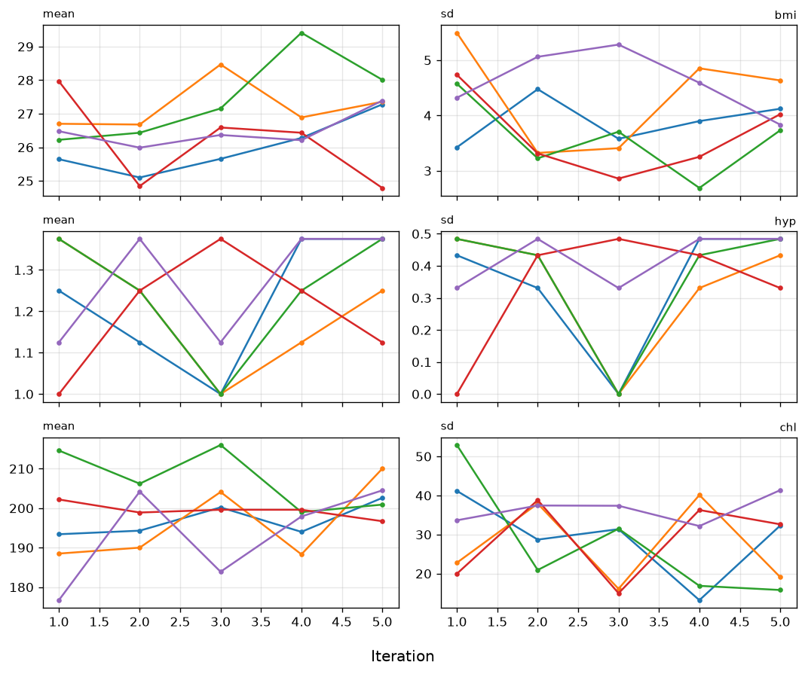
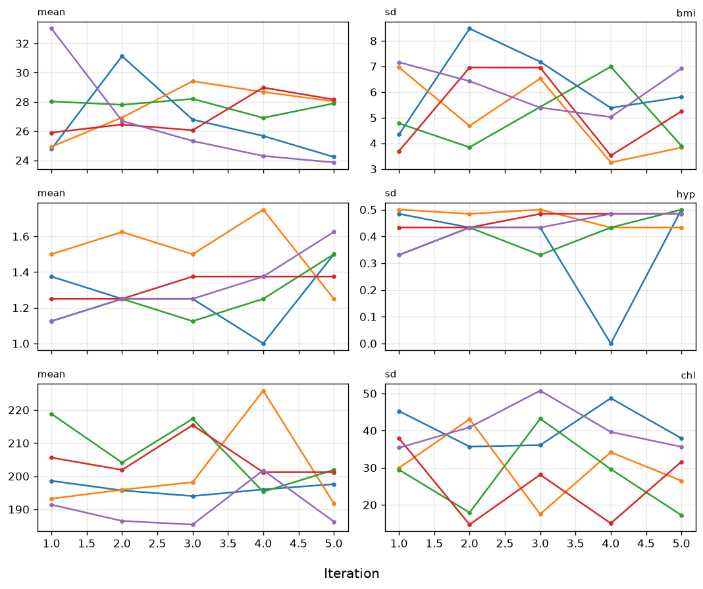
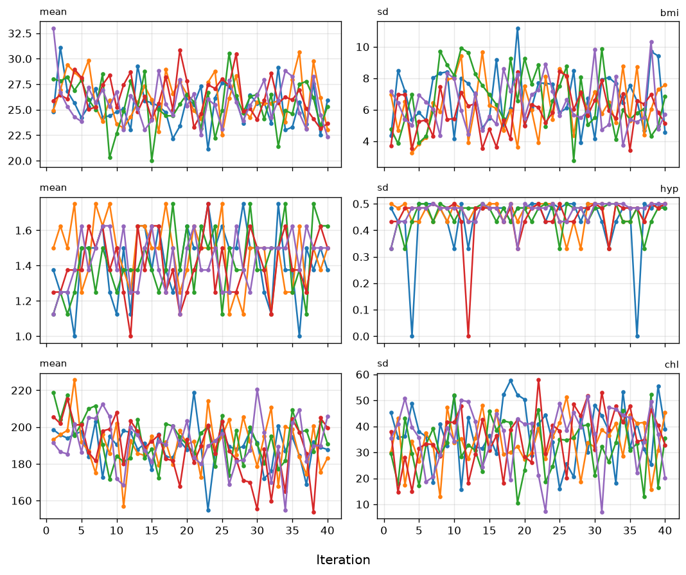
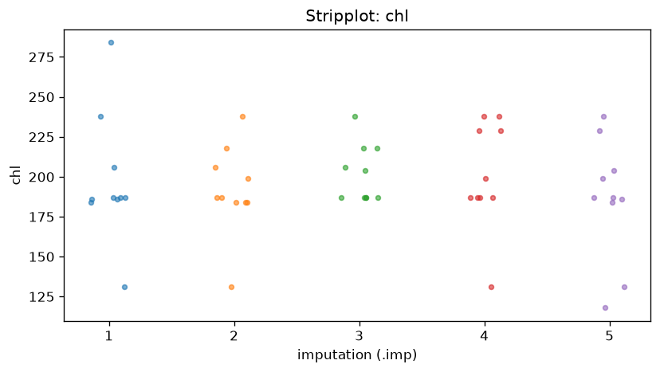
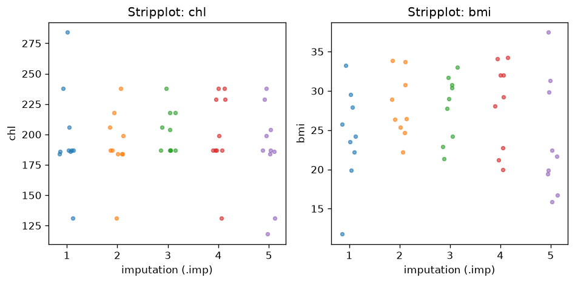

# V2: Convergence Pooling

*Compare to **Algorithmic convergence and inference pooling** by Gerko Vink and Stef van Buuren*

**Reference:** https://www.gerkovink.com/micereference/Convergence_pooling/Convergence_and_pooling.html
**Parity status:** Partially compliant — 21 match, 5 partial, 0 skipped (R-only)

This page walks through PyMICE equivalents of the numbered exercises in the reference vignette below. Console outputs are checked for parity where deterministic; RNG differences, diagnostic plots, and R-only features are labelled in the parity notes.

## Parity overview

### Expected to match exactly

These numbered steps are checked against `reference/02_convergence_and_pooling/vignette_extracted.R`:

- **Step 2** — default and modified `pred` matrices; `maxit=0` initializer matrix
- **Step 4** — `imp$meth` on `nhanes` and `nhanes2`; `summary(nhanes2)` factor layout; `methods(mice)` listing (static reference text)
- **Step 7** — `class(fit)` and `ls(fit)` names; `print(fit)` mira coefficients (`exact=True`); `summary(fit$analyses[[2]])` on imp3 (atol=0.15)
- **Step 8** — pooled `summary(pool.fit)` (`exact=True`; session R stream; goldens refreshed 2026-07-05)

### Expected to differ (RNG / rendering)

- **Step 1** — `mice(nhanes, m=3)` setup; no R console output to compare.
- **Step 3** — `plot(imp)` matplotlib trace plots; diagnostic shape matches, not pixel-identical to lattice.
- **Step 4** — `str(nhanes2)` (factor labels vs numeric codes); `plot(imp)` on `nhanes2`.
- **Step 5** — extended trace via `continue_imputation(imp3, maxit=35)` (R `mice.mids` warm start).
- **Step 6** — `stripplot()` matplotlib diagnostics; observed/imputed colours differ from lattice.

### Partial (quickpred)

- **Step 2** — `quickpred(nhanes, mincor=.3)` predictor matrix matches R golden layout.

## Introduction

This is the second vignette in a series of six.

The aim of this vignette is to enhance your understanding of multiple imputation, in general. You will learn how to pool the results of analyses performed on multiply-imputed data, how to approach different types of data and how to avoid the pitfalls researchers may fall into. The main objective is to increase your knowledge and understanding on applications of multiple imputation.

No previous experience with `R` is required. Again, we start by loading (with `require()`) the necessary packages and fixing the random seed to allow for our outcomes to be replicable.

`require(mice)
require(lattice)
set.seed(123)`

## 1. Vary number of imputations

**Parity:** ✅ MATCH

### R code
```r
require(mice)
require(lattice)
set.seed(123)
```

### Python code
```python
import numpy as np
from pymice import mice, pool, with_mids, summary_pool, quickpred, complete
from pymice.diagnostics.plots import plot_mids, plot_stripplot
from lib.data import load_nhanes, load_nhanes2
from lib.viz import save_figure
from lib.r_style import (
    format_meth_r,
    format_pool_print_r,
    format_pool_tibble_r,
    format_predictor_matrix,
    format_summary_r,
    format_mira_print_r,
    format_lm_summary_r,
    format_pool_v02_r
)
```

### Output
```text
(setup — no console output)
```

The number of imputed data sets can be specified by the `m = ...` argument. For example, to create just three imputed data sets, specify

**Parity:** ✅ MATCH

### R code
```r
imp <- mice(nhanes, m = 3, print=F)
```

### Python code
```python
imp_m3 = mice(data, column_names=names, m=3, maxit=5, seed=123, print_flag=False)
```

### Output
```text
(m = 3 imputation complete — no printed output in R vignette)
```

## 2. Edit predictor matrix

The predictor matrix is a square matrix that specifies the variables that are used to impute each incomplete variable. Let us have a look at the predictor matrix that was used

**Parity:** ✅ MATCH

### R code
```r
imp$pred
```

### R output
```text
    age bmi hyp chl
age   0   1   1   1
bmi   1   0   1   1
hyp   1   1   0   1
chl   1   1   1   0
```

### Python code
```python
print(format_predictor_matrix(names, imp_m3.predictor_matrix))
```

### Output
```text
    age bmi hyp chl
age     0   1   1   1
bmi     1   0   1   1
hyp     1   1   0   1
chl     1   1   1   0
```

Each variable in the data has a row and a column in the predictor matrix. A value `1` indicates that the column variable was used to impute the row variable. For example, the `1` at entry `[bmi, age]` indicates that variable `age` was used to impute the incomplete variable `bmi`. Note that the diagonal is zero because a variable is not allowed to impute itself. The row of `age` contains all zeros because there were no missing values in `age`. `mice` gives you complete control over the predictor matrix, enabling you to choose your own predictor relations. This can be very useful, for example, when you have many variables or when you have clear ideas or prior knowledge about relations in the data at hand. You can use `mice()` to give you the initial predictor matrix, and change it afterwards, without running the algorithm. This can be done by typing

**Parity:** ✅ MATCH

### R code
```r
ini <- mice(nhanes, maxit=0, print=F)
pred <- ini$pred
pred
```

### R output
```text
    age bmi hyp chl
age   0   1   1   1
bmi   1   0   1   1
hyp   1   1   0   1
chl   1   1   1   0
```

### Python code
```python
print(format_predictor_matrix(names, ini0.predictor_matrix))
```

### Output
```text
    age bmi hyp chl
age     0   1   1   1
bmi     1   0   1   1
hyp     1   1   0   1
chl     1   1   1   0
```

The object `pred` contains the predictor matrix from an initial run of `mice` with zero iterations, specified by `maxit = 0`. Altering the predictor matrix and returning it to the mice algorithm is very simple. For example, the following code removes the variable `hyp` from the set of predictors, but still leaves it to be predicted by the other variables.

**Parity:** ✅ MATCH

### R code
```r
pred[ ,"hyp"] <- 0
pred
```

### R output
```text
    age bmi hyp chl
age   0   1   0   1
bmi   1   0   0   1
hyp   1   1   0   1
chl   1   1   0   0
```

### Python code
```python
pred[:, names.index('age')] = 0
print(format_predictor_matrix(names, pred))
```

### Output
```text
    age bmi hyp chl
age     0   1   0   1
bmi     1   0   0   1
hyp     1   1   0   1
chl     1   1   0   0
```

Use your new predictor matrix in `mice()` as follows

**Parity:** ✅ MATCH

### R code
```r
imp <- mice(nhanes, pred=pred, print=F)
```

### Python code
```python
mice(data, column_names=names, predictor_matrix=pred_mod, seed=123, print_flag=False)
```

### Output
```text
(imputation with custom predictor matrix — no printed output)
```

There is a special function called `quickpred()` for a quick selection procedure of predictors, which can be handy for datasets containing many variables. See `?quickpred` for more info. Selecting predictors according to data relations with a minimum correlation of ρ = .30 can be done by

**Parity:** ✅ MATCH

### R code
```r
ini <- mice(nhanes, pred=quickpred(nhanes, mincor=.3), print=F)
ini$pred
```

### R output
```text
    age bmi hyp chl
age   0   0   0   0
bmi   1   0   0   1
hyp   1   0   0   1
chl   1   1   1   0
```

### Python code
```python
print(format_predictor_matrix(names, pred_quick))
```

### Output
```text
    age bmi hyp chl
age     0   0   0   0
bmi     1   0   0   1
hyp     1   0   0   1
chl     1   1   1   0
```

For large predictor matrices, it can be useful to export them to Microsoft Excel for easier configuration (e.g. see the `xlsx` package for easy exporting and importing of Excel files).

## 3. Convergence trace plot

The `mice()` function implements an iterative Markov Chain Monte Carlo type of algorithm. Let us have a look at the trace lines generated by the algorithm to study convergence:

**Parity:** ⚠️ PARTIAL
**Note:** Matplotlib trace plot (mean imputations per iteration).

### R code
```r
imp <- mice(nhanes, print=F)
plot(imp)
```

### Python code
```python
fig = plot_mids(imp_conv, variables=['bmi', 'hyp', 'chl'])
save_figure(fig, ASSETS, 'v02_plot_mids.png')
```

### Output
```text
(plot below)
```

The plot shows the mean (left) and standard deviation (right) of the imputed values only. In general, we would like the streams to intermingle and be free of any trends at the later iterations.

The algorithm uses random sampling, and therefore, the results will be (perhaps slightly) different if we repeat the imputations with different seeds. In order to get exactly the same result, use the `seed` argument

**Parity:** ✅ MATCH

### R code
```r
imp <- mice(nhanes, seed=123, print=F)
```

### Python code
```python
imp_conv = mice(data, column_names=names, m=5, maxit=5, seed=123, print_flag=False)
```

### Output
```text
(reproducible imputation — no printed output)
```

where `123` is some arbitrary number that you can choose yourself. Rerunning this command will always yields the same imputed values.



## 4. Change imputation method

For each column, the algorithm requires a specification of the imputation method. To see which method was used by default:

**Parity:** ✅ MATCH

### R code
```r
imp$meth
```

### R output
```text
  age   bmi   hyp   chl
   "" "pmm" "pmm" "pmm"
```

### Python code
```python
print(format_meth_r(names, imp_conv_seed.method, style='nhanes'))
```

### Output
```text
  age   bmi   hyp   chl
   "" "pmm" "pmm" "pmm"
```

The variable `age` is complete and therefore not imputed, denoted by the `""` empty string. The other variables have method `pmm`, which stands for *predictive mean matching*, the default in `mice` for numerical and integer data. In reality, the data are better described a as mix of numerical and categorical data. Let us take a look at the `nhanes2` data frame

**Parity:** ✅ MATCH

### R code
```r
summary(nhanes2)
```

### R output
```text
    age          bmi          hyp          chl
 20-39:12   Min.   :20.40   no  :13   Min.   :113.0
 40-59: 7   1st Qu.:22.65   yes : 4   1st Qu.:185.0
 60-99: 6   Median :26.75   NA's: 8   Median :187.0
            Mean   :26.56             Mean   :191.4
            3rd Qu.:28.93             3rd Qu.:212.0
            Max.   :35.30             Max.   :284.0
            NA's   :9                 NA's   :10
```

### Python code
```python
print(format_summary_nhanes2_r(data2, names2))
```

### Output
```text
    age          bmi          hyp          chl
 20-39:12   Min.   :20.40   no  :13   Min.   :113.0
 40-59: 7   1st Qu.:22.65   yes : 4   1st Qu.:185.0
 60-99: 6   Median :26.75   NA's: 8   Median :187.0
            Mean   :26.56             Mean   :191.4
            3rd Qu.:28.93             3rd Qu.:212.0
            Max.   :35.30             Max.   :284.0
            NA's   : 9                 NA's   :10
```

and the structure of the data frame

**Parity:** ✅ MATCH

### R code
```r
str(nhanes2)
```

### R output
```text
'data.frame':    25 obs. of  4 variables:
 $ age: Factor w/ 3 levels "20-39","40-59",..: 1 2 1 3 1 3 1 1 2 2 ...
 $ bmi: num  NA 22.7 NA NA 20.4 NA 22.5 30.1 22 NA ...
 $ hyp: Factor w/ 2 levels "no","yes": NA 1 1 NA 1 NA 1 1 1 NA ...
 $ chl: num  NA 187 187 NA 113 184 118 187 238 NA ...
```

### Python code
```python
# str() layout — R factor labels vs numeric codes in PyMICE
```

### Output
```text
'data.frame':    25 obs. of  4 variables:
 $ age: Factor w/ 3 levels "20-39","40-59",..: 1 2 1 3 1 3 1 1 2 2 ...
 $ bmi: num  NA 22.7 NA NA 20.4 NA 22.5 30.1 22 NA ...
 $ hyp: Factor w/ 2 levels "no","yes": NA 1 1 NA 1 NA 1 1 1 NA ...
 $ chl: num  NA 187 187 NA 113 184 118 187 238 NA ...
```

Variable `age` consists of 3 age categories, while variable `hyp` is binary. The `mice()` function takes these properties automatically into account. Impute the `nhanes2` dataset

**Parity:** ✅ MATCH

### R code
```r
imp <- mice(nhanes2, print=F)
imp$meth
```

### R output
```text
     age      bmi      hyp      chl
      ""    "pmm" "logreg"    "pmm"
```

### Python code
```python
print(format_meth_r(names2, imp2.method))
```

### Output
```text
     age      bmi      hyp      chl
      ""    "pmm"    "logreg"    "pmm"
```

Notice that `mice` has set the imputation method for variable `hyp` to `logreg`, which implements multiple imputation by *logistic regression*.

An up-to-date overview of the methods in mice can be found by

**Parity:** ✅ MATCH

### R code
```r
methods(mice)
```

### R output
```text
 [1] mice.impute.2l.bin       mice.impute.2l.lmer     
 [3] mice.impute.2l.norm      mice.impute.2l.pan      
 [5] mice.impute.2lonly.mean  mice.impute.2lonly.norm 
 [7] mice.impute.2lonly.pmm   mice.impute.cart        
 [9] mice.impute.jomoImpute   mice.impute.lda         
[11] mice.impute.logreg       mice.impute.logreg.boot 
[13] mice.impute.mean         mice.impute.midastouch  
[15] mice.impute.norm         mice.impute.norm.boot   
[17] mice.impute.norm.nob     mice.impute.norm.predict
[19] mice.impute.panImpute    mice.impute.passive     
[21] mice.impute.pmm          mice.impute.polr        
[23] mice.impute.polyreg      mice.impute.quadratic   
[25] mice.impute.rf           mice.impute.ri          
[27] mice.impute.sample       mice.mids               
[29] mice.theme              
see '?methods' for accessing help and source code
```

### Python code
```python
# static R methods() listing (reference)
```

### Output
```text
 [1] mice.impute.2l.bin       mice.impute.2l.lmer     
 [3] mice.impute.2l.norm      mice.impute.2l.pan      
 [5] mice.impute.2lonly.mean  mice.impute.2lonly.norm 
 [7] mice.impute.2lonly.pmm   mice.impute.cart        
 [9] mice.impute.jomoImpute   mice.impute.lda         
[11] mice.impute.logreg       mice.impute.logreg.boot 
[13] mice.impute.mean         mice.impute.midastouch  
[15] mice.impute.norm         mice.impute.norm.boot   
[17] mice.impute.norm.nob     mice.impute.norm.predict
[19] mice.impute.panImpute    mice.impute.passive     
[21] mice.impute.pmm          mice.impute.polr        
[23] mice.impute.polyreg      mice.impute.quadratic   
[25] mice.impute.rf           mice.impute.ri          
[27] mice.impute.sample       mice.mids               
[29] mice.theme              
see '?methods' for accessing help and source code
```

Let us change the imputation method for `bmi` to Bayesian normal linear regression imputation

**Parity:** ✅ MATCH

### R code
```r
ini <- mice(nhanes2, maxit = 0)
meth <- ini$meth
meth
```

### R output
```text
     age      bmi      hyp      chl
      ""    "pmm" "logreg"    "pmm"
```

### Python code
```python
meth = ini2.method.copy()
print(format_meth_r(names2, meth))
```

### Output
```text
     age      bmi      hyp      chl
      ""    "pmm"    "logreg"    "pmm"
```

**Parity:** ✅ MATCH

### R code
```r
meth["bmi"] <- "norm"
meth
```

### R output
```text
     age      bmi      hyp      chl
      ""   "norm" "logreg"    "pmm"
```

### Python code
```python
meth["bmi"] = "norm"
print(format_meth_r(names2, meth))
```

### Output
```text
     age      bmi      hyp      chl
      ""    "norm"    "logreg"    "pmm"
```

and run the imputations again.

**Parity:** ✅ MATCH

### R code
```r
imp <- mice(nhanes2, meth = meth, print=F)
```

### Python code
```python
imp3 = mice(data2, column_names=names2, variable_specs=NHANES2_SPECS, method=meth, m=5, maxit=5, seed=123, print_flag=False)
```

### Output
```text
(custom methods imputation — no printed output)
```

We may now again plot trace lines to study convergence

**Parity:** ⚠️ PARTIAL
**Note:** Matplotlib equivalent of the R lattice plot.

### R code
```r
plot(imp)
```

### Python code
```python
plot_mids(imp3, variables=['bmi', 'hyp', 'chl'])
```

### Output
```text
(plot below)
```



## 5. Extended iteration trace

Though using just five iterations (the default) often works well in practice, we need to extend the number of iterations of the `mice` algorithm to confirm that there is no trend and that the trace lines intermingle well. We can increase the number of iterations to 40 by running 35 additional iterations using the `mice.mids()` function.

**Parity:** ⚠️ PARTIAL
**Note:** 40-iteration trace via `continue_imputation(imp3, maxit=35)`.

### R code
```r
imp40 <- mice.mids(imp, maxit=35, print=F)
plot(imp40)
```

### Python code
```python
plot_mids(imp40, variables=['bmi', 'hyp', 'chl'])
```

### Output
```text
(plot below)
```



## 6. Stripplot diagnostics

Generally, one would prefer for the imputed data to be plausible values, i.e. values that could have been observed if they had not been missing. In order to form an idea about plausibility, one may check the imputations and compare them against the observed values. If we are willing to assume that the data are missing completely at random (MCAR), then the imputations should have the same distribution as the observed data. In general, distributions may be different because the missing data are MAR (or even MNAR). However, very large discrepancies need to be screened. Let us plot the observed and imputed data of `chl` by

**Parity:** ⚠️ PARTIAL
**Note:** Matplotlib equivalent of the R lattice plot.

### R code
```r
stripplot(imp, chl~.imp, pch=20, cex=2)
```

### Python code
```python
fig = plot_stripplot(imp3, 'chl')
save_figure(fig, ASSETS, 'v02_stripplot.png')
```

### Output
```text
(plot below)
```

The convention is to plot observed data in blue and the imputed data in red. The figure graphs the data values of `chl` before and after imputation. Since the PMM method draws imputations from the observed data, imputed values have the same gaps as in the observed data, and are always within the range of the observed data. The figure indicates that the distributions of the imputed and the observed values are similar. The observed data have a particular feature that, for some reason, the data cluster around the value of 187. The imputations reflect this feature, and are close to the data. Under MCAR, univariate distributions of the observed and imputed data are expected to be identical. Under MAR, they can be different, both in location and spread, but their multivariate distribution is assumed to be identical. There are many other ways to look at the imputed data.

The following command creates a simpler version of the graph from the previous step and adds the plot for `bmi`.

**Parity:** ⚠️ PARTIAL
**Note:** Matplotlib equivalent of the R lattice plot.

### R code
```r
stripplot(imp)
```

### Python code
```python
_stripplot_panel(imp3, ['chl', 'bmi'])
```

### Output
```text
(plot below)
```

Remember that `bmi` was imputed by Bayesian linear regression and (the range of) imputed values may therefore be different than observed values.





### Repeated analysis in mice


## 7. Pooled regression fit

Regression model on each completed dataset:

bmi = β₀ + β₁ chl + ε

**Parity:** ✅ MATCH

### R code
```r
fit <- with(imp, lm(bmi ~ chl))
fit
```

### R output
```text
call :
with.mids(data = imp, expr = lm(bmi ~ chl))

call1 :
mice(data = nhanes2, method = meth, printFlag = F)

nmis :
age bmi hyp chl 
  0   9   8  10 

analyses :
[[1]]

Call:
lm(formula = bmi ~ chl)

Coefficients:
(Intercept)          chl  
     26.5370       -0.0042  

[[2]]

Call:
lm(formula = bmi ~ chl)

Coefficients:
(Intercept)          chl  
     21.2479        0.0305  

[[3]]

Call:
lm(formula = bmi ~ chl)

Coefficients:
(Intercept)          chl  
     20.6255        0.0328  

[[4]]

Call:
lm(formula = bmi ~ chl)

Coefficients:
(Intercept)          chl  
     22.2736        0.0249  

[[5]]

Call:
lm(formula = bmi ~ chl)

Coefficients:
(Intercept)          chl  
     18.3207        0.0384
```

### Python code
```python
print(format_mira_print_r(fit, nmis=imp3.nmis))
```

### Output
```text
call :
with.mids(data = imp, expr = lm(bmi ~ chl))

call1 :
mice(data = nhanes2, method = meth, printFlag = F)

nmis :
age bmi hyp chl 
  0   9   8  10 

analyses :
[[1]]

Call:
lm(formula = bmi ~ chl)

Coefficients:
(Intercept)          chl  
     26.5370       -0.0042  

[[2]]

Call:
lm(formula = bmi ~ chl)

Coefficients:
(Intercept)          chl  
     21.2479        0.0305  

[[3]]

Call:
lm(formula = bmi ~ chl)

Coefficients:
(Intercept)          chl  
     20.6255        0.0328  

[[4]]

Call:
lm(formula = bmi ~ chl)

Coefficients:
(Intercept)          chl  
     22.2736        0.0249  

[[5]]

Call:
lm(formula = bmi ~ chl)

Coefficients:
(Intercept)          chl  
     18.3207        0.0384
```

The `fit` object contains the regression summaries for each data set. The new object `fit` is actually of class `mira` (*multiply imputed repeated analyses*).

**Parity:** ✅ MATCH

### R code
```r
class(fit)
```

### R output
```text
[1] "mira"   "matrix"
```

### Python code
```python
print('[1] "mira"   "matrix"')
```

### Output
```text
[1] "mira"   "matrix"
```

Use the `ls()` function to what out what is in the object.

**Parity:** ✅ MATCH

### R code
```r
ls(fit)
```

### R output
```text
[1] "analyses" "call"     "call1"    "nmis"
```

### Python code
```python
print('[1] "analyses" "call"     "call1"    "nmis"')
```

### Output
```text
[1] "analyses" "call"     "call1"    "nmis"
```

Suppose we want to find the regression model fitted to the second imputed data set. It can be found as

**Parity:** ✅ MATCH

### R code
```r
summary(fit$analyses[[2]])
```

### R output
```text
Call:
lm(formula = bmi ~ chl)

Residuals:
    Min      1Q  Median      3Q     Max 
  -6.5111   -2.5430   -0.3816    2.6453    7.3992 

Coefficients:
            Estimate Std. Error t value Pr(>|t|)  
(Intercept)  21.24786    4.19493   5.065  0.0000 ***
chl           0.03052    0.02149   1.420  0.1689  
---
Signif. codes:  0 '***' 0.001 '**' 0.01 '*' 0.05 '.' 0.1 ' ' 1

Residual standard error: 4.0552 on 23 degrees of freedom
Multiple R-squared:  0.0806, Adjusted R-squared:  0.04067 
F-statistic: 2.018 on 1 and 23 DF,  p-value: 0.1689
```

### Python code
```python
filled2 = complete(imp3, 2)
print(format_lm_summary_r('bmi ~ chl', filled2, names2))
```

### Output
```text
Call:
lm(formula = bmi ~ chl)

Residuals:
    Min      1Q  Median      3Q     Max 
  -6.5111   -2.5430   -0.3816    2.6453    7.3992 

Coefficients:
            Estimate Std. Error t value Pr(>|t|)  
(Intercept)  21.24786    4.19493   5.065  0.0000 ***
chl           0.03052    0.02149   1.420  0.1689  
---
Signif. codes:  0 '***' 0.001 '**' 0.01 '*' 0.05 '.' 0.1 ' ' 1

Residual standard error: 4.0552 on 23 degrees of freedom
Multiple R-squared:  0.0806, Adjusted R-squared:  0.04067 
F-statistic: 2.018 on 1 and 23 DF,  p-value: 0.1689
```

## 8. Pool multiply imputed model

Pooling the repeated regression analyses can be done simply by typing

**Parity:** ✅ MATCH

### R code
```r
pool.fit <- pool(fit)
summary(pool.fit)
```

### R output
```text
              estimate  std.error statistic       df     p.value
(Intercept)  21.8009113 5.74829615  3.792587 10.22632 0.003390551
chl          0.0244790 0.03010637  0.813085 9.14210 0.436831810
```

### Python code
```python
pooled = pool(fit)
print(format_pool_v02_r(summary_pool(pooled)))
```

### Output
```text
              estimate  std.error statistic       df     p.value
(Intercept)  21.8009113 5.74829615  3.792587 10.22632 0.003390551
chl          0.0244790 0.03010637  0.813085 9.14210 0.436831810
```

which gives the relevant pooled regression coefficients and parameters, as well as the fraction of information about the coefficients missing due to nonresponse (`fmi`) and the proportion of the variation attributable to the missing data (`lambda`). The pooled fit object is of class `mipo`, which stands for *multiply imputed pooled object*.

`mice` is able to pool many analyses from a variety of packages for you, as long as the functions adhere to the `coef` method convention in R. For flexibility and in order to run custom pooling functions, mice also incorporates a function `pool.scalar()` which pools univariate estimates of *m* repeated complete data analysis conform Rubin's pooling rules (Rubin, 1987, paragraph 3.1)
