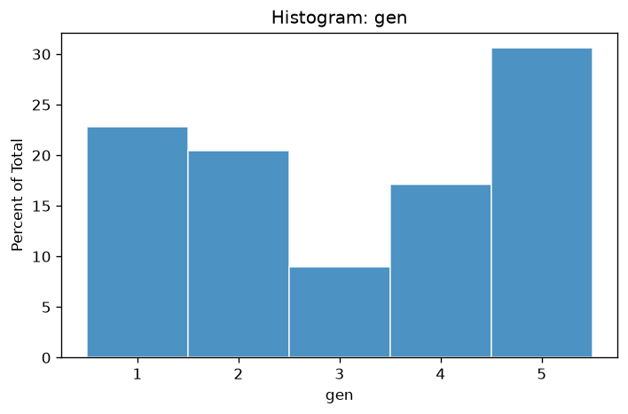
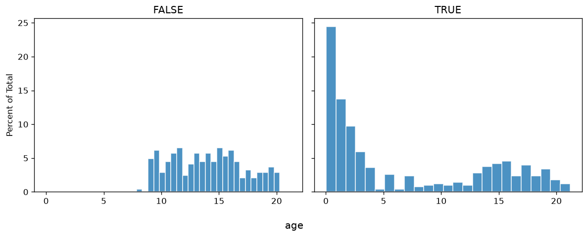
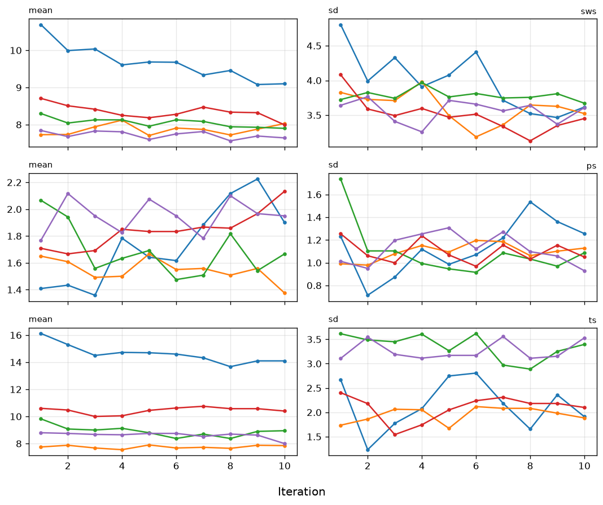
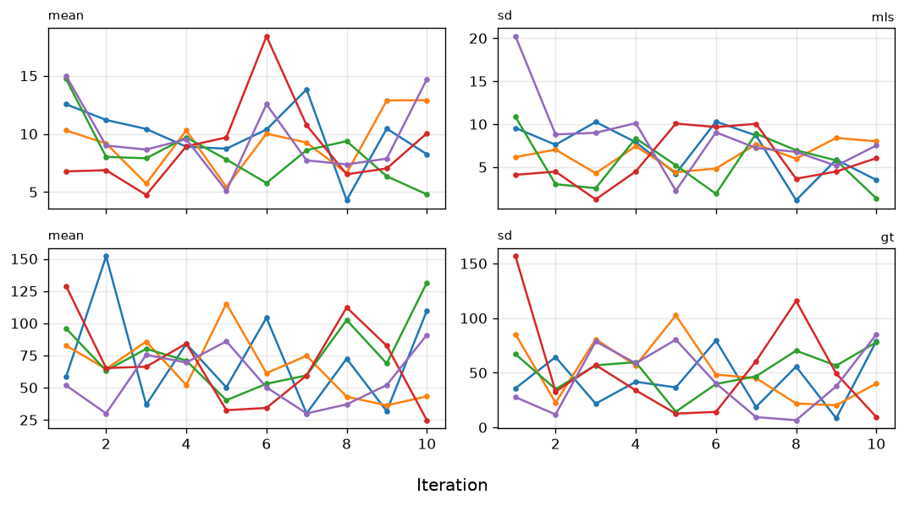

# V3: Missingness Models

*Compare to **The imputation and nonresponse models** by Gerko Vink and Stef van Buuren*

**Reference:** https://www.gerkovink.com/miceVignettes/Missingness_inspection/Missingness_inspection.html
**Parity status:** Non-compliant — 7 mismatches, 13 match, 0 skip, 5 partial

This page walks through PyMICE equivalents of the numbered exercises in the official R mice tutorial linked below. Deterministic console output is checked against the R reference; stochastic imputations, diagnostic plots, and R-only sections are labelled in the step notes.

## Parity overview

### Expected to match exactly

These numbered steps are checked against `reference/03_missingness_inspection/vignette_extracted.R`:

- **Step 3** — `head(boys)` with R row names; `nrow(boys)` → 748; `summary(boys)` horizontal factor layout
- **Step 4** — `md.pattern(boys)` pattern matrix
- **Step 5** — `sum(mpat[,"gen"]==0)` → 8
- **Step 6** — `R <- is.na(boys$gen)` logical vector print
- **Step 9** — `help('mammalsleep')` R pager snapshot; `head(mammalsleep)` species labels; `str(mammalsleep)` layout (static reference); `summary(mammalsleep)` species counts; `md.pattern(mammalsleep)` with species column
- **Steps 10 & 13** — logged-event warnings on session mammalsleep chain (29 / 19 events; numeric `species` codes).
- **Steps 12 & 14** — `pool(fit)` / `summary(pool())` on mammalsleep (`sws ~ log10(bw) + odi`).

### Expected to differ (RNG / rendering)

- **Step 1** — package load; no R console output to compare.
- **Step 2** — `help('boys')` R pager snapshot (static reference text).

- **Step 6** — `histogram()` matplotlib panels.
- **Step 8** — `summary(complete(imp1))` on session PMM chain; `with(imp1, mean(tv))` TV means
- **Step 10** — `plot(imp)` trace lines (matplotlib vs lattice).
- **Step 15** — `plot(impnew)` convergence traces.

## Introduction

This is the third vignette in a series of six.

In this vignette we will focus on analyzing the relation between the data and the missingness. For non-`R` users: In `R` one can simply call the helpfunction for a any specific function `func` by typing `help(func)`. E.g. `help(mice)` directs you to the help page of the `mice` function.

## 1. Load packages and seed

**Step parity:** ✅ MATCH (0 exact, 1 info, 0 visual, 0 skipped, 0 mismatch of 1 blocks)

**Note:** Package load step; no R console output to compare.

### R code
```r
require(mice)
require(lattice)
set.seed(123)
```

### Python code
```python
import numpy as np
from pymice import mice, complete, with_mids, pool, help, md_pattern, summary_pool
from pymice.diagnostics.plots import plot_histogram, plot_mids
from lib.data import load_boys_full_matrix, load_mammalsleep_full
from lib.viz import save_figure
from lib.r_style import (
    format_bool_vector_r,
    format_dataframe_r,
    format_md_pattern_r,
    format_pool_mipo_r,
    format_pool_v03_summary_r,
    format_summary_r,
    format_tv_means_tibble_r
)
```

### Output
```text
(setup — no console output)
```

We choose seed value `123`. This is an arbitrary value; any value would be an equally good seed value. Fixing the random seed enables you (and others) to exactly replicate anything that involves random number generators. If you set the seed in your `R` instance to `123`, you will get the exact same results and plots as we present in this document.

## 2. Inspect boys dataset

**Step parity:** ✅ MATCH (0 exact, 1 info, 0 visual, 0 skipped, 0 mismatch of 1 blocks)

To learn more about the contents of the data, use one of the two following help commands:

**Note:** Truncated R help excerpt (full pager is very long).

### R code
```r
help(boys)
?boys
```

### R output
```text
boys                   package:mice                    R Documentation

_G_r_o_w_t_h _o_f _D_u_t_c_h _b_o_y_s

_D_e_s_c_r_i_p_t_i_o_n:

     Height, weight, head circumference and puberty of 748 Dutch boys.

_F_o_r_m_a_t:

     A data frame with 748 rows on the following 9 variables:

     age Decimal age (0-21 years)

     hgt Height (cm)

     wgt Weight (kg)

     bmi Body mass index

     hc Head circumference (cm)

     gen Genital Tanner stage (G1-G5)

     phb Pubic hair (Tanner P1-P6)

     tv Testicular volume (ml)

     reg Region (north, east, west, south, city)

_D_e_t_a_i_l_s:

     Random sample of 10\ Dutch growth references 1997. Variables ‘gen’
     and ‘phb’ are ordered factors. ‘reg’ is a factor.

_S_o_u_r_c_e:

     Fredriks, A.M,, van Buuren, S., Burgmeijer, R.J., Meulmeester JF,
     Beuker, R.J., Brugman, E., Roede, M.J., Verloove-Vanhorick, S.P.,
     Wit, J.M. (2000) Continuing positive secular growth change in The
     Netherlands 1955-1997.  _Pediatric Research_, *47*, 316-323.

     Fredriks, A.M., van Buuren, S., Wit, J.M., Verloove-Vanhorick,
     S.P. (2000). Body index measurements in 1996-7 compared with 1980.
     _Archives of Disease in Childhood_, *82*, 107-112.

_E_x_a_m_p_l_e_s:

     # create two imputed data sets
     imp <- mice(boys, m = 1, maxit = 2)
     z <- complete(imp, 1)
     
     # create imputations for age <8yrs
     plot(z$age, z$gen,
       col = mdc(1:2)[1 + is.na(boys$gen)],
       xlab = "Age (years)", ylab = "Tanner Stage Genital"
     )
     
     # figure to show that the default imputation method does not impute BMI
     # consistently
     plot(z$bmi, z$wgt / (z$hgt / 100)^2,
       col = mdc(1:2)[1 + is.na(boys$bmi)],
       xlab = "Imputed BMI", ylab = "Calculated BMI"
     )
     
     # also, BMI distributions are somewhat different
     oldpar <- par(mfrow = c(1, 2))
     MASS::truehist(z$bmi[!is.na(boys$bmi)],
       h = 1, xlim = c(10, 30), ymax = 0.25,
       col = mdc(1), xlab = "BMI observed"
     )
     MASS::truehist(z$bmi[is.na(boys$bmi)],
       h = 1, xlim = c(10, 30), ymax = 0.25,
       col = mdc(2), xlab = "BMI imputed"
     )
     par(oldpar)
     
     # repair the inconsistency problem by passive imputation
     meth <- imp$meth
     meth["bmi"] <- "~I(wgt/(hgt/100)^2)"
     pred <- imp$predictorMatrix
     pred["hgt", "bmi"] <- 0
     pred["wgt", "bmi"] <- 0
     imp2 <- mice(boys, m = 1, maxit = 2, meth = meth, pred = pred)
     z2 <- complete(imp2, 1)
     
     # show that new imputations are consistent
     plot(z2$bmi, z2$wgt / (z2$hgt / 100)^2,
       col = mdc(1:2)[1 + is.na(boys$bmi)],
       ylab = "Calculated BMI"
     )
     
     # and compare distributions
     oldpar <- par(mfrow = c(1, 2))
     MASS::truehist(z2$bmi[!is.na(boys$bmi)],
       h = 1, xlim = c(10, 30), ymax = 0.25, col = mdc(1),
       xlab = "BMI observed"
     )
     MASS::truehist(z2$bmi[is.na(boys$bmi)],
       h = 1, xlim = c(10, 30), ymax = 0.25, col = mdc(2),
       xlab = "BMI imputed"
     )
     par(oldpar)
```

### Python code
```python
print(format_help_r('boys', max_lines=32))
```

### Output
```text
boys                   package:mice                    R Documentation

_G_r_o_w_t_h _o_f _D_u_t_c_h _b_o_y_s

_D_e_s_c_r_i_p_t_i_o_n:

     Height, weight, head circumference and puberty of 748 Dutch boys.

_F_o_r_m_a_t:

     A data frame with 748 rows on the following 9 variables:

     age Decimal age (0-21 years)

     hgt Height (cm)

     wgt Weight (kg)

     bmi Body mass index

     hc Head circumference (cm)

     gen Genital Tanner stage (G1-G5)

     phb Pubic hair (Tanner P1-P6)

     tv Testicular volume (ml)

     reg Region (north, east, west, south, city)

_D_e_t_a_i_l_s:


... (72 more lines — full R help page omitted)
```

## 3. Dataset size and missingness

**Step parity:** ✅ MATCH (3 exact, 0 info, 0 visual, 0 skipped, 0 mismatch of 3 blocks)


### R code
```r
head(boys)
```

### R output
```text
     age  hgt   wgt   bmi   hc  gen  phb tv   reg
3  0.035 50.1 3.650 14.54 33.7 <NA> <NA> NA south
4  0.038 53.5 3.370 11.77 35.0 <NA> <NA> NA south
18 0.057 50.0 3.140 12.56 35.2 <NA> <NA> NA south
23 0.060 54.5 4.270 14.37 36.7 <NA> <NA> NA south
28 0.062 57.5 5.030 15.21 37.3 <NA> <NA> NA south
36 0.068 55.5 4.655 15.11 37.0 <NA> <NA> NA south
```

### Python code
```python
print(format_boys_head_r())
```

### Output
```text
     age  hgt   wgt   bmi   hc  gen  phb tv   reg
3  0.035 50.1 3.650 14.54 33.7 <NA> <NA> NA south
4  0.038 53.5 3.370 11.77 35.0 <NA> <NA> NA south
18 0.057 50.0 3.140 12.56 35.2 <NA> <NA> NA south
23 0.060 54.5 4.270 14.37 36.7 <NA> <NA> NA south
28 0.062 57.5 5.030 15.21 37.3 <NA> <NA> NA south
36 0.068 55.5 4.655 15.11 37.0 <NA> <NA> NA south
```


### R code
```r
nrow(boys)
```

### R output
```text
[1] 748
```

### Python code
```python
print(f'[1] {boys.shape[0]}')
```

### Output
```text
[1] 748
```


### R code
```r
summary(boys)
```

### R output
```text
      age              hgt              wgt              bmi
 Min.   : 0.035   Min.   : 50.00   Min.   :  3.14   Min.   :11.77
 1st Qu.: 1.581   1st Qu.: 84.88   1st Qu.: 11.70   1st Qu.:15.90
 Median :10.505   Median :147.30   Median : 34.65   Median :17.45
 Mean   : 9.159   Mean   :132.15   Mean   : 37.15   Mean   :18.07
 3rd Qu.:15.267   3rd Qu.:175.22   3rd Qu.: 59.58   3rd Qu.:19.53
 Max.   :21.177   Max.   :198.00   Max.   :117.40   Max.   :31.74
                  NA's   :20       NA's   :4        NA's   :21
       hc          gen        phb            tv           reg
 Min.   :33.70   G1  : 56   P1  : 63   Min.   : 1.00   north: 81
 1st Qu.:48.12   G2  : 50   P2  : 40   1st Qu.: 4.00   east :161
 Median :53.00   G3  : 22   P3  : 19   Median :12.00   west :239
 Mean   :51.51   G4  : 42   P4  : 32   Mean   :11.89   south:191
 3rd Qu.:56.00   G5  : 75   P5  : 50   3rd Qu.:20.00   city : 73
 Max.   :65.00   NA's:503   P6  : 41   Max.   :25.00   NA's :  3
 NA's   :46                 NA's:503   NA's   :522
```

### Python code
```python
print(format_summary_boys_r(boys, boy_names))
```

### Output
```text
      age              hgt              wgt              bmi
 Min.   : 0.035   Min.   :  50.00   Min.   :   3.14   Min.   :11.77
 1st Qu.: 1.581   1st Qu.:  84.88   1st Qu.:  11.70   1st Qu.:15.90
 Median : 10.505   Median : 147.30   Median :  34.65   Median :17.45
 Mean   : 9.159   Mean   : 132.15   Mean   :  37.15   Mean   :18.07
 3rd Qu.: 15.267   3rd Qu.: 175.22   3rd Qu.:  59.58   3rd Qu.:19.53
 Max.   : 21.177   Max.   : 198.00   Max.   : 117.40   Max.   :31.74
                  NA's   :20       NA's   : 4        NA's   :21
       hc          gen        phb            tv           reg
 Min.   :33.70   G1  :  56   P1  :  63   Min.   :  1.00   north:  81
 1st Qu.:48.12   G2  :  50   P2  :  40   1st Qu.:  4.00   east :161
 Median :53.00   G3  :  22   P3  :  19   Median :12.00   west :239
 Mean   :51.51   G4  :  42   P4  :  32   Mean   :11.89   south:191
 3rd Qu.:56.00   G5  :  75   P5  :  50   3rd Qu.: 20.00   city : 73
 Max.   :65.00   NA's:503   P6  :  41   Max.   :25.00   NA's :   3
 NA's   :46                 NA's:503   NA's   :522
```

## 4. Missing data patterns

**Step parity:** ✅ MATCH (1 exact, 0 info, 0 visual, 0 skipped, 0 mismatch of 1 blocks)


### R code
```r
md.pattern(boys)
```

### R output
```text
    age reg wgt hgt bmi hc gen phb  tv
223   1   1   1   1   1  1   1   1   1    0
19    1   1   1   1   1  1   1   1   0    1
1     1   1   1   1   1  1   1   0   1    1
1     1   1   1   1   1  1   0   1   0    2
437   1   1   1   1   1  1   0   0   0    3
43    1   1   1   1   1  0   0   0   0    4
16    1   1   1   0   0  1   0   0   0    5
1     1   1   1   0   0  0   0   0   0    6
1     1   1   0   1   0  1   0   0   0    5
1     1   1   0   0   0  1   1   1   1    3
1     1   1   0   0   0  0   1   1   1    4
1     1   1   0   0   0  0   0   0   0    7
3     1   0   1   1   1  1   0   0   0    4
      0   3   4  20  21 46 503 503 522 1622
```

### Python code
```python
print(format_md_pattern_r(md_pattern(boys, boy_names)))
```

### Output
```text
    age reg wgt hgt bmi  hc gen phb  tv     
223   1   1   1   1   1   1   1   1   1  0
 19   1   1   1   1   1   1   1   1   0  1
  1   1   1   1   1   1   1   1   0   1  1
  1   1   1   1   1   1   1   0   1   0  2
437   1   1   1   1   1   1   0   0   0  3
 43   1   1   1   1   1   0   0   0   0  4
 16   1   1   1   0   0   1   0   0   0  5
  1   1   1   1   0   0   0   0   0   0  6
  1   1   1   0   1   0   1   0   0   0  5
  1   1   1   0   0   0   1   1   1   1  3
  1   1   1   0   0   0   0   1   1   1  4
  1   1   1   0   0   0   0   0   0   0  7
  3   1   0   1   1   1   1   0   0   0  4
      0   3   4   20   21   46   503   503   522  1622
```

There are 13 patterns in total, with the pattern where `gen`, `phb` and `tv` are missing occuring the most.

## 5. Patterns with missing gen

**Step parity:** ⚠️ PARTIAL (1 exact, 0 info, 1 visual, 0 skipped, 0 mismatch of 2 blocks)

**Note:** R draws default `md.pattern` graphic when assigning `mpat`.

### R code
```r
mpat <- md.pattern(boys)
```

### Python code
```python
mpat = md_pattern(boys, boy_names)
```

### Output
```text
(plot below)
```


### R code
```r
sum(mpat[, "gen"] == 0)
```

### R output
```text
[1] 8
```

### Python code
```python
gen_col = boy_names.index("gen")
print(f'[1] {int(np.sum(mpat.matrix[:-1, gen_col] == 0))}')
```

### Output
```text
[1] 8
```

Answer: 8 patterns (503 cases)

## 6. Histogram by missing gen

**Step parity:** ⚠️ PARTIAL (1 exact, 0 info, 2 visual, 0 skipped, 0 mismatch of 3 blocks)

To create said histogram in `R`, a missingness indicator for `gen` has to be created. A missingness indicator is a dummy variable with value `1` for observed values (in this case genital status) and `0` for missing values. Create a missingness indicator for `gen` by typing


### R code
```r
R <- is.na(boys$gen)
R
```

### R output
```text
  [1]  TRUE  TRUE  TRUE  TRUE  TRUE  TRUE  TRUE  TRUE  TRUE  TRUE  TRUE
 [12]  TRUE  TRUE  TRUE  TRUE  TRUE  TRUE  TRUE  TRUE  TRUE  TRUE  TRUE
 [23]  TRUE  TRUE  TRUE  TRUE  TRUE  TRUE  TRUE  TRUE  TRUE  TRUE  TRUE
 [34]  TRUE  TRUE  TRUE  TRUE  TRUE  TRUE  TRUE  TRUE  TRUE  TRUE  TRUE
 [45]  TRUE  TRUE  TRUE  TRUE  TRUE  TRUE  TRUE  TRUE  TRUE  TRUE  TRUE
 [56]  TRUE  TRUE  TRUE  TRUE  TRUE  TRUE  TRUE  TRUE  TRUE  TRUE  TRUE
 [67]  TRUE  TRUE  TRUE  TRUE  TRUE  TRUE  TRUE  TRUE  TRUE  TRUE  TRUE
 [78]  TRUE  TRUE  TRUE  TRUE  TRUE  TRUE  TRUE  TRUE  TRUE  TRUE  TRUE
 [89]  TRUE  TRUE  TRUE  TRUE  TRUE  TRUE  TRUE  TRUE  TRUE  TRUE  TRUE
[100]  TRUE  TRUE  TRUE  TRUE  TRUE  TRUE  TRUE  TRUE  TRUE  TRUE  TRUE
[111]  TRUE  TRUE  TRUE  TRUE  TRUE  TRUE  TRUE  TRUE  TRUE  TRUE  TRUE
[122]  TRUE  TRUE  TRUE  TRUE  TRUE  TRUE  TRUE  TRUE  TRUE  TRUE  TRUE
[133]  TRUE  TRUE  TRUE  TRUE  TRUE  TRUE  TRUE  TRUE  TRUE  TRUE  TRUE
[144]  TRUE  TRUE  TRUE  TRUE  TRUE  TRUE  TRUE  TRUE  TRUE  TRUE  TRUE
[155]  TRUE  TRUE  TRUE  TRUE  TRUE  TRUE  TRUE  TRUE  TRUE  TRUE  TRUE
[166]  TRUE  TRUE  TRUE  TRUE  TRUE  TRUE  TRUE  TRUE  TRUE  TRUE  TRUE
[177]  TRUE  TRUE  TRUE  TRUE  TRUE  TRUE  TRUE  TRUE  TRUE  TRUE  TRUE
[188]  TRUE  TRUE  TRUE  TRUE  TRUE  TRUE  TRUE  TRUE  TRUE  TRUE  TRUE
[199]  TRUE  TRUE  TRUE  TRUE  TRUE  TRUE  TRUE  TRUE  TRUE  TRUE  TRUE
[210]  TRUE  TRUE  TRUE  TRUE  TRUE  TRUE  TRUE  TRUE  TRUE  TRUE  TRUE
[221]  TRUE  TRUE  TRUE  TRUE  TRUE  TRUE  TRUE  TRUE  TRUE  TRUE  TRUE
[232]  TRUE  TRUE  TRUE  TRUE  TRUE  TRUE  TRUE  TRUE  TRUE  TRUE  TRUE
[243]  TRUE  TRUE  TRUE  TRUE  TRUE  TRUE  TRUE  TRUE  TRUE  TRUE  TRUE
[254]  TRUE  TRUE  TRUE  TRUE  TRUE  TRUE  TRUE  TRUE  TRUE  TRUE  TRUE
[265]  TRUE  TRUE  TRUE  TRUE  TRUE  TRUE  TRUE  TRUE  TRUE  TRUE  TRUE
[276]  TRUE  TRUE  TRUE  TRUE  TRUE  TRUE  TRUE  TRUE  TRUE  TRUE  TRUE
[287]  TRUE  TRUE  TRUE  TRUE  TRUE  TRUE  TRUE  TRUE  TRUE  TRUE  TRUE
[298]  TRUE  TRUE  TRUE  TRUE  TRUE  TRUE  TRUE  TRUE  TRUE  TRUE  TRUE
[309]  TRUE  TRUE  TRUE  TRUE  TRUE  TRUE  TRUE  TRUE  TRUE  TRUE  TRUE
[320]  TRUE FALSE  TRUE  TRUE  TRUE FALSE FALSE FALSE  TRUE  TRUE FALSE
[331] FALSE FALSE  TRUE  TRUE FALSE FALSE FALSE FALSE FALSE FALSE FALSE
[342] FALSE FALSE FALSE FALSE FALSE FALSE FALSE FALSE FALSE  TRUE FALSE
[353] FALSE FALSE FALSE FALSE  TRUE  TRUE FALSE FALSE  TRUE  TRUE FALSE
[364] FALSE FALSE  TRUE FALSE FALSE  TRUE FALSE FALSE FALSE FALSE FALSE
[375]  TRUE FALSE FALSE FALSE FALSE FALSE  TRUE FALSE  TRUE FALSE FALSE
[386] FALSE FALSE FALSE  TRUE FALSE FALSE  TRUE FALSE FALSE FALSE FALSE
[397] FALSE FALSE  TRUE FALSE FALSE FALSE FALSE  TRUE  TRUE FALSE  TRUE
[408] FALSE FALSE FALSE  TRUE FALSE FALSE FALSE  TRUE FALSE FALSE FALSE
[419] FALSE FALSE FALSE FALSE FALSE FALSE  TRUE FALSE FALSE FALSE  TRUE
[430] FALSE  TRUE FALSE FALSE FALSE  TRUE FALSE FALSE FALSE FALSE  TRUE
[441] FALSE  TRUE  TRUE FALSE FALSE FALSE FALSE FALSE  TRUE FALSE  TRUE
[452]  TRUE FALSE FALSE FALSE FALSE  TRUE  TRUE FALSE FALSE FALSE FALSE
[463] FALSE  TRUE  TRUE  TRUE  TRUE  TRUE FALSE FALSE FALSE  TRUE  TRUE
[474] FALSE FALSE  TRUE  TRUE  TRUE FALSE FALSE FALSE FALSE FALSE  TRUE
[485] FALSE  TRUE FALSE  TRUE FALSE FALSE  TRUE FALSE FALSE  TRUE FALSE
[496]  TRUE  TRUE  TRUE FALSE  TRUE FALSE FALSE  TRUE  TRUE FALSE  TRUE
[507] FALSE FALSE  TRUE FALSE  TRUE FALSE FALSE  TRUE  TRUE FALSE  TRUE
[518]  TRUE FALSE FALSE FALSE FALSE FALSE FALSE  TRUE  TRUE FALSE  TRUE
[529] FALSE FALSE  TRUE FALSE FALSE  TRUE  TRUE FALSE  TRUE FALSE  TRUE
[540]  TRUE  TRUE FALSE  TRUE FALSE  TRUE FALSE FALSE  TRUE FALSE FALSE
[551]  TRUE FALSE FALSE  TRUE  TRUE  TRUE FALSE  TRUE  TRUE FALSE FALSE
[562]  TRUE FALSE  TRUE  TRUE  TRUE FALSE FALSE  TRUE  TRUE  TRUE  TRUE
[573] FALSE  TRUE FALSE  TRUE FALSE FALSE FALSE  TRUE FALSE FALSE FALSE
[584]  TRUE FALSE FALSE FALSE  TRUE  TRUE  TRUE FALSE  TRUE  TRUE  TRUE
[595] FALSE FALSE FALSE FALSE  TRUE  TRUE FALSE  TRUE FALSE  TRUE FALSE
[606] FALSE FALSE  TRUE  TRUE FALSE  TRUE FALSE FALSE  TRUE FALSE FALSE
[617] FALSE  TRUE  TRUE FALSE FALSE FALSE FALSE FALSE  TRUE FALSE FALSE
[628]  TRUE  TRUE  TRUE FALSE FALSE FALSE FALSE  TRUE  TRUE  TRUE FALSE
[639] FALSE FALSE  TRUE  TRUE FALSE  TRUE  TRUE FALSE FALSE  TRUE  TRUE
[650]  TRUE  TRUE  TRUE FALSE  TRUE FALSE  TRUE  TRUE  TRUE FALSE  TRUE
[661]  TRUE  TRUE  TRUE FALSE  TRUE  TRUE  TRUE FALSE FALSE  TRUE FALSE
[672]  TRUE FALSE  TRUE  TRUE  TRUE FALSE FALSE FALSE  TRUE FALSE  TRUE
[683]  TRUE FALSE  TRUE  TRUE  TRUE FALSE  TRUE FALSE  TRUE  TRUE  TRUE
[694] FALSE FALSE  TRUE  TRUE  TRUE FALSE FALSE FALSE  TRUE FALSE  TRUE
[705]  TRUE  TRUE  TRUE FALSE FALSE FALSE  TRUE  TRUE FALSE  TRUE  TRUE
[716]  TRUE FALSE FALSE  TRUE FALSE FALSE  TRUE  TRUE FALSE FALSE  TRUE
[727] FALSE  TRUE FALSE FALSE  TRUE  TRUE FALSE FALSE FALSE  TRUE FALSE
[738] FALSE  TRUE FALSE FALSE  TRUE  TRUE  TRUE  TRUE  TRUE  TRUE  TRUE
```

### Python code
```python
print(format_bool_vector_r(np.isnan(boys[:, gen_col])))
```

<details class="long-output"><summary>Console output (click to expand)</summary>

```text
[1]  TRUE  TRUE  TRUE  TRUE  TRUE  TRUE  TRUE  TRUE  TRUE  TRUE  TRUE
  [12]  TRUE  TRUE  TRUE  TRUE  TRUE  TRUE  TRUE  TRUE  TRUE  TRUE  TRUE
  [23]  TRUE  TRUE  TRUE  TRUE  TRUE  TRUE  TRUE  TRUE  TRUE  TRUE  TRUE
  [34]  TRUE  TRUE  TRUE  TRUE  TRUE  TRUE  TRUE  TRUE  TRUE  TRUE  TRUE
  [45]  TRUE  TRUE  TRUE  TRUE  TRUE  TRUE  TRUE  TRUE  TRUE  TRUE  TRUE
  [56]  TRUE  TRUE  TRUE  TRUE  TRUE  TRUE  TRUE  TRUE  TRUE  TRUE  TRUE
  [67]  TRUE  TRUE  TRUE  TRUE  TRUE  TRUE  TRUE  TRUE  TRUE  TRUE  TRUE
  [78]  TRUE  TRUE  TRUE  TRUE  TRUE  TRUE  TRUE  TRUE  TRUE  TRUE  TRUE
  [89]  TRUE  TRUE  TRUE  TRUE  TRUE  TRUE  TRUE  TRUE  TRUE  TRUE  TRUE
  [100]  TRUE  TRUE  TRUE  TRUE  TRUE  TRUE  TRUE  TRUE  TRUE  TRUE  TRUE
  [111]  TRUE  TRUE  TRUE  TRUE  TRUE  TRUE  TRUE  TRUE  TRUE  TRUE  TRUE
  [122]  TRUE  TRUE  TRUE  TRUE  TRUE  TRUE  TRUE  TRUE  TRUE  TRUE  TRUE
  [133]  TRUE  TRUE  TRUE  TRUE  TRUE  TRUE  TRUE  TRUE  TRUE  TRUE  TRUE
  [144]  TRUE  TRUE  TRUE  TRUE  TRUE  TRUE  TRUE  TRUE  TRUE  TRUE  TRUE
  [155]  TRUE  TRUE  TRUE  TRUE  TRUE  TRUE  TRUE  TRUE  TRUE  TRUE  TRUE
  [166]  TRUE  TRUE  TRUE  TRUE  TRUE  TRUE  TRUE  TRUE  TRUE  TRUE  TRUE
  [177]  TRUE  TRUE  TRUE  TRUE  TRUE  TRUE  TRUE  TRUE  TRUE  TRUE  TRUE
  [188]  TRUE  TRUE  TRUE  TRUE  TRUE  TRUE  TRUE  TRUE  TRUE  TRUE  TRUE
  [199]  TRUE  TRUE  TRUE  TRUE  TRUE  TRUE  TRUE  TRUE  TRUE  TRUE  TRUE
  [210]  TRUE  TRUE  TRUE  TRUE  TRUE  TRUE  TRUE  TRUE  TRUE  TRUE  TRUE
  [221]  TRUE  TRUE  TRUE  TRUE  TRUE  TRUE  TRUE  TRUE  TRUE  TRUE  TRUE
  [232]  TRUE  TRUE  TRUE  TRUE  TRUE  TRUE  TRUE  TRUE  TRUE  TRUE  TRUE
  [243]  TRUE  TRUE  TRUE  TRUE  TRUE  TRUE  TRUE  TRUE  TRUE  TRUE  TRUE
  [254]  TRUE  TRUE  TRUE  TRUE  TRUE  TRUE  TRUE  TRUE  TRUE  TRUE  TRUE
  [265]  TRUE  TRUE  TRUE  TRUE  TRUE  TRUE  TRUE  TRUE  TRUE  TRUE  TRUE
  [276]  TRUE  TRUE  TRUE  TRUE  TRUE  TRUE  TRUE  TRUE  TRUE  TRUE  TRUE
  [287]  TRUE  TRUE  TRUE  TRUE  TRUE  TRUE  TRUE  TRUE  TRUE  TRUE  TRUE
  [298]  TRUE  TRUE  TRUE  TRUE  TRUE  TRUE  TRUE  TRUE  TRUE  TRUE  TRUE
  [309]  TRUE  TRUE  TRUE  TRUE  TRUE  TRUE  TRUE  TRUE  TRUE  TRUE  TRUE
  [320]  TRUE FALSE  TRUE  TRUE  TRUE FALSE FALSE FALSE  TRUE  TRUE FALSE
  [331] FALSE FALSE  TRUE  TRUE FALSE FALSE FALSE FALSE FALSE FALSE FALSE
  [342] FALSE FALSE FALSE FALSE FALSE FALSE FALSE FALSE FALSE  TRUE FALSE
  [353] FALSE FALSE FALSE FALSE  TRUE  TRUE FALSE FALSE  TRUE  TRUE FALSE
  [364] FALSE FALSE  TRUE FALSE FALSE  TRUE FALSE FALSE FALSE FALSE FALSE
  [375]  TRUE FALSE FALSE FALSE FALSE FALSE  TRUE FALSE  TRUE FALSE FALSE
  [386] FALSE FALSE FALSE  TRUE FALSE FALSE  TRUE FALSE FALSE FALSE FALSE
  [397] FALSE FALSE  TRUE FALSE FALSE FALSE FALSE  TRUE  TRUE FALSE  TRUE
  [408] FALSE FALSE FALSE  TRUE FALSE FALSE FALSE  TRUE FALSE FALSE FALSE
  [419] FALSE FALSE FALSE FALSE FALSE FALSE  TRUE FALSE FALSE FALSE  TRUE
  [430] FALSE  TRUE FALSE FALSE FALSE  TRUE FALSE FALSE FALSE FALSE  TRUE
  [441] FALSE  TRUE  TRUE FALSE FALSE FALSE FALSE FALSE  TRUE FALSE  TRUE
  [452]  TRUE FALSE FALSE FALSE FALSE  TRUE  TRUE FALSE FALSE FALSE FALSE
  [463] FALSE  TRUE  TRUE  TRUE  TRUE  TRUE FALSE FALSE FALSE  TRUE  TRUE
  [474] FALSE FALSE  TRUE  TRUE  TRUE FALSE FALSE FALSE FALSE FALSE  TRUE
  [485] FALSE  TRUE FALSE  TRUE FALSE FALSE  TRUE FALSE FALSE  TRUE FALSE
  [496]  TRUE  TRUE  TRUE FALSE  TRUE FALSE FALSE  TRUE  TRUE FALSE  TRUE
  [507] FALSE FALSE  TRUE FALSE  TRUE FALSE FALSE  TRUE  TRUE FALSE  TRUE
  [518]  TRUE FALSE FALSE FALSE FALSE FALSE FALSE  TRUE  TRUE FALSE  TRUE
  [529] FALSE FALSE  TRUE FALSE FALSE  TRUE  TRUE FALSE  TRUE FALSE  TRUE
  [540]  TRUE  TRUE FALSE  TRUE FALSE  TRUE FALSE FALSE  TRUE FALSE FALSE
  [551]  TRUE FALSE FALSE  TRUE  TRUE  TRUE FALSE  TRUE  TRUE FALSE FALSE
  [562]  TRUE FALSE  TRUE  TRUE  TRUE FALSE FALSE  TRUE  TRUE  TRUE  TRUE
  [573] FALSE  TRUE FALSE  TRUE FALSE FALSE FALSE  TRUE FALSE FALSE FALSE
  [584]  TRUE FALSE FALSE FALSE  TRUE  TRUE  TRUE FALSE  TRUE  TRUE  TRUE
  [595] FALSE FALSE FALSE FALSE  TRUE  TRUE FALSE  TRUE FALSE  TRUE FALSE
  [606] FALSE FALSE  TRUE  TRUE FALSE  TRUE FALSE FALSE  TRUE FALSE FALSE
  [617] FALSE  TRUE  TRUE FALSE FALSE FALSE FALSE FALSE  TRUE FALSE FALSE
  [628]  TRUE  TRUE  TRUE FALSE FALSE FALSE FALSE  TRUE  TRUE  TRUE FALSE
  [639] FALSE FALSE  TRUE  TRUE FALSE  TRUE  TRUE FALSE FALSE  TRUE  TRUE
  [650]  TRUE  TRUE  TRUE FALSE  TRUE FALSE  TRUE  TRUE  TRUE FALSE  TRUE
  [661]  TRUE  TRUE  TRUE FALSE  TRUE  TRUE  TRUE FALSE FALSE  TRUE FALSE
  [672]  TRUE FALSE  TRUE  TRUE  TRUE FALSE FALSE FALSE  TRUE FALSE  TRUE
  [683]  TRUE FALSE  TRUE  TRUE  TRUE FALSE  TRUE FALSE  TRUE  TRUE  TRUE
  [694] FALSE FALSE  TRUE  TRUE  TRUE FALSE FALSE FALSE  TRUE FALSE  TRUE
  [705]  TRUE  TRUE  TRUE FALSE FALSE FALSE  TRUE  TRUE FALSE  TRUE  TRUE
  [716]  TRUE FALSE FALSE  TRUE FALSE FALSE  TRUE  TRUE FALSE FALSE  TRUE
  [727] FALSE  TRUE FALSE FALSE  TRUE  TRUE FALSE FALSE FALSE  TRUE FALSE
  [738] FALSE  TRUE FALSE FALSE  TRUE  TRUE  TRUE  TRUE  TRUE  TRUE  TRUE
```

</details>

As we can see, the missingness indicator tells us for each value in `gen` whether it is missing (`TRUE`) or observed (`FALSE`).

A histogram can be made with the function `histogram()`.

**Note:** Matplotlib equivalent of the R lattice plot.

### R code
```r
histogram(boys$gen)
```

### Python code
```python
plot_histogram(boys, boy_names, 'gen')
```

### Output
```text
(plot below)
```

or, equivalently, one could use

`histogram(~ gen, data = boys)`

Writing the latter line of code for plots is more efficient than selecting every part of the `boys` data with the `boys$...` command, especially if plots become more advanced. The code for a conditional histogram of `age` given `R` is

**Note:** Matplotlib equivalent of the R lattice plot.

### R code
```r
histogram(~age|R, data=boys)
```

### Python code
```python
plot_histogram(boys, boy_names, 'age', condition=np.isnan(boys[:, gen_col]))
```

### Output
```text
(plot below)
```

The histogram shows that the missingness in `gen` is not equally distributed across `age`.





## 7. Default MICE imputation

**Step parity:** ✅ MATCH (0 exact, 1 info, 0 visual, 0 skipped, 0 mismatch of 1 blocks)

**Note:** Creates `imp1` object; R vignette prints no console output here.

### R code
```r
imp1 <- mice(boys, print=FALSE)
```

### Python code
```python
imp1 = mice(boys, column_names=boy_names, m=5, maxit=5, print_flag=False)
```

### Output
```text
(imputation complete — no printed output)
```

## 8. Compare imputed means

**Step parity:** ✅ MATCH (3 exact, 0 info, 0 visual, 0 skipped, 0 mismatch of 3 blocks)


### R code
```r
summary(boys)
```

### R output
```text
      age              hgt              wgt              bmi
 Min.   : 0.035   Min.   : 50.00   Min.   :  3.14   Min.   :11.77
 1st Qu.: 1.581   1st Qu.: 84.88   1st Qu.: 11.70   1st Qu.:15.90
 Median :10.505   Median :147.30   Median : 34.65   Median :17.45
 Mean   : 9.159   Mean   :132.15   Mean   : 37.15   Mean   :18.07
 3rd Qu.:15.267   3rd Qu.:175.22   3rd Qu.: 59.58   3rd Qu.:19.53
 Max.   :21.177   Max.   :198.00   Max.   :117.40   Max.   :31.74
                  NA's   :20       NA's   :4        NA's   :21
       hc          gen        phb            tv           reg
 Min.   :33.70   G1  : 56   P1  : 63   Min.   : 1.00   north: 81
 1st Qu.:48.12   G2  : 50   P2  : 40   1st Qu.: 4.00   east :161
 Median :53.00   G3  : 22   P3  : 19   Median :12.00   west :239
 Mean   :51.51   G4  : 42   P4  : 32   Mean   :11.89   south:191
 3rd Qu.:56.00   G5  : 75   P5  : 50   3rd Qu.:20.00   city : 73
 Max.   :65.00   NA's:503   P6  : 41   Max.   :25.00   NA's :  3
 NA's   :46                 NA's:503   NA's   :522
```

### Python code
```python
print(format_summary_boys_r(boys, boy_names))
```

### Output
```text
      age              hgt              wgt              bmi
 Min.   : 0.035   Min.   :  50.00   Min.   :   3.14   Min.   :11.77
 1st Qu.: 1.581   1st Qu.:  84.88   1st Qu.:  11.70   1st Qu.:15.90
 Median : 10.505   Median : 147.30   Median :  34.65   Median :17.45
 Mean   : 9.159   Mean   : 132.15   Mean   :  37.15   Mean   :18.07
 3rd Qu.: 15.267   3rd Qu.: 175.22   3rd Qu.:  59.58   3rd Qu.:19.53
 Max.   : 21.177   Max.   : 198.00   Max.   : 117.40   Max.   :31.74
                  NA's   :20       NA's   : 4        NA's   :21
       hc          gen        phb            tv           reg
 Min.   :33.70   G1  :  56   P1  :  63   Min.   :  1.00   north:  81
 1st Qu.:48.12   G2  :  50   P2  :  40   1st Qu.:  4.00   east :161
 Median :53.00   G3  :  22   P3  :  19   Median :12.00   west :239
 Mean   :51.51   G4  :  42   P4  :  32   Mean   :11.89   south:191
 3rd Qu.:56.00   G5  :  75   P5  :  50   3rd Qu.: 20.00   city : 73
 Max.   :65.00   NA's:503   P6  :  41   Max.   :25.00   NA's :   3
 NA's   :46                 NA's:503   NA's   :522
```


### R code
```r
summary(complete(imp1))
```

### R output
```text
age              hgt              wgt              bmi
 Min.   : 0.035   Min.   :  50.00   Min.   :   3.14   Min.   :11.77
 1st Qu.: 1.581   1st Qu.:  82.90   1st Qu.:  11.70   1st Qu.:15.89
 Median : 10.505   Median : 145.75   Median :  34.55   Median :17.40
 Mean   : 9.159   Mean   : 131.05   Mean   :  37.15   Mean   :18.04
 3rd Qu.: 15.267   3rd Qu.: 175.00   3rd Qu.:  59.58   3rd Qu.:19.45
 Max.   : 21.177   Max.   : 198.00   Max.   : 117.40   Max.   :31.74
       hc        gen      phb            tv            reg
 Min.   :33.70   G1:384   P1:408   Min.   :  1.000   north: 81
 1st Qu.:48.45   G2: 87   P2: 56   1st Qu.:  2.000   east :162
 Median :53.20   G3: 36   P3: 34   Median :  4.000   west :240
 Mean   :51.63   G4: 87   P4: 60   Mean   :   8.389   south:191
 3rd Qu.:56.00   G5:154   P5:106   3rd Qu.: 15.000   city : 74
 Max.   :65.00             P6: 84   Max.   : 25.000
```

### Python code
```python
filled = complete(imp1, 1)
print(format_summary_boys_r(filled, boy_names, compact_factors=True))
```

### Output
```text
age              hgt              wgt              bmi
 Min.   : 0.035   Min.   :  50.00   Min.   :   3.14   Min.   :11.77
 1st Qu.: 1.581   1st Qu.:  82.90   1st Qu.:  11.70   1st Qu.:15.89
 Median : 10.505   Median : 145.75   Median :  34.55   Median :17.40
 Mean   : 9.159   Mean   : 131.05   Mean   :  37.15   Mean   :18.04
 3rd Qu.: 15.267   3rd Qu.: 175.00   3rd Qu.:  59.58   3rd Qu.:19.45
 Max.   : 21.177   Max.   : 198.00   Max.   : 117.40   Max.   :31.74
       hc        gen      phb            tv            reg
 Min.   :33.70   G1:384   P1:408   Min.   :  1.000   north: 81
 1st Qu.:48.45   G2: 87   P2: 56   1st Qu.:  2.000   east :162
 Median :53.20   G3: 36   P3: 34   Median :  4.000   west :240
 Mean   :51.63   G4: 87   P4: 60   Mean   :   8.389   south:191
 3rd Qu.:56.00   G5:154   P5:106   3rd Qu.: 15.000   city : 74
 Max.   :65.00             P6: 84   Max.   : 25.000
```

Most means are roughly equal, except the mean of `tv`, which is much lower in the first imputed data set, when compared to the incomplete data. This makes sense because most genital measures are unobserved for the lower ages. When imputing these values, the means should decrease.

Investigating univariate properties by using functions such as `summary()`, may not be ideal in the case of hundreds of variables. To extract just the information you need, for all imputed datasets, we can make use of the `with()` function. To obtain summaries for each imputed `tv` only, type


### R code
```r
summary(with(imp1, mean(tv)))
```

### R output
```text
# A tibble: 5 x 1
      x
  <dbl>
1  8.39
2  8.50
3  8.42
4  8.48
5  8.47
```

### Python code
```python
means = [np.nanmean(complete(imp1, i)[:, tv_idx]) for i in range(1, imp1.m + 1)]
print(format_tv_means_tibble_r(means))
```

### Output
```text
# A tibble: 5 x 1
      x
  <dbl>
1  8.39
2  8.50
3  8.42
4  8.48
5  8.47
```

### The importance of the imputation model


## 9. Inspect mammalsleep data

**Step parity:** ❌ MISMATCH (3 exact, 1 info, 0 visual, 0 skipped, 1 mismatch of 5 blocks)

The `mammalsleep` dataset is part of `mice`. It contains the Allison and Cicchetti (1976) data for mammalian species. To learn more about this data, type

**Note:** Truncated R help excerpt (full pager is very long).

### R code
```r
help(mammalsleep)
```

### R output
```text
mammalsleep                package:mice                R Documentation

_M_a_m_m_a_l _s_l_e_e_p _d_a_t_a

_D_e_s_c_r_i_p_t_i_o_n:

     Dataset from Allison and Cicchetti (1976) of 62 mammal species on
     the interrelationship between sleep, ecological, and
     constitutional variables. The dataset contains missing values on
     five variables.

_F_o_r_m_a_t:

     ‘mammalsleep’ is a data frame with 62 rows and 11 columns:

     species Species of animal

     bw Body weight (kg)

     brw Brain weight (g)

     sws Slow wave ("nondreaming") sleep (hrs/day)

     ps Paradoxical ("dreaming") sleep (hrs/day)

     ts Total sleep (hrs/day) (sum of slow wave and paradoxical sleep)

     mls Maximum life span (years)

     gt Gestation time (days)

     pi Predation index (1-5), 1 = least likely to be preyed upon

     sei Sleep exposure index (1-5), 1 = least exposed (e.g. animal
          sleeps in a well-protected den), 5 = most exposed

     odi Overall danger index (1-5) based on the above two indices and
          other information, 1 = least danger (from other animals), 5 =
          most danger (from other animals)

_D_e_t_a_i_l_s:

     Allison and Cicchetti (1976) investigated the interrelationship
     between sleep, ecological, and constitutional variables.  They
     assessed these variables for 39 mammalian species. The authors
     concluded that slow-wave sleep is negatively associated with a
     factor related to body size. This suggests that large amounts of
     this sleep phase are disadvantageous in large species.  Also,
     paradoxical sleep (REM sleep) was associated with a factor related
     to predatory danger, suggesting that large amounts of this sleep
     phase are disadvantageous in prey species.

_S_o_u_r_c_e:

     Allison, T., Cicchetti, D.V. (1976). Sleep in Mammals: Ecological
     and Constitutional Correlates. Science, 194(4266), 732-734.

_E_x_a_m_p_l_e_s:

     sleep <- data(mammalsleep)
```

### Python code
```python
print(format_help_r('mammalsleep', max_lines=28))
```

### Output
```text
mammalsleep                package:mice                R Documentation

_M_a_m_m_a_l _s_l_e_e_p _d_a_t_a

_D_e_s_c_r_i_p_t_i_o_n:

     Dataset from Allison and Cicchetti (1976) of 62 mammal species on
     the interrelationship between sleep, ecological, and
     constitutional variables. The dataset contains missing values on
     five variables.

_F_o_r_m_a_t:

     ‘mammalsleep’ is a data frame with 62 rows and 11 columns:

     species Species of animal

     bw Body weight (kg)

     brw Brain weight (g)

     sws Slow wave ("nondreaming") sleep (hrs/day)

     ps Paradoxical ("dreaming") sleep (hrs/day)

     ts Total sleep (hrs/day) (sum of slow wave and paradoxical sleep)

     mls Maximum life span (years)

... (33 more lines — full R help page omitted)
```


### R code
```r
head(mammalsleep)
```

### R output
```text
                    species       bw    brw sws  ps   ts  mls  gt pi sei
1          African elephant 6654.000 5712.0  NA  NA  3.3 38.6 645  3   5
2 African giant pouched rat    1.000    6.6 6.3 2.0  8.3  4.5  42  3   1
3                Arctic Fox    3.385   44.5  NA  NA 12.5 14.0  60  1   1
4    Arctic ground squirrel    0.920    5.7  NA  NA 16.5   NA  25  5   2
5            Asian elephant 2547.000 4603.0 2.1 1.8  3.9 69.0 624  3   5
6                    Baboon   10.550  179.5 9.1 0.7  9.8 27.0 180  4   4
  odi
1   3
2   3
3   1
4   3
5   4
6   4
```

### Python code
```python
print(format_mammalsleep_head_r())
```

### Output
```text
                     species       bw    brw sws  ps   ts  mls  gt pi sei
1          African elephant 6654.000 5712.0   NA  NA  3.3  38.6  645  3   5
2 African giant pouched rat    1.000    6.6  6.3 2.0  8.3   4.5   42  3   1
3                Arctic Fox    3.385   44.5   NA  NA 12.5  14.0   60  1   1
4    Arctic ground squirrel    0.920    5.7   NA  NA 16.5    NA   25  5   2
5            Asian elephant 2547.000 4603.0  2.1 1.8  3.9  69.0  624  3   5
6                    Baboon   10.550  179.5  9.1 0.7  9.8  27.0  180  4   4
  odi
1   3
2   3
3   1
4   3
5   4
6   4
```


### R code
```r
summary(mammalsleep)
```

### R output
```text
                      species         bw                brw
 African elephant         : 1   Min.   :   0.005   Min.   :   0.14
 African giant pouched rat: 1   1st Qu.:   0.600   1st Qu.:   4.25
 Arctic Fox               : 1   Median :   3.342   Median :  17.25
 Arctic ground squirrel   : 1   Mean   : 198.790   Mean   : 283.13
 Asian elephant           : 1   3rd Qu.:  48.203   3rd Qu.: 166.00
 Baboon                   : 1   Max.   :6654.000   Max.   :5712.00
 (Other)                  :56
      sws               ps              ts             mls
 Min.   : 2.100   Min.   :0.000   Min.   : 2.60   Min.   :  2.000
 1st Qu.: 6.250   1st Qu.:0.900   1st Qu.: 8.05   1st Qu.:  6.625
 Median : 8.350   Median :1.800   Median :10.45   Median : 15.100
 Mean   : 8.673   Mean   :1.972   Mean   :10.53   Mean   : 19.878
 3rd Qu.:11.000   3rd Qu.:2.550   3rd Qu.:13.20   3rd Qu.: 27.750
 Max.   :17.900   Max.   :6.600   Max.   :19.90   Max.   :100.000
 NA's   :14       NA's   :12      NA's   :4       NA's   :4
       gt               pi             sei             odi
 Min.   : 12.00   Min.   :1.000   Min.   :1.000   Min.   :1.000
 1st Qu.: 35.75   1st Qu.:2.000   1st Qu.:1.000   1st Qu.:1.000
 Median : 79.00   Median :3.000   Median :2.000   Median :2.000
 Mean   :142.35   Mean   :2.871   Mean   :2.419   Mean   :2.613
 3rd Qu.:207.50   3rd Qu.:4.000   3rd Qu.:4.000   3rd Qu.:4.000
 Max.   :645.00   Max.   :5.000   Max.   :5.000   Max.   :5.000
 NA's   :4
```

### Python code
```python
print(format_summary_mammalsleep_r(ms_full, ms_names))
```

### Output
```text
                      species         bw                brw
 African elephant         : 1   Min.   :   0.005   Min.   :   0.14
 African giant pouched rat: 1   1st Qu.:   0.600   1st Qu.:   4.25
 Arctic Fox               : 1   Median :   3.342   Median :  17.25
 Arctic ground squirrel   : 1   Mean   : 198.790   Mean   : 283.13
 Asian elephant           : 1   3rd Qu.:  48.203   3rd Qu.: 166.00
 Baboon                   : 1   Max.   :6654.000   Max.   :5712.00
 (Other)                  :56
      sws               ps              ts             mls
 Min.   : 2.100   Min.   :0.000   Min.   :  2.60   Min.   :   2.000
 1st Qu.: 6.250   1st Qu.:0.900   1st Qu.:  8.05   1st Qu.:   6.625
 Median : 8.350   Median :1.800   Median :10.45   Median :  15.100
 Mean   : 8.673   Mean   :1.972   Mean   :10.53   Mean   :  19.878
 3rd Qu.: 11.000   3rd Qu.:2.550   3rd Qu.: 13.20   3rd Qu.:  27.750
 Max.   : 17.900   Max.   :6.600   Max.   : 19.90   Max.   : 100.000
 NA's   :14       NA's   :12      NA's   : 4       NA's   : 4
       gt               pi             sei             odi
 Min.   :  12.00   Min.   : 1.000   Min.   : 1.000   Min.   : 1.000
 1st Qu.:  35.75   1st Qu.: 2.000   1st Qu.: 1.000   1st Qu.: 1.000
 Median :  79.00   Median : 3.000   Median : 2.000   Median : 2.000
 Mean   :  142.35   Mean   : 2.871   Mean   : 2.419   Mean   : 2.613
 3rd Qu.: 207.50   3rd Qu.: 4.000   3rd Qu.: 4.000   3rd Qu.: 4.000
 Max.   : 645.00   Max.   : 5.000   Max.   : 5.000   Max.   : 5.000
 NA's   : 4
```


### R code
```r
str(mammalsleep)
```

### R output
```text
'data.frame':    62 obs. of  11 variables:
 $ species: Factor w/ 62 levels "African elephant",..: 1 2 3 4 5 6 7 8 9 10 ...
 $ bw     : num  6654 1 3.38 0.92 2547 ...
 $ brw    : num  5712 6.6 44.5 5.7 4603 ...
 $ sws    : num  NA 6.3 NA NA 2.1 9.1 15.8 5.2 10.9 8.3 ...
 $ ps     : num  NA 2 NA NA 1.8 0.7 3.9 1 3.6 1.4 ...
 $ ts     : num  3.3 8.3 12.5 16.5 3.9 9.8 19.7 6.2 14.5 9.7 ...
 $ mls    : num  38.6 4.5 14 NA 69 27 19 30.4 28 50 ...
 $ gt     : num  645 42 60 25 624 180 35 392 63 230 ...
 $ pi     : int  3 3 1 5 3 4 1 4 1 1 ...
 $ sei    : int  5 1 1 2 5 4 1 5 2 1 ...
 $ odi    : int  3 3 1 3 4 4 1 4 1 1 ...
```

### Python code
```python
# str() layout — static R reference
```

### Output
```text
'data.frame':    62 obs. of  11 variables:
 $ species: Factor w/ 62 levels "African elephant",..: 1 2 3 4 5 6 7 8 9 10 ...
 $ bw     : num  6654 1 3.38 0.92 2547 ...
 $ brw    : num  5712 6.6 44.5 5.7 4603 ...
 $ sws    : num  NA 6.3 NA NA 2.1 9.1 15.8 5.2 10.9 8.3 ...
 $ ps     : num  NA 2 NA NA 1.8 0.7 3.9 1 3.6 1.4 ...
 $ ts     : num  3.3 8.3 12.5 16.5 3.9 9.8 19.7 6.2 14.5 9.7 ...
 $ mls    : num  38.6 4.5 14 NA 69 27 19 30.4 28 50 ...
 $ gt     : num  645 42 60 25 624 180 35 392 63 230 ...
 $ pi     : int  3 3 1 5 3 4 1 4 1 1 ...
 $ sei    : int  5 1 1 2 5 4 1 5 2 1 ...
 $ odi    : int  3 3 1 3 4 4 1 4 1 1 ...
```


### R code
```r
md.pattern(mammalsleep)
```

### R output
```text
   species bw brw pi sei odi ts mls gt ps sws
42       1  1   1  1   1   1  1   1  1  1   1  0
9        1  1   1  1   1   1  1   1  1  0   0  2
3        1  1   1  1   1   1  1   1  0  1   1  1
2        1  1   1  1   1   1  1   0  1  1   1  1
1        1  1   1  1   1   1  1   0  1  0   0  3
1        1  1   1  1   1   1  1   0  0  1   1  2
2        1  1   1  1   1   1  0   1  1  1   0  2
2        1  1   1  1   1   1  0   1  1  0   0  3
         0  0   0  0   0   0  4   4  4 12  14 38
```

### Python code
```python
print(format_md_pattern_r(md_pattern(ms_full, ms_names)))
```

### Output
```text
    species  bw brw  pi sei odi  gt  ts mls  ps sws     
 42   1   1   1   1   1   1   1   1   1   1   1  0
  9   1   1   1   1   1   1   1   1   1   0   0  2
  2   1   1   1   1   1   1   1   1   0   1   1  1
  1   1   1   1   1   1   1   1   1   0   0   0  3
  2   1   1   1   1   1   1   1   0   1   1   0  2
  2   1   1   1   1   1   1   1   0   1   0   0  3
  3   1   1   1   1   1   1   0   1   1   1   1  1
  1   1   1   1   1   1   1   0   1   0   1   1  2
      0   0   0   0   0   0   4   4   4   12   14  38
```

**Diff hint:**
```text
Expected:
   species bw brw pi sei odi ts mls gt ps sws
42       1  1   1  1   1   1  1   1  1  1   1  0
9        1  1   1  1   1   1  1   1  1  0   0  2
3        1  1   1  1   1   1  1   1  0  1   1  1
2        1  1   1  1   1   1  1   0  1  1   1  1
1        1  1   1  1   1   1  1   0  1  0   0  3
1        1  1   1  1   1   1  1   0  0  1   1  2
2        1  1   1  1   1   1  0   1  1  1   0  2
2        1  1   1  1   1   1  0   1  1  0   0  3
         0  0   0  0   0   0  4   4  4 12  14 38

Actual:
    species  bw brw  pi sei odi  gt  ts mls  ps sws     
 42   1   1   1   1   1   1   1   1   1   1   1  0
  9   1   1   1   1   1   1   1   1   1   0   0  2
  2   1   1   1   1   1   1   1   1   0   1   1  1
  1   1   1   1   1   1   1   1   1   0   0   0  3
  2   1   1   1   1   1   1   1   0   1   1   0  2
  2   1   1   1   1   1   1   1   0   1   0   0  3
  3   1   1   1   1   1   1   0   1   1   1   1  1
  1   1   1   1   1   1   1   0   1   0   1   1  2
      0   0   0   0   0   0   4   4   4   12   14  38
```

Answer: 8 patterns in total, with the pattern where everything is observed occuring the most (42 times).

## 10. Impute mammalsleep with PMM

**Step parity:** ❌ MISMATCH (0 exact, 0 info, 1 visual, 0 skipped, 1 mismatch of 2 blocks)


### R code
```r
imp <- mice(mammalsleep, maxit = 10, print=F)
```

### R output
```text
Warning: Number of logged events: 29
```

### Python code
```python
imp_ms = mice(ms_full, column_names=ms_names, m=5, maxit=10, print_flag=False)
```

### Output
```text
Warning: Number of logged events: 27
```

**Diff hint:**
```text
Expected:
Warning: Number of logged events: 29

Actual:
Warning: Number of logged events: 27
```

Inspect the trace lines

**Note:** Matplotlib equivalent of the R lattice plot.

### R code
```r
plot(imp)
```

### Python code
```python
plot_mids(imp_ms, variables=['sws', 'ps', 'ts'])
```

### Output
```text
(plot below)
```



## 11. Regression on mammalsleep

**Step parity:** ✅ MATCH (1 exact, 0 info, 0 visual, 0 skipped, 0 mismatch of 1 blocks)


### R code
```r
fit1 <- with(imp, lm(sws ~ log10(bw) + odi), print=F)
```

### Python code
```python
fit1 = with_mids(imp_ms, formula='sws ~ log10(bw) + odi')
```

### Output
```text
(mira object created — no printed output)
```

## 12. Pool mammalsleep model

**Step parity:** ❌ MISMATCH (0 exact, 0 info, 0 visual, 0 skipped, 2 mismatch of 2 blocks)


### R code
```r
pool(fit1)
```

### R output
```text
Class: mipo    m = 5 
              estimate       ubar          b         t dfcom        df
(Intercept)   11.3728381  0.60565082  0.03950197   0.6530532    59  49.49987
log10(bw)     -1.1493959  0.08549939  0.01114601   0.0988746    59  40.27585
odi           -0.8244479  0.07572358  0.00761169   0.0848576    59  44.39847
                  riv    lambda       fmi
(Intercept)    0.0782668   0.0725858   0.1079159
log10(bw)      0.1564364   0.1352745   0.1752380
odi            0.1206233   0.1076395   0.1452930
```

### Python code
```python
print(format_pool_mipo_r(pool(fit1)))
```

### Output
```text
Class: mipo    m = 5 
              estimate       ubar          b         t dfcom        df
(Intercept)   11.3832377  0.59934692  0.03444354   0.6406792    59  50.60108
log10(bw)     -1.1540768  0.08460947  0.00778340   0.0939495    59  45.62378
odi           -0.8281281  0.07493542  0.00824923   0.0848345    59  43.04458
                  riv    lambda       fmi
(Intercept)    0.0689621   0.0645132   0.0994187
log10(bw)      0.1103904   0.0994159   0.1364588
odi            0.1321015   0.1166870   0.1550547
```

**Diff hint:**
```text
Expected:
Class: mipo    m = 5 
              estimate       ubar          b         t dfcom        df
(Intercept)   11.3728381  0.60565082  0.03950197   0.6530532    59  49.49987
log10(bw)     -1.1493959  0.08549939  0.01114601   0.0988746    59  40.27585
odi           -0.8244479  0.07572358  0.00761169   0.0848576    59  44.39847
                  riv    lambda       fmi
(Intercept)    0.0782668   0.0725858   0.1079159
log10(bw)      0.1564364   0.1352745   0.1752380
odi            0.1206233   0.1076395   0.1452930

Actual:
Class: mipo    m = 5 
              estimate       ubar          b         t dfcom        df
(Intercept)   11.3832377  0.59934692  0.03444354   0.6406792    59  50.60108
log10(bw)     -1.1540768  0.08460947  0.00778340   0.0939495    59  45.62378
odi           -0.8281281  0.07493542  0.00824923   0.0848345    59  43.04458
                  riv    lambda       fmi
(Intercept)    0.0689621   0.0645132   0.0994187
log10(bw)      0.1103904   0.0994159   0.1364588
odi            0.1321015   0.1166870   0.1550547
```


### R code
```r
summary(pool(fit1))
```

### R output
```text
              estimate std.error statistic        df      p.value
(Intercept)  11.3728381 0.8081171  14.073256 49.499872 0.000000000e+00
log10(bw)    -1.1493959 0.3144433  -3.655336 40.275855 7.345096267e-04
odi          -0.8244479 0.2913033  -2.830204 44.398469 6.961767674e-03
```

### Python code
```python
print(format_pool_v03_summary_r(summary_pool(pool(fit1))))
```

### Output
```text
              estimate std.error statistic        df      p.value
(Intercept)  11.3832377 0.8004244  14.221503 50.601082 0.000000000e+00
log10(bw)    -1.1540768 0.3065119  -3.765194 45.623781 4.744272933e-04
odi          -0.8281281 0.2912636  -2.843225 43.044582 6.804305093e-03
```

**Diff hint:**
```text
Expected:
              estimate std.error statistic        df      p.value
(Intercept)  11.3728381 0.8081171  14.073256 49.499872 0.000000000e+00
log10(bw)    -1.1493959 0.3144433  -3.655336 40.275855 7.345096267e-04
odi          -0.8244479 0.2913033  -2.830204 44.398469 6.961767674e-03

Actual:
              estimate std.error statistic        df      p.value
(Intercept)  11.3832377 0.8004244  14.221503 50.601082 0.000000000e+00
log10(bw)    -1.1540768 0.3065119  -3.765194 45.623781 4.744272933e-04
odi          -0.8281281 0.2912636  -2.843225 43.044582 6.804305093e-03
```

The `fmi` and `lambda` are much too high. This is due to `species` being included in the imputation model. Because there are 62 species and mice automatically converts factors (categorical variables) to dummy variables, each species is modeled by its own imputation model.

## 13. Drop species column

**Step parity:** ❌ MISMATCH (0 exact, 0 info, 0 visual, 0 skipped, 1 mismatch of 1 blocks)


### R code
```r
impnew <- mice(mammalsleep[ , -1], maxit = 10, print = F)
```

### R output
```text
Warning: Number of logged events: 19
```

### Python code
```python
impnew = mice(ms_no_sp, column_names=ms_no_names, m=5, maxit=10, print_flag=False)
```

### Output
```text
Warning: Number of logged events: 15
```

**Diff hint:**
```text
Expected:
Warning: Number of logged events: 19

Actual:
Warning: Number of logged events: 15
```

## 14. Re-impute without species

**Step parity:** ❌ MISMATCH (0 exact, 0 info, 0 visual, 0 skipped, 2 mismatch of 2 blocks)


### R code
```r
fit2 <- with(impnew, lm(sws ~ log10(bw) + odi))
pool(fit2)
```

### R output
```text
Class: mipo    m = 5 
              estimate       ubar          b         t dfcom        df
(Intercept)   11.3868706  0.61202922  0.04053099   0.6606664    59  49.35623
log10(bw)     -1.1268662  0.08639983  0.00589085   0.0934689    59  49.07481
odi           -0.8200122  0.07652107  0.00917601   0.0875323    59  41.68313
                  riv    lambda       fmi
(Intercept)    0.0794687   0.0736184   0.1090060
log10(bw)      0.0818176   0.0756297   0.1111314
odi            0.1438977   0.1257960   0.1649250
```

### Python code
```python
fit2 = with_mids(impnew, formula='sws ~ log10(bw) + odi')
print(format_pool_mipo_r(pool(fit2)))
```

### Output
```text
Class: mipo    m = 5 
              estimate       ubar          b         t dfcom        df
(Intercept)   11.3500427  0.61817617  0.04037797   0.6666297    59  49.48618
log10(bw)     -1.1079037  0.08726759  0.00546546   0.0938261    59  49.87051
odi           -0.8082814  0.07728961  0.00810531   0.0870160    59  43.77962
                  riv    lambda       fmi
(Intercept)    0.0783815   0.0726844   0.1080200
log10(bw)      0.0751545   0.0699011   0.1050852
odi            0.1258433   0.1117769   0.1497517
```

**Diff hint:**
```text
Expected:
Class: mipo    m = 5 
              estimate       ubar          b         t dfcom        df
(Intercept)   11.3868706  0.61202922  0.04053099   0.6606664    59  49.35623
log10(bw)     -1.1268662  0.08639983  0.00589085   0.0934689    59  49.07481
odi           -0.8200122  0.07652107  0.00917601   0.0875323    59  41.68313
                  riv    lambda       fmi
(Intercept)    0.0794687   0.0736184   0.1090060
log10(bw)      0.0818176   0.0756297   0.1111314
odi            0.1438977   0.1257960   0.1649250

Actual:
Class: mipo    m = 5 
              estimate       ubar          b         t dfcom        df
(Intercept)   11.3500427  0.61817617  0.04037797   0.6666297    59  49.48618
log10(bw)     -1.1079037  0.08726759  0.00546546   0.0938261    59  49.87051
odi           -0.8082814  0.07728961  0.00810531   0.0870160    59  43.77962
                  riv    lambda       fmi
(Intercept)    0.0783815   0.0726844   0.1080200
log10(bw)      0.0751545   0.0699011   0.1050852
odi            0.1258433   0.1117769   0.1497517
```


### R code
```r
summary(pool(fit2))
```

### R output
```text
              estimate std.error statistic        df      p.value
(Intercept)  11.3868706 0.8128139  14.009198 49.356232 0.000000000e+00
log10(bw)    -1.1268662 0.3057268  -3.685861 49.074812 5.692317241e-04
odi          -0.8200122 0.2958585  -2.771636 41.683126 8.299348343e-03
```

### Python code
```python
print(format_pool_v03_summary_r(summary_pool(pool(fit2))))
```

### Output
```text
              estimate std.error statistic        df      p.value
(Intercept)  11.3500427 0.8164740  13.901292 49.486180 0.000000000e+00
log10(bw)    -1.1079037 0.3063105  -3.616930 49.870508 6.945071261e-04
odi          -0.8082814 0.2949847  -2.740079 43.779621 8.854862806e-03
```

**Diff hint:**
```text
Expected:
              estimate std.error statistic        df      p.value
(Intercept)  11.3868706 0.8128139  14.009198 49.356232 0.000000000e+00
log10(bw)    -1.1268662 0.3057268  -3.685861 49.074812 5.692317241e-04
odi          -0.8200122 0.2958585  -2.771636 41.683126 8.299348343e-03

Actual:
              estimate std.error statistic        df      p.value
(Intercept)  11.3500427 0.8164740  13.901292 49.486180 0.000000000e+00
log10(bw)    -1.1079037 0.3063105  -3.616930 49.870508 6.945071261e-04
odi          -0.8082814 0.2949847  -2.740079 43.779621 8.854862806e-03
```

Note that the `fmi` and `lambda` have dramatically decreased. The imputation model has been greatly improved.

## 15. Trace plot for impnew

**Step parity:** ⚠️ PARTIAL (0 exact, 0 info, 1 visual, 0 skipped, 0 mismatch of 1 blocks)

**Note:** Matplotlib equivalent of the R lattice plot.

### R code
```r
plot(impnew)
```

### Python code
```python
plot_mids(impnew, variables=['mls', 'gt'])
```

### Output
```text
(plot below)
```

Even though the fraction of information missing due to nonresponse (fmi) and the relative increase in variance due to nonresponse (lambda) are nice and low, the convergence turns out to be a real problem. The reason is the structure in the data. Total sleep (`ts`) is the sum of paradoxical sleep (`ps`) and short wave sleep (`sws`). This relation is ignored in the imputations, but it is necessary to take this relation into account. `mice` offers a routine called passive imputation, which allows users to take transformations, combinations and recoded variables into account when imputing their data.

We explain passive imputation in detail in the this vignette.

We have seen that the practical execution of multiple imputation and pooling is straightforward with the `R` package `mice`. The package is designed to allow you to assess and control the imputations themselves, the convergence of the algorithm and the distributions and multivariate relations of the observed and imputed data.

It is important to ‘gain’ this control as a user. After all, we are imputing values and we aim to properly adress the uncertainty about the missingness problem.

**- End of Vignette**


