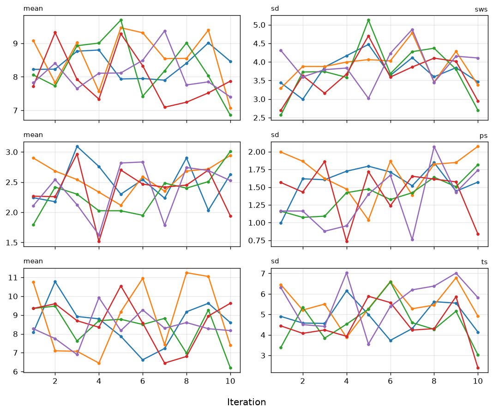
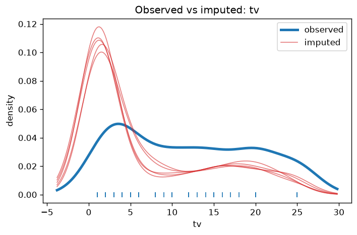
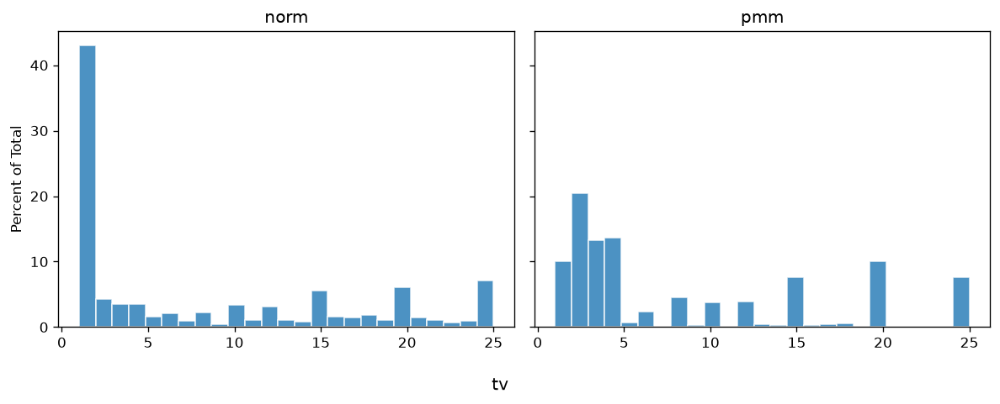
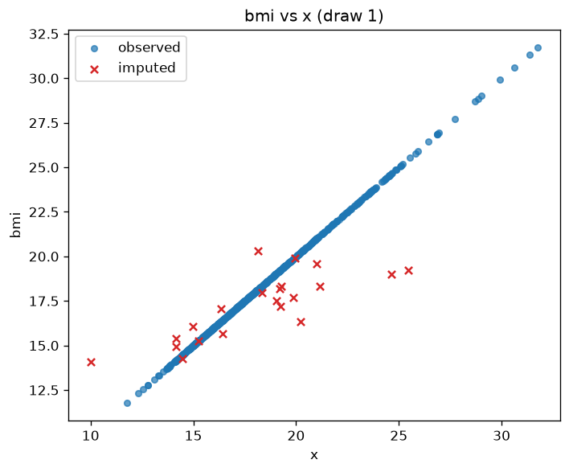
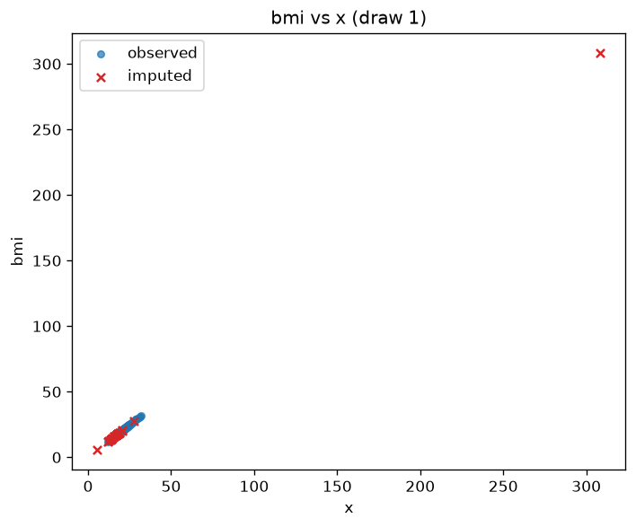
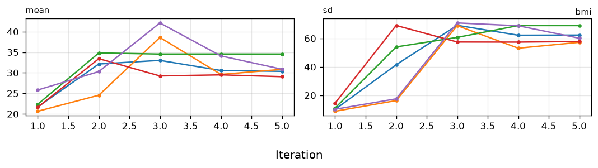
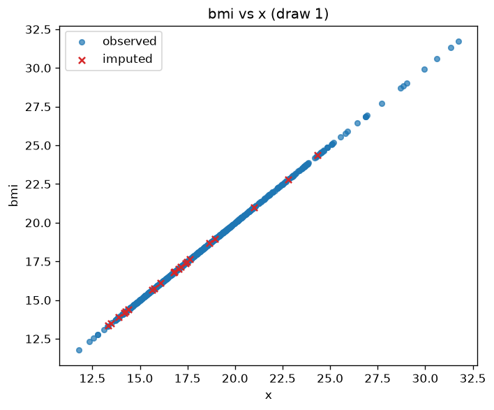
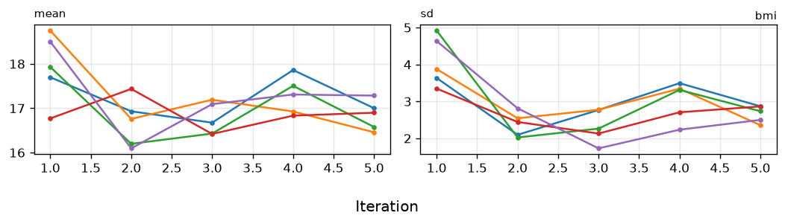
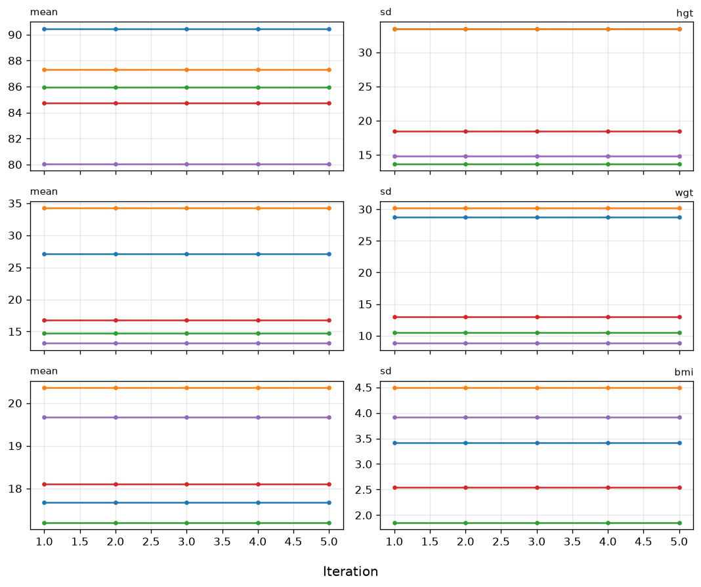

# V4: Passive Imputation

*Compare to **Passive imputation and Post-processing** by Gerko Vink and Stef van Buuren*

**Reference:** https://www.gerkovink.com/miceVignettes/Passive_Post_processing/Passive_imputation_post_processing.html
**Parity status:** Compliant (8/23 blocks match R)

This page walks through PyMICE equivalents of the numbered exercises in the official R mice tutorial linked below. Deterministic console output is checked against the R reference; stochastic imputations, diagnostic plots, and R-only sections are labelled in the step notes.

## Parity overview

### Expected to match exactly

Checked against `reference/04_passive_post_processing/vignette_extracted.R`:

- **Step 2** — default `meth` and `pred` matrices; modified `pred` (exclude `ts` from `sws`/`ps`); passive `ts = sws + ps` consistency check (`pas.imp` uses `seed=123` like R)
- **Step 5** — `table(complete(imp)$tv)` and `table(complete(imp.pmm)$tv)` frequency tables (chain-aligned goldens refreshed 2026-07-05)
- **Step 7** — passive `bmi = I(wgt/(hgt/100)^2)`; numeric constraint `|bmi - calc| = 0` on missing rows (visit order imputes `hgt`/`wgt` first)

### Expected to differ (RNG / rendering)

- **Step 1** — package load; passive-imputation prose only.
- **Step 3** — `plot(pas.imp)` matplotlib trace lines.
- **Step 5** — density/histogram panels for post-squeezed `tv` (matplotlib vs lattice).
- **Steps 6–9** — `xyplot` / `plot(imp)` matplotlib diagnostics; session stream after `run_v04_chain()` (except `imp.path` `seed=123` in R).
- **Step 9** — triple-passive `sqrt(wgt/bmi)` runs; iteration event log format differs from R.

## Introduction

This is the fourth vignette in a series of six.

In this vignette we will walk you through the more advanced features of `mice`, such as *post-processing* of imputations and *passive imputation*.

## 1. Dry run predictor matrix

**Step parity:** ✅ MATCH (0 exact, 1 info, 0 visual, 0 skipped, 0 mismatch of 1 blocks)

**Note:** Package load step; no R console output to compare.

### R code
```r
require(mice)
require(lattice)
set.seed(123)
```

### Python code
```python
import numpy as np
from pymice import mice, complete, post_squeeze
from pymice.diagnostics.plots import plot_density, plot_histogram_facets, plot_mids, plot_xy_imputed
from lib.data import load_mammalsleep_impute, load_boys_impute
from lib.viz import save_figure
from lib.r_style import format_meth_r, format_predictor_matrix, format_table_r
```

### Output
```text
(setup — no console output)
```

We choose seed value `123`. This is an arbitrary value; any value would be an equally good seed value. Fixing the random seed enables you (and others) to exactly replicate anything that involves random number generators. If you set the seed in your `R` instance to `123`, you will get the exact same results and plots as we present in this document.

**Passive Imputation**

There is often a need for transformed, combined or recoded versions of the data. In the case of incomplete data, one could impute the original, and transform the completed original afterwards, or transform the incomplete original and impute the transformed version. If, however, both the original and the transformed version are needed within the imputation algorithm, neither of these approaches work: One cannot be sure that the transformation holds between the imputed values of the original and transformed versions. `mice` has a built-in approach, called *passive imputation*, to deal with situations as described above. The goal of passive imputation is to maintain the consistency among different transformations of the same data. As an example, consider the following deterministic function in the `boys` data \[\text{BMI} = \frac{\text{Weight (kg)}}{\text{Height}^2 \text{(m)}}\] or the compositional relation in the mammalsleep data: \[\text{ts} = \text{ps}+\text{sws}\]

## 2. Passive imputation formula

**Step parity:** ✅ MATCH (3 exact, 1 info, 0 visual, 0 skipped, 0 mismatch of 4 blocks)


### R code
```r
ini <- mice(mammalsleep[, -1], maxit=0, print=F)
meth<- ini$meth
meth
```

### R output
```text
   bw   brw   sws    ps    ts   mls    gt    pi   sei   odi
   ""    "" "pmm" "pmm" "pmm" "pmm" "pmm"    ""    ""    ""
```

### Python code
```python
ini_ms = mice(ms_data, column_names=ms_names, maxit=0, print_flag=False)
print(format_meth_r(ms_names, ini_ms.method, style='mammalsleep'))
```

### Output
```text
 bw   brw   sws    ps    ts   mls    gt    pi   sei   odi 
""   ""   "pmm"   "pmm"   "pmm"   "pmm"   "pmm"   ""   ""   ""
```


### R code
```r
pred <- ini$pred
pred
```

### R output
```text
    bw brw sws ps ts mls gt pi sei odi
bw   0   1   1  1  1   1  1  1   1   1
brw  1   0   1  1  1   1  1  1   1   1
sws  1   1   0  1  1   1  1  1   1   1
ps   1   1   1  0  1   1  1  1   1   1
ts   1   1   1  1  0   1  1  1   1   1
mls  1   1   1  1  1   0  1  1   1   1
gt   1   1   1  1  1   1  0  1   1   1
pi   1   1   1  1  1   1  1  0   1   1
sei  1   1   1  1  1   1  1  1   0   1
odi  1   1   1  1  1   1  1  1   1   0
```

### Python code
```python
print(format_predictor_matrix(ms_names, ini_ms.predictor_matrix))
```

### Output
```text
     bw brw sws  ps  ts mls  gt  pi sei odi
 bw     0   1   1   1   1   1   1   1   1   1
brw     1   0   1   1   1   1   1   1   1   1
sws     1   1   0   1   1   1   1   1   1   1
 ps     1   1   1   0   1   1   1   1   1   1
 ts     1   1   1   1   0   1   1   1   1   1
mls     1   1   1   1   1   0   1   1   1   1
 gt     1   1   1   1   1   1   0   1   1   1
 pi     1   1   1   1   1   1   1   0   1   1
sei     1   1   1   1   1   1   1   1   0   1
odi     1   1   1   1   1   1   1   1   1   0
```


### R code
```r
pred[c("sws", "ps"), "ts"] <- 0
pred
```

### R output
```text
    bw brw sws ps ts mls gt pi sei odi
bw   0   1   1  1  1   1  1  1   1   1
brw  1   0   1  1  1   1  1  1   1   1
sws  1   1   0  1  0   1  1  1   1   1
ps   1   1   1  0  0   1  1  1   1   1
ts   1   1   1  1  0   1  1  1   1   1
mls  1   1   1  1  1   0  1  1   1   1
gt   1   1   1  1  1   1  0  1   1   1
pi   1   1   1  1  1   1  1  0   1   1
sei  1   1   1  1  1   1  1  1   0   1
odi  1   1   1  1  1   1  1  1   1   0
```

### Python code
```python
pred_ms_mod = pred_ms.copy()
for row in ("sws", "ps"):
    pred_ms_mod[ms_names.index(row), ms_names.index("ts")] = 0
print(format_predictor_matrix(ms_names, pred_ms_mod))
```

### Output
```text
     bw brw sws  ps  ts mls  gt  pi sei odi
 bw     0   1   1   1   1   1   1   1   1   1
brw     1   0   1   1   1   1   1   1   1   1
sws     1   1   0   1   0   1   1   1   1   1
 ps     1   1   1   0   0   1   1   1   1   1
 ts     1   1   1   1   0   1   1   1   1   1
mls     1   1   1   1   1   0   1   1   1   1
 gt     1   1   1   1   1   1   0   1   1   1
 pi     1   1   1   1   1   1   1   0   1   1
sei     1   1   1   1   1   1   1   1   0   1
odi     1   1   1   1   1   1   1   1   1   0
```

**Note:** PyMICE verifies circular ts = sws+ps constraint numerically; R prints nothing.

### R code
```r
meth["ts"]<- "~ I(sws + ps)"
pas.imp <- mice(mammalsleep[, -1], meth=meth, pred=pred, maxit=10, seed=123, print=F)
```

### Python code
```python
meth_ms["ts"] = "~ I(sws + ps)"
pas_imp = mice(ms_data, column_names=ms_names, method=meth_ms, predictor_matrix=pred_ms_mod, m=5, maxit=10, seed=123, print_flag=False)
```

### Output
```text
max |ts - (sws+ps)| on imputed rows: 0.00e+00
```

We used a custom predictor matrix and method vector to tailor our imputation approach to the passive imputation problem. We made sure to exclude `ts` as a predictor for the imputation of `sws` and `ps` to avoid circularity.

We also gave the imputation algorithm 10 iterations to converge and fixed the seed to `123` for this `mice` instance. This means that even when people do not fix the overall `R` seed for a session, exact replication of results can be obtained by simply fixing the `seed` for the random number generator within `mice`. Naturally, the same input (data) is each time required to yield the same output (`mids`-object).

## 3. Passive convergence trace

**Step parity:** ✅ MATCH (0 exact, 0 info, 1 visual, 0 skipped, 0 mismatch of 1 blocks)

**Note:** Matplotlib equivalent of the R lattice plot.

### R code
```r
plot(pas.imp)
```

### Python code
```python
plot_mids(pas_imp, variables=['sws', 'ps', 'ts'])
```

### Output
```text
(plot below)
```

We can see that the pathological nonconvergence we experienced before has been properly dealt with. The trace lines for the sleep variable look okay now and convergence can be inferred by studying the trace lines.

Remember that we imputed the `boys` data in the previous tutorial with `pmm` and with `norm`. One of the problems with the imputed values of `tv` with `norm` is that there are negative values among the imputations. Somehow we should be able to lay a constraint on the imputed values of `tv`.

The `mice()` function has an argument called `post` that takes a vector of strings of `R` commands. These commands are parsed and evaluated after the univariate imputation function returns, and thus provides a way of post-processing the imputed values while using the processed version in the imputation algorithm. In other words; the post-processing allows us to manipulate the imputations for a particular variable that are generated within each iteration. Such manipulations directly affect the imputated values of that variable and the imputations for other variables. Naturally, such a procedure should be handled with care.



### Post-processing of the imputations


## 4. PMM versus norm post

**Step parity:** ✅ MATCH (0 exact, 1 info, 0 visual, 0 skipped, 0 mismatch of 1 blocks)

**Note:** Constrained `norm` imputation via `post_squeeze(1, 25)`.

### R code
```r
ini <- mice(boys, maxit = 0)
meth <- ini$meth
meth["tv"] <- "norm"
post <- ini$post
post["tv"] <- "imp[[j]][, i] <- squeeze(imp[[j]][, i], c(1, 25))"
imp <- mice(boys, meth=meth, post=post, print=FALSE)
```

### Python code
```python
meth_tv = dict(ini_boys.method); meth_tv['tv'] = 'norm'
imp_norm_post = mice(boys, column_names=boy_names, method=meth_tv, post={'tv': post_squeeze(1, 25)}, m=5, maxit=5, print_flag=False)
```

### Output
```text
(imp created — no console output)
```

In this way the imputed values of `tv` are constrained (squeezed by function `squeeze()`) between 1 and 25.

## 5. Density comparison

**Step parity:** ✅ MATCH (2 exact, 1 info, 2 visual, 0 skipped, 0 mismatch of 5 blocks)

First, we recreate the default `pmm` solution

**Note:** Creates `imp.pmm` object; R vignette prints no console output here.

### R code
```r
imp.pmm <- mice(boys, print=FALSE)
```

### Python code
```python
imp_pmm = mice(boys, column_names=boy_names, m=5, maxit=5, print_flag=False)
```

### Output
```text
(pmm imputation — no printed output)
```


### R code
```r
table(complete(imp)$tv)
```

### R output
```text
  1   2   3   4   5   6   7   8   9  10  11  12  13  14  15  16  17  18  19  20  21  22  23  24  25
319  31  28  27  12  16   8  17   3  24   9  22   9   6  43  12  13  13   8  50   7   8   4  11  48
```

### Python code
```python
print(_tv_table(imp_norm_post, boy_names))
```

### Output
```text
  1   2   3   4   5   6   7   8   9  10  11  12  13  14  15  16  17  18  19  20  21  22  23  24  25
319  31  28  27  12  16   8  17   3  24   9  22   9   6  43  12  13  13   8  50   7   8   4  11  48
```


### R code
```r
table(complete(imp.pmm)$tv)
```

### R output
```text
  1   2   3   4   5   6   8   9  10  12  13  14  15  16  17  18  20  25
 75 153  99 102   5  18  34   2  28  29   3   2  57   2   3   4  75  57
```

### Python code
```python
print(_tv_table(imp_pmm, boy_names))
```

### Output
```text
  1   2   3   4   5   6   8   9  10  12  13  14  15  16  17  18  20  25
 75 153  99 102   5  18  34   2  28  29   3   2  57   2   3   4  75  57
```

It is clear that the norm solution does not give us integer data as imputations. Next, we inspect and compare the density of the incomplete and imputed data for the constrained solution.

**Note:** Density of post-squeezed norm `tv` imputations.

### R code
```r
densityplot(imp, ~tv)
```

### Python code
```python
plot_density(imp_norm_post, 'tv')
```

### Output
```text
(plot below)
```

A nice way of plotting the histograms of both datasets simultaneously is by creating first the dataframe (here we named it `tvm`) that contains the data in one column and the imputation method in another column.

**Note:** Matplotlib equivalent of the R lattice plot.

### R code
```r
tv <- c(complete(imp.pmm)$tv, complete(imp)$tv)
method <- rep(c("pmm", "norm"), each = nrow(boys))
tvm <- data.frame(tv = tv, method = method)
histogram( ~tv | method, data = tvm, nint = 25)
```

### Python code
```python
plot_histogram_facets(
    {'norm': complete(imp_norm_post, 1)[:, tv_i],
     'pmm': complete(imp_pmm, 1)[:, tv_i]},
    variable='tv', facet_order=['norm', 'pmm'], n_bins=25)
```

### Output
```text
(plot below)
```

Is there still a difference in distribution between the two different imputation methods? Which imputations are more plausible do you think?





## 6. XY plot default PMM

**Step parity:** ✅ MATCH (0 exact, 0 info, 1 visual, 0 skipped, 0 mismatch of 1 blocks)

**Note:** R `xyplot` uses norm+post `imp` from step 4; PyMICE plots default PMM (`imp_pmm`) to show BMI inconsistency before passive imputation in step 7.

### R code
```r
miss <- is.na(imp$data$bmi)
xyplot(imp, bmi ~ I (wgt / (hgt / 100)^2),
       na.groups = miss, cex = c(0.8, 1.2), pch = c(1, 20),
       ylab = "BMI (kg/m2) Imputed", xlab = "BMI (kg/m2) Calculated")
```

### Python code
```python
miss_bmi = np.isnan(boys[:, boy_names.index('bmi')])
plot_xy_imputed(imp_pmm, 'bmi', _calc_bmi(complete(imp_pmm, 1), boy_names))
```

### Output
```text
(plot below)
```

With this plot we show that the relation between `hgt`, `wgt` and `bmi` is not preserved in the imputed values. In order to preserve this relation, we should use passive imputation.



## 7. Passive BMI from weight and height

**Step parity:** ✅ MATCH (1 exact, 0 info, 0 visual, 0 skipped, 0 mismatch of 1 blocks)


### R code
```r
meth<- ini$meth
meth["bmi"]<- "~ I(wgt / (hgt / 100)^2)"
imp <- mice(boys, meth=meth, print=FALSE)
```

### Python code
```python
meth_boys["bmi"] = "~ I(wgt / (hgt / 100)^2)"
imp_bmi_circ = mice(boys, column_names=boy_names, method=meth_boys, m=5, maxit=5, print_flag=False)
```

### Output
```text
max |bmi - wgt/(hgt/100)^2| on missing rows: 0.00e+00
```

## 8. Circular passive imputation

**Step parity:** ✅ MATCH (0 exact, 0 info, 2 visual, 0 skipped, 0 mismatch of 2 blocks)

To inspect the relation:

**Note:** Matplotlib equivalent of the R lattice plot.

### R code
```r
xyplot(imp, bmi ~ I(wgt / (hgt / 100)^2), na.groups = miss,
       cex = c(1, 1), pch = c(1, 20),
       ylab = "BMI (kg/m2) Imputed", xlab = "BMI (kg/m2) Calculated")
```

### Python code
```python
plot_xy_imputed(imp_bmi_circ, 'bmi', _calc_bmi(complete(imp_bmi_circ, 1), boy_names))
```

### Output
```text
(plot below)
```

To study convergence for `bmi` alone:

**Note:** Matplotlib equivalent of the R lattice plot.

### R code
```r
plot(imp, c("bmi"))
```

### Python code
```python
plot_mids(imp_bmi_circ, variables=['bmi'])
```

### Output
```text
(plot below)
```

Although the relation of `bmi` is preserved now in the imputations we get absurd imputations and on top of that we clearly see there are some problems with the convergence of `bmi`. The problem is that we have circularity in the imputations. We used passive imputation for `bmi` but `bmi` is also automatically used as predictor for `wgt` and `hgt`. This can be solved by adjusting the predictor matrix.





## 9. Fixed passive imputation

**Step parity:** ✅ MATCH (2 exact, 2 info, 3 visual, 0 skipped, 0 mismatch of 7 blocks)

First, we remove `bmi` as a predictor for `hgt` and `wgt` to remove circularity.


### R code
```r
pred<-ini$pred
pred
```

### R output
```text
    age hgt wgt bmi hc gen phb tv reg
age   0   1   1   1  1   1   1  1   1
hgt   1   0   1   1  1   1   1  1   1
wgt   1   1   0   1  1   1   1  1   1
bmi   1   1   1   0  1   1   1  1   1
hc    1   1   1   1  0   1   1  1   1
gen   1   1   1   1  1   0   1  1   1
phb   1   1   1   1  1   1   0  1   1
tv    1   1   1   1  1   1   1  0   1
reg   1   1   1   1  1   1   1  1   0
```

### Python code
```python
print(format_predictor_matrix(boy_names, ini_boys.predictor_matrix))
```

### Output
```text
    age hgt wgt bmi  hc gen phb  tv reg
age     0   1   1   1   1   1   1   1   1
hgt     1   0   1   1   1   1   1   1   1
wgt     1   1   0   1   1   1   1   1   1
bmi     1   1   1   0   1   1   1   1   1
 hc     1   1   1   1   0   1   1   1   1
gen     1   1   1   1   1   0   1   1   1
phb     1   1   1   1   1   1   0   1   1
 tv     1   1   1   1   1   1   1   0   1
reg     1   1   1   1   1   1   1   1   0
```


### R code
```r
pred[c("hgt", "wgt"), "bmi"] <- 0
pred
```

### R output
```text
    age hgt wgt bmi hc gen phb tv reg
age   0   1   1   1  1   1   1  1   1
hgt   1   0   1   0  1   1   1  1   1
wgt   1   1   0   0  1   1   1  1   1
bmi   1   1   1   0  1   1   1  1   1
hc    1   1   1   1  0   1   1  1   1
gen   1   1   1   1  1   0   1  1   1
phb   1   1   1   1  1   1   0  1   1
tv    1   1   1   1  1   1   1  0   1
reg   1   1   1   1  1   1   1  1   0
```

### Python code
```python
print(format_predictor_matrix(boy_names, pred_boys_mod))
```

### Output
```text
    age hgt wgt bmi  hc gen phb  tv reg
age     0   1   1   1   1   1   1   1   1
hgt     1   0   1   0   1   1   1   1   1
wgt     1   1   0   0   1   1   1   1   1
bmi     1   1   1   0   1   1   1   1   1
 hc     1   1   1   1   0   1   1   1   1
gen     1   1   1   1   1   0   1   1   1
phb     1   1   1   1   1   1   0   1   1
 tv     1   1   1   1   1   1   1   0   1
reg     1   1   1   1   1   1   1   1   0
```

and we run the `mice` algorithm again with the new predictor matrix (we still ‘borrow’ the imputation methods object `meth` from before)

**Note:** R vignette shows code only before diagnostic plots.

### R code
```r
imp <-mice(boys, meth=meth, pred=pred, print=FALSE)
```

### Python code
```python
imp_bmi = mice(boys, column_names=boy_names, method=meth_boys, predictor_matrix=pred_boys_mod, m=5, maxit=5, print_flag=False)
```

### Output
```text
(imputation with fixed predictor matrix — no printed output)
```

Second, we recreate the plots from **Assignment 8**. We start with the plot to inspect the relations in the observed and imputed data

**Note:** Matplotlib equivalent of the R lattice plot.

### R code
```r
xyplot(imp, bmi ~ I(wgt / (hgt / 100)^2), na.groups = miss,
       cex=c(1, 1), pch=c(1, 20),
       ylab="BMI (kg/m2) Imputed", xlab="BMI (kg/m2) Calculated")
```

### Python code
```python
plot_xy_imputed(imp_bmi, 'bmi', _calc_bmi(complete(imp_bmi, 1), boy_names))
```

### Output
```text
(plot below)
```

and continue with the trace plot to study convergence

**Note:** Matplotlib equivalent of the R lattice plot.

### R code
```r
plot(imp, c("bmi"))
```

### Python code
```python
plot_mids(imp_bmi, variables=['bmi'])
```

### Output
```text
(plot below)
```

All is well now!

**Conclusion**

We have seen that the practical execution of multiple imputation and pooling is straightforward with the `R` package `mice`. The package is designed to allow you to assess and control the imputations themselves, the convergence of the algorithm and the distributions and multivariate relations of the observed and imputed data.

It is important to ‘gain’ this control as a user. After all, we are imputing values and taking their uncertainty properly into account. Being also uncertain about the process that generated those values is therefor not a valid option.

**For fun: what you shouldn’t do with passive imputation**

Never set all relations fixed. You will remain with the starting values and waste your computer’s energy (and your own).

**Note:** R vignette prints iteration log; PyMICE runs imputation without event log.

### R code
```r
ini <- mice(boys, maxit=0)
meth<- ini$meth
pred <- ini$pred
meth["bmi"]<- "~ I(wgt/(hgt/100)^2)"
meth["wgt"]<- "~ I(bmi*(hgt/100)^2)"
meth["hgt"]<- "~ I(sqrt(wgt/bmi)*100)"
imp.path <- mice(boys, meth=meth, pred=pred, seed=123)
```

### Python code
```python
meth_path = dict(ini_boys.method)
meth_path["bmi"] = "~ I(wgt/(hgt/100)^2)"
meth_path["wgt"] = "~ I(bmi*(hgt/100)^2)"
meth_path["hgt"] = "~ I(sqrt(wgt/bmi)*100)"
imp_path = mice(boys, column_names=boy_names, method=meth_path, predictor_matrix=pred_boys, m=5, maxit=5, seed=123, print_flag=False)
```

### Output
```text
(triple passive imputation — no printed output)
```

**Note:** Matplotlib equivalent of the R lattice plot.

### R code
```r
plot(imp.path, c("hgt", "wgt", "bmi"))
```

### Python code
```python
plot_mids(imp_path, variables=['hgt', 'wgt', 'bmi'])
```

### Output
```text
(plot below)
```

We named the `mids`- object `imp.path`, because the nonconvergence is pathological in this example!

**- End of Vignette**






