# V5: Multilevel Data

*Compare to **Imputing multi-level data** by Gerko Vink and Stef van Buuren*

**Reference:** https://www.gerkovink.com/micereference/Multi_level/Multi_level_data.html
**Parity status:** Partially compliant — 28 match, 27 partial, 1 skipped (R-only)

This page walks through PyMICE equivalents of the numbered exercises in the reference vignette below. Console outputs are checked for parity where deterministic; RNG differences, diagnostic plots, and R-only features are labelled in the parity notes.

## Parity overview

### Expected to match exactly

Checked against `reference/05_multilevel_data/golden_outputs.json` (refreshed from bundled CSV + `as.factor(class)`):

- **Step 2** — `head(popNCR)`, `dim` / `nrow` / `ncol`, `summary(popNCR)` (factor `class` layout)
- **Step 4** — full `is.na(popular)` logical vector (`width=12`, R `[1]` print)
- **Step 7** — observed ICCs for `popular`, `popteach`, `texp` on incomplete data
- **Step 8** — default `meth` / modified `meth`, `pred` matrices, `pred` with `class` and `pupil` zeroed
- **Steps 9.25, 10–12, 17, 20, 26** — ICC tables, iteration log, logged-event warnings (90 events) on session chain
- **Steps 21–24** — `pred` / `meth` setup matrices (console output only; deterministic)
- **Step 16** — `head(complete(imp2))` exact via `format_popncr_head_r` (session chain golden refreshed 2026-07-05)
- **Step 26** — logged-events warning (90 events) exact on session chain

### Expected to differ (RNG / rendering)

- **Step 1** — package load; workspace `ls()` not reproduced.
- **Steps 3, 5–6** — `md.pattern` exact; matplotlib `histogram()` panels differ from lattice.
- **Steps 13–15, 18, 22–23, 25–26** — trace / density matplotlib diagnostics.
- **Step 14** — extended traces via `continue_imputation` (R `mice.mids` warm start).

### Partial (documented tolerances)

- **Step 9.24** — imputed norm summary (atol=0.2; sex counts may differ by 1).
- **Steps 21–26 imputed values** — multilevel samplers (`2l.norm`, `2l.pan`, `2lonly.mean`, `logreg`) and PMM on `popNCR3` within moment tolerance ~0.15; setup matrices exact.
- **Step 19** — intentionally empty in R (defers ICC table to step 20).

## Introduction

This is the fifth vignette in a series of six.

In this vignette we will focus on multi-level imputation. You need to have package `pan` installed. You can install it by running: `install.packages("pan")`.

**1. Open the `popular.RData` workspace.** A workspace with complete and incomplete versions of the popularity data can be obtained here or can be loaded into the Global Environment by running:

`con <- url("https://www.gerkovink.com/mimp/popular.RData")
load(con)`
This workspace contains several datasets and functions that, when loaded, are available to you in R. If you’d like to see what is inside: run the following code

`ls()`
`## [1] "con"                      "icc"                     
## [3] "mice.impute.2lonly.mean2" "popMCAR"                 
## [5] "popMCAR2"                 "popNCR"                  
## [7] "popNCR2"                  "popNCR3"                 
## [9] "popular"`
The dataset `popNCR` is a variation on the Hox (2010) data, where the missingness in the variables is either missing at random (MAR) or missing not at random (MNAR).

## 1. Load packages and seed

**Parity:** ✅ MATCH

### R code
```r
require(mice)
require(lattice)
require(pan)
set.seed(123)
```

### Python code
```python
import numpy as np
from pymice import mice, complete, md_pattern, pool, summary_pool, with_mids
from pymice.diagnostics.plots import plot_histogram, plot_mids, plot_density
from lib.data import load_popncr
from lib.viz import save_figure
from lib.r_style import (
    format_dataframe_r,
    format_summary_popncr_r,
    format_md_pattern_r,
    format_bool_vector_r,
    format_predictor_matrix,
    format_pool_tibble_r
)
```

### Output
```text
(setup — no console output)
```

We choose seed value `123`. This is an arbitrary value; any value would be an equally good seed value. Fixing the random seed enables you (and others) to exactly replicate anything that involves random number generators. If you set the seed in your `R` instance to `123`, you will get the exact same results and plots as we present in this document.

We are going to work with the popularity data from Joop Hox (2010). The variables in this data set are described as follows:

### Inspection of the incomplete data


## 2. Inspect popNCR data

**Parity:** ✅ MATCH

### R code
```r
head(popNCR)
```

### R output
```text
pupil class extrav  sex texp popular popteach
1     1     1      5    1   NA     6.3       NA
2     2     1     NA    0   24     4.9       NA
3     3     1      4    1   NA     5.3        6
4     4     1      3 <NA>   NA     4.7        5
5     5     1      5    1   24      NA        6
6     6     1     NA    0   NA     4.7        5
```

### Python code
```python
print(format_dataframe_r(data[:6], names))
```

### Output
```text
   1        1        1        5        1       NA      6.3       NA
   2        2        1       NA        0       24      4.9       NA
   3        3        1        4        1       NA      5.3        6
   4        4        1        3       NA       NA      4.7        5
   5        5        1        5        1       24       NA        6
   6        6        1       NA        0       NA      4.7        5
```

**Parity:** ✅ MATCH

### R code
```r
dim(popNCR)
```

### R output
```text
[1] 2000    7
```

### Python code
```python
print(f"[1] {data.shape[0]}    {data.shape[1]}")
```

### Output
```text
[1] 2000    7
```

**Parity:** ✅ MATCH

### R code
```r
nrow(popNCR)
```

### R output
```text
[1] 2000
```

### Python code
```python
print(f'[1] {data.shape[0]}')
```

### Output
```text
[1] 2000
```

**Parity:** ✅ MATCH

### R code
```r
ncol(popNCR)
```

### R output
```text
[1] 7
```

### Python code
```python
print(f'[1] {data.shape[1]}')
```

### Output
```text
[1] 7
```

**Parity:** ✅ MATCH

### R code
```r
summary(popNCR)
```

### R output
```text
pupil           class          extrav         sex           texp
 Min.   : 1.00   17     :  26   Min.   : 1.000   0   :661   Min.   : 2.0
 1st Qu.: 6.00   63     :  25   1st Qu.: 4.000   1   :843   1st Qu.: 7.0
 Median :11.00   10     :  24   Median : 5.000   NA's:496   Median :12.0
 Mean   :10.65   15     :  24   Mean   : 5.313              Mean   :11.8
 3rd Qu.:16.00   4      :  23   3rd Qu.: 6.000              3rd Qu.:16.0
 Max.   :26.00   21     :  23   Max.   :10.000              Max.   :25.0
                 (Other):1855   NA's   :516                 NA's   :976
    popular         popteach
 Min.   :0.000   Min.   : 1.000
 1st Qu.:3.900   1st Qu.: 4.000
 Median :4.800   Median : 5.000
 Mean   :4.829   Mean   : 4.834
 3rd Qu.:5.800   3rd Qu.: 6.000
 Max.   :9.100   Max.   :10.000
 NA's   :510     NA's   :528
```

### Python code
```python
print(format_summary_popncr_r(data, names))
```

### Output
```text
pupil           class          extrav         sex           texp
 Min.   : 1.00      17     :  26      Min.   : 1.000   0   :661      Min.   :  2.0
 1st Qu.: 6.00      63     :  25      1st Qu.: 4.000   1   :843      1st Qu.:  7.0
 Median :11.00      10     :  24      Median : 5.000   NA's:496      Median : 12.0
 Mean   :10.65      15     :  24      Mean   : 5.313                    Mean   : 11.8
 3rd Qu.:16.00       4     :  23      3rd Qu.: 6.000                    3rd Qu.: 16.0
 Max.   :26.00      21     :  23      Max.   :10.000                    Max.   : 25.0
                 (Other):1855   NA's   : 516                 NA's   : 976
    popular         popteach     
 Min.   :0.000    Min.   : 1.000
 1st Qu.:3.900    1st Qu.: 4.000
 Median :4.800    Median : 5.000
 Mean   :4.829    Mean   : 4.834
 3rd Qu.:5.800    3rd Qu.: 6.000
 Max.   :9.100    Max.   :10.000
              NA's   :510     NA's   :528
```

The data set has 2000 rows and 7 columns (variables). The variables `extrav`, `sex`, `texp`, `popular` and `popteach` contain missings. About a quarter of these variables is missing, except for `texp` where 50 % is missing.

## 3. Missing data patterns

**Parity:** ✅ MATCH

### R code
```r
md.pattern(popNCR)
```

### R output
```text
pupil class sex popular extrav popteach texp
308     1     1   1       1      1        1    1    0
279     1     1   1       1      1        1    0    1
110     1     1   1       1      1        0    1    1
115     1     1   1       1      1        0    0    2
114     1     1   1       1      0        1    1    1
98      1     1   1       1      0        1    0    2
33      1     1   1       1      0        0    1    2
24      1     1   1       1      0        0    0    3
119     1     1   1       0      1        1    1    1
113     1     1   1       0      1        1    0    2
50      1     1   1       0      1        0    1    2
75      1     1   1       0      1        0    0    3
29      1     1   1       0      0        1    1    2
21      1     1   1       0      0        1    0    3
2       1     1   1       0      0        0    1    3
14      1     1   1       0      0        0    0    4
102     1     1   0       1      1        1    1    1
89      1     1   0       1      1        1    0    2
25      1     1   0       1      1        0    1    2
29      1     1   0       1      1        0    0    3
85      1     1   0       1      0        1    1    2
56      1     1   0       1      0        1    0    3
9       1     1   0       1      0        0    1    3
14      1     1   0       1      0        0    0    4
19      1     1   0       0      1        1    1    2
27      1     1   0       0      1        1    0    3
13      1     1   0       0      1        0    1    3
11      1     1   0       0      1        0    0    4
4       1     1   0       0      0        1    1    3
9       1     1   0       0      0        1    0    4
2       1     1   0       0      0        0    1    4
2       1     1   0       0      0        0    0    5
        0     0 496     510    516      528  976 3026
```

### Python code
```python
print(format_md_pattern_r(mp))
```

### Output
```text
    pupil class sex popular extrav popteach texp     
308   1   1   1   1   1   1   1  0
279   1   1   1   1   1   1   0  1
110   1   1   1   1   1   0   1  1
115   1   1   1   1   1   0   0  2
114   1   1   1   1   0   1   1  1
 98   1   1   1   1   0   1   0  2
 33   1   1   1   1   0   0   1  2
 24   1   1   1   1   0   0   0  3
119   1   1   1   0   1   1   1  1
113   1   1   1   0   1   1   0  2
 50   1   1   1   0   1   0   1  2
 75   1   1   1   0   1   0   0  3
 29   1   1   1   0   0   1   1  2
 21   1   1   1   0   0   1   0  3
  2   1   1   1   0   0   0   1  3
 14   1   1   1   0   0   0   0  4
102   1   1   0   1   1   1   1  1
 89   1   1   0   1   1   1   0  2
 25   1   1   0   1   1   0   1  2
 29   1   1   0   1   1   0   0  3
 85   1   1   0   1   0   1   1  2
 56   1   1   0   1   0   1   0  3
  9   1   1   0   1   0   0   1  3
 14   1   1   0   1   0   0   0  4
 19   1   1   0   0   1   1   1  2
 27   1   1   0   0   1   1   0  3
 13   1   1   0   0   1   0   1  3
 11   1   1   0   0   1   0   0  4
  4   1   1   0   0   0   1   1  3
  9   1   1   0   0   0   1   0  4
  2   1   1   0   0   0   0   1  4
  2   1   1   0   0   0   0   0  5
      0   0   496   510   516   528   976  3026
```

**Parity:** ✅ MATCH

### R code
```r
md.pattern(popNCR[ , -5])
```

### R output
```text
pupil class sex popular extrav popteach
587     1     1   1       1      1        1    0
225     1     1   1       1      1        0    1
212     1     1   1       1      0        1    1
57      1     1   1       1      0        0    2
232     1     1   1       0      1        1    1
125     1     1   1       0      1        0    2
50      1     1   1       0      0        1    2
16      1     1   1       0      0        0    3
191     1     1   0       1      1        1    1
54      1     1   0       1      1        0    2
141     1     1   0       1      0        1    2
23      1     1   0       1      0        0    3
46      1     1   0       0      1        1    2
24      1     1   0       0      1        0    3
13      1     1   0       0      0        1    3
4       1     1   0       0      0        0    4
        0     0 496     510    516      528 2050
```

### Python code
```python
print(format_md_pattern_r(mp_no_texp))
```

### Output
```text
    pupil class sex popular extrav popteach     
587   1   1   1   1   1   1  0
225   1   1   1   1   1   0  1
212   1   1   1   1   0   1  1
 57   1   1   1   1   0   0  2
232   1   1   1   0   1   1  1
125   1   1   1   0   1   0  2
 50   1   1   1   0   0   1  2
 16   1   1   1   0   0   0  3
191   1   1   0   1   1   1  1
 54   1   1   0   1   1   0  2
141   1   1   0   1   0   1  2
 23   1   1   0   1   0   0  3
 46   1   1   0   0   1   1  2
 24   1   1   0   0   1   0  3
 13   1   1   0   0   0   1  3
  4   1   1   0   0   0   0  4
      0   0   496   510   516   528  2050
```

There are 32 unique patterns. The pattern where everything is observed and the pattern where only texp is missing occur most frequently.

If we omit texp, then the following pattern matrix is realized:

Without texp, there are only 16 patterns.

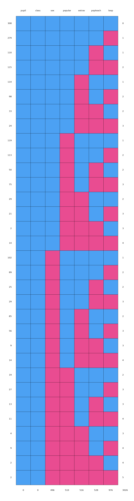

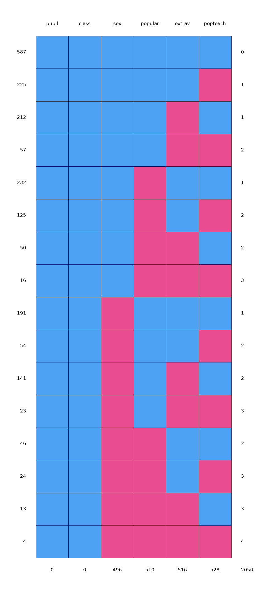

## 4. popular missingness vs popteach

In R the missingness indicator

`is.na(popNCR$popular)`

can be used to create a dummy variable for the missingness in `popular`. Alternatively, one can use the missingness indicator directly in a formula (as we will do below).

Does the missing data of `popular` depend on `popteach`? One could for example check this by making a histogram of `popteach` separately for the pupils with known popularity and missing popularity.

**Parity:** ✅ MATCH

### R code
```r
is.na(popNCR$popular)
```

### R output
```text
[1] FALSE FALSE FALSE FALSE  TRUE FALSE FALSE  TRUE  TRUE FALSE FALSE FALSE
  [13] FALSE  TRUE FALSE FALSE FALSE FALSE FALSE FALSE  TRUE FALSE FALSE FALSE
  [25] FALSE  TRUE  TRUE FALSE FALSE FALSE FALSE FALSE FALSE FALSE FALSE FALSE
  [37]  TRUE FALSE FALSE FALSE FALSE  TRUE FALSE FALSE FALSE FALSE FALSE FALSE
  [49] FALSE FALSE  TRUE FALSE FALSE FALSE FALSE FALSE FALSE FALSE FALSE FALSE
  [61] FALSE FALSE FALSE  TRUE  TRUE  TRUE FALSE FALSE FALSE  TRUE FALSE FALSE
  [73] FALSE  TRUE  TRUE FALSE FALSE FALSE FALSE  TRUE  TRUE FALSE FALSE FALSE
  [85] FALSE FALSE  TRUE FALSE FALSE FALSE  TRUE  TRUE FALSE FALSE FALSE FALSE
  [97] FALSE FALSE  TRUE FALSE  TRUE FALSE  TRUE FALSE FALSE FALSE FALSE FALSE
 [109] FALSE FALSE FALSE FALSE FALSE  TRUE  TRUE  TRUE FALSE FALSE FALSE  TRUE
 [121] FALSE  TRUE FALSE FALSE FALSE FALSE FALSE FALSE FALSE FALSE FALSE FALSE
 [133]  TRUE FALSE FALSE FALSE FALSE FALSE FALSE FALSE FALSE FALSE  TRUE FALSE
 [145] FALSE FALSE FALSE FALSE FALSE FALSE FALSE FALSE FALSE FALSE FALSE FALSE
 [157]  TRUE FALSE FALSE FALSE FALSE FALSE FALSE FALSE FALSE FALSE FALSE FALSE
 [169]  TRUE FALSE FALSE FALSE FALSE FALSE FALSE  TRUE FALSE FALSE FALSE FALSE
 [181] FALSE  TRUE FALSE FALSE  TRUE FALSE FALSE FALSE FALSE FALSE FALSE FALSE
 [193]  TRUE  TRUE  TRUE FALSE FALSE FALSE FALSE FALSE  TRUE FALSE  TRUE FALSE
 [205] FALSE FALSE  TRUE FALSE FALSE FALSE  TRUE FALSE FALSE FALSE  TRUE FALSE
 [217]  TRUE FALSE FALSE FALSE FALSE FALSE FALSE FALSE FALSE FALSE FALSE FALSE
 [229] FALSE FALSE FALSE FALSE  TRUE FALSE FALSE FALSE FALSE FALSE FALSE FALSE
 [241] FALSE FALSE FALSE FALSE  TRUE FALSE FALSE FALSE FALSE FALSE  TRUE  TRUE
 [253]  TRUE FALSE FALSE FALSE  TRUE FALSE FALSE FALSE  TRUE FALSE FALSE  TRUE
 [265] FALSE FALSE FALSE FALSE FALSE FALSE FALSE FALSE FALSE FALSE FALSE  TRUE
 [277]  TRUE  TRUE FALSE FALSE FALSE FALSE FALSE FALSE FALSE FALSE FALSE  TRUE
 [289] FALSE FALSE FALSE FALSE  TRUE  TRUE FALSE  TRUE FALSE  TRUE FALSE  TRUE
 [301]  TRUE  TRUE FALSE FALSE FALSE FALSE FALSE FALSE  TRUE FALSE FALSE FALSE
 [313] FALSE FALSE FALSE FALSE FALSE  TRUE FALSE FALSE FALSE FALSE FALSE FALSE
 [325] FALSE FALSE FALSE  TRUE FALSE FALSE  TRUE FALSE  TRUE  TRUE FALSE FALSE
 [337] FALSE FALSE FALSE  TRUE  TRUE FALSE FALSE FALSE FALSE FALSE FALSE FALSE
 [349] FALSE FALSE  TRUE  TRUE FALSE  TRUE FALSE FALSE FALSE  TRUE  TRUE FALSE
 [361] FALSE FALSE FALSE  TRUE FALSE  TRUE  TRUE  TRUE FALSE FALSE FALSE  TRUE
 [373] FALSE FALSE  TRUE FALSE FALSE FALSE FALSE FALSE FALSE  TRUE FALSE FALSE
 [385] FALSE FALSE FALSE  TRUE FALSE FALSE FALSE FALSE FALSE  TRUE FALSE FALSE
 [397] FALSE FALSE FALSE  TRUE FALSE FALSE  TRUE FALSE FALSE FALSE FALSE FALSE
 [409] FALSE  TRUE FALSE  TRUE FALSE FALSE FALSE FALSE FALSE FALSE FALSE FALSE
 [421] FALSE  TRUE FALSE FALSE FALSE  TRUE FALSE  TRUE  TRUE FALSE  TRUE FALSE
 [433] FALSE FALSE FALSE FALSE FALSE FALSE  TRUE FALSE FALSE FALSE  TRUE FALSE
 [445] FALSE FALSE  TRUE  TRUE  TRUE  TRUE  TRUE  TRUE  TRUE  TRUE FALSE  TRUE
 [457]  TRUE FALSE FALSE  TRUE FALSE FALSE  TRUE FALSE FALSE FALSE  TRUE FALSE
 [469] FALSE FALSE FALSE FALSE  TRUE FALSE  TRUE FALSE FALSE FALSE FALSE FALSE
 [481] FALSE  TRUE  TRUE  TRUE FALSE FALSE FALSE FALSE FALSE FALSE FALSE FALSE
 [493] FALSE FALSE FALSE FALSE  TRUE  TRUE FALSE  TRUE FALSE FALSE FALSE FALSE
 [505] FALSE FALSE FALSE FALSE FALSE FALSE FALSE FALSE  TRUE FALSE  TRUE  TRUE
 [517] FALSE FALSE  TRUE FALSE FALSE  TRUE FALSE FALSE  TRUE FALSE FALSE FALSE
 [529] FALSE FALSE FALSE FALSE  TRUE FALSE FALSE FALSE FALSE FALSE FALSE FALSE
 [541] FALSE FALSE FALSE FALSE FALSE  TRUE FALSE FALSE FALSE FALSE FALSE  TRUE
 [553] FALSE FALSE  TRUE FALSE FALSE FALSE FALSE  TRUE FALSE FALSE FALSE FALSE
 [565]  TRUE  TRUE FALSE FALSE FALSE FALSE FALSE  TRUE  TRUE FALSE FALSE  TRUE
 [577] FALSE FALSE FALSE FALSE  TRUE FALSE  TRUE FALSE  TRUE FALSE FALSE FALSE
 [589]  TRUE FALSE  TRUE FALSE  TRUE FALSE FALSE FALSE FALSE  TRUE FALSE FALSE
 [601] FALSE  TRUE FALSE FALSE FALSE FALSE FALSE FALSE FALSE FALSE  TRUE  TRUE
 [613] FALSE  TRUE FALSE FALSE FALSE FALSE FALSE FALSE FALSE FALSE FALSE FALSE
 [625] FALSE FALSE FALSE  TRUE FALSE FALSE  TRUE FALSE FALSE FALSE FALSE FALSE
 [637] FALSE FALSE  TRUE FALSE FALSE FALSE FALSE  TRUE FALSE  TRUE FALSE FALSE
 [649]  TRUE FALSE FALSE  TRUE FALSE  TRUE FALSE  TRUE FALSE FALSE  TRUE  TRUE
 [661]  TRUE  TRUE FALSE  TRUE  TRUE  TRUE FALSE FALSE  TRUE  TRUE  TRUE FALSE
 [673] FALSE FALSE FALSE FALSE FALSE FALSE FALSE FALSE FALSE FALSE  TRUE FALSE
 [685]  TRUE FALSE FALSE  TRUE FALSE FALSE FALSE FALSE FALSE FALSE  TRUE  TRUE
 [697]  TRUE  TRUE  TRUE  TRUE FALSE FALSE FALSE FALSE  TRUE FALSE  TRUE FALSE
 [709]  TRUE  TRUE FALSE FALSE FALSE FALSE FALSE FALSE FALSE FALSE  TRUE FALSE
 [721] FALSE  TRUE  TRUE FALSE FALSE FALSE  TRUE FALSE  TRUE FALSE  TRUE FALSE
 [733] FALSE FALSE FALSE FALSE FALSE  TRUE  TRUE  TRUE FALSE FALSE  TRUE FALSE
 [745] FALSE FALSE  TRUE FALSE FALSE  TRUE FALSE FALSE FALSE FALSE FALSE FALSE
 [757] FALSE FALSE FALSE FALSE FALSE FALSE  TRUE FALSE  TRUE FALSE  TRUE FALSE
 [769] FALSE FALSE FALSE FALSE FALSE FALSE  TRUE FALSE FALSE FALSE FALSE  TRUE
 [781] FALSE FALSE FALSE FALSE FALSE FALSE FALSE  TRUE FALSE  TRUE FALSE  TRUE
 [793]  TRUE  TRUE FALSE  TRUE FALSE FALSE  TRUE FALSE FALSE FALSE  TRUE FALSE
 [805] FALSE FALSE FALSE FALSE FALSE FALSE FALSE  TRUE FALSE FALSE FALSE FALSE
 [817] FALSE FALSE  TRUE FALSE FALSE FALSE FALSE  TRUE FALSE FALSE FALSE FALSE
 [829] FALSE FALSE FALSE  TRUE FALSE FALSE FALSE FALSE FALSE FALSE FALSE FALSE
 [841]  TRUE FALSE FALSE FALSE  TRUE FALSE FALSE  TRUE FALSE FALSE FALSE FALSE
 [853] FALSE  TRUE FALSE  TRUE FALSE  TRUE  TRUE FALSE FALSE FALSE  TRUE FALSE
 [865] FALSE FALSE FALSE FALSE FALSE FALSE FALSE FALSE FALSE FALSE  TRUE  TRUE
 [877] FALSE FALSE FALSE FALSE FALSE FALSE FALSE FALSE FALSE FALSE FALSE  TRUE
 [889]  TRUE  TRUE  TRUE FALSE FALSE FALSE FALSE FALSE FALSE FALSE FALSE FALSE
 [901]  TRUE FALSE FALSE FALSE FALSE FALSE  TRUE FALSE FALSE FALSE  TRUE  TRUE
 [913] FALSE FALSE FALSE  TRUE FALSE  TRUE FALSE FALSE FALSE FALSE FALSE FALSE
 [925] FALSE FALSE  TRUE FALSE  TRUE  TRUE  TRUE FALSE  TRUE FALSE FALSE  TRUE
 [937] FALSE FALSE  TRUE  TRUE FALSE  TRUE FALSE FALSE FALSE FALSE FALSE FALSE
 [949] FALSE  TRUE FALSE  TRUE  TRUE FALSE  TRUE FALSE FALSE FALSE FALSE FALSE
 [961] FALSE  TRUE FALSE FALSE FALSE FALSE FALSE  TRUE FALSE FALSE FALSE FALSE
 [973] FALSE FALSE FALSE FALSE FALSE  TRUE FALSE  TRUE FALSE FALSE FALSE  TRUE
 [985] FALSE  TRUE  TRUE FALSE FALSE FALSE FALSE FALSE  TRUE FALSE FALSE FALSE
 [997]  TRUE  TRUE FALSE  TRUE FALSE  TRUE FALSE  TRUE FALSE FALSE FALSE FALSE
[1009] FALSE FALSE FALSE FALSE FALSE FALSE FALSE FALSE FALSE FALSE FALSE FALSE
[1021] FALSE FALSE FALSE FALSE FALSE FALSE FALSE FALSE FALSE FALSE  TRUE FALSE
[1033] FALSE FALSE FALSE FALSE  TRUE  TRUE FALSE FALSE FALSE  TRUE FALSE FALSE
[1045]  TRUE  TRUE FALSE  TRUE  TRUE FALSE  TRUE  TRUE FALSE FALSE  TRUE FALSE
[1057] FALSE  TRUE FALSE  TRUE FALSE FALSE  TRUE FALSE FALSE FALSE FALSE FALSE
[1069] FALSE  TRUE FALSE FALSE FALSE FALSE FALSE FALSE FALSE FALSE  TRUE FALSE
[1081]  TRUE FALSE FALSE FALSE FALSE FALSE FALSE FALSE FALSE FALSE FALSE FALSE
[1093] FALSE FALSE FALSE FALSE FALSE  TRUE  TRUE FALSE FALSE FALSE FALSE FALSE
[1105] FALSE FALSE FALSE FALSE FALSE  TRUE FALSE FALSE FALSE FALSE  TRUE FALSE
[1117] FALSE FALSE FALSE FALSE FALSE FALSE FALSE FALSE FALSE FALSE FALSE  TRUE
[1129] FALSE FALSE FALSE FALSE FALSE FALSE FALSE FALSE FALSE FALSE FALSE FALSE
[1141] FALSE FALSE  TRUE FALSE FALSE  TRUE FALSE  TRUE  TRUE  TRUE FALSE FALSE
[1153] FALSE FALSE  TRUE FALSE FALSE FALSE  TRUE FALSE FALSE FALSE FALSE FALSE
[1165] FALSE FALSE FALSE FALSE FALSE FALSE FALSE FALSE  TRUE FALSE  TRUE FALSE
[1177] FALSE FALSE  TRUE FALSE FALSE  TRUE FALSE FALSE FALSE FALSE FALSE FALSE
[1189] FALSE FALSE FALSE  TRUE FALSE FALSE FALSE FALSE FALSE FALSE FALSE FALSE
[1201]  TRUE FALSE FALSE FALSE FALSE FALSE FALSE FALSE  TRUE FALSE  TRUE  TRUE
[1213] FALSE FALSE FALSE  TRUE FALSE FALSE FALSE  TRUE FALSE FALSE FALSE FALSE
[1225] FALSE FALSE FALSE FALSE FALSE FALSE FALSE FALSE  TRUE FALSE FALSE  TRUE
[1237] FALSE FALSE FALSE FALSE FALSE FALSE FALSE FALSE FALSE FALSE  TRUE FALSE
[1249] FALSE FALSE FALSE  TRUE  TRUE FALSE FALSE FALSE FALSE FALSE  TRUE FALSE
[1261] FALSE FALSE FALSE  TRUE  TRUE  TRUE  TRUE  TRUE  TRUE  TRUE  TRUE FALSE
[1273]  TRUE FALSE FALSE  TRUE  TRUE  TRUE FALSE  TRUE FALSE FALSE  TRUE FALSE
[1285] FALSE  TRUE  TRUE FALSE FALSE FALSE FALSE  TRUE FALSE  TRUE FALSE FALSE
[1297] FALSE FALSE FALSE  TRUE  TRUE FALSE  TRUE  TRUE FALSE  TRUE FALSE FALSE
[1309] FALSE  TRUE  TRUE FALSE FALSE FALSE FALSE  TRUE FALSE  TRUE FALSE FALSE
[1321] FALSE  TRUE FALSE FALSE FALSE  TRUE  TRUE FALSE FALSE FALSE FALSE  TRUE
[1333]  TRUE  TRUE FALSE  TRUE FALSE  TRUE FALSE FALSE  TRUE  TRUE  TRUE  TRUE
[1345] FALSE  TRUE  TRUE FALSE FALSE FALSE FALSE FALSE FALSE  TRUE FALSE FALSE
[1357] FALSE  TRUE  TRUE  TRUE FALSE  TRUE FALSE FALSE FALSE FALSE FALSE FALSE
[1369] FALSE  TRUE FALSE FALSE FALSE FALSE FALSE  TRUE  TRUE FALSE  TRUE FALSE
[1381] FALSE FALSE  TRUE  TRUE  TRUE  TRUE FALSE FALSE FALSE FALSE  TRUE FALSE
[1393] FALSE  TRUE FALSE FALSE  TRUE  TRUE FALSE FALSE FALSE  TRUE FALSE FALSE
[1405]  TRUE FALSE FALSE FALSE FALSE  TRUE FALSE  TRUE  TRUE  TRUE FALSE FALSE
[1417] FALSE FALSE FALSE FALSE FALSE FALSE FALSE FALSE FALSE  TRUE  TRUE FALSE
[1429]  TRUE FALSE FALSE FALSE  TRUE FALSE FALSE FALSE FALSE FALSE  TRUE FALSE
[1441]  TRUE FALSE  TRUE FALSE  TRUE  TRUE FALSE FALSE FALSE FALSE FALSE FALSE
[1453]  TRUE FALSE FALSE FALSE FALSE FALSE FALSE FALSE FALSE  TRUE FALSE FALSE
[1465] FALSE FALSE  TRUE  TRUE  TRUE FALSE FALSE FALSE FALSE  TRUE  TRUE FALSE
[1477]  TRUE FALSE  TRUE  TRUE  TRUE FALSE FALSE  TRUE FALSE FALSE FALSE FALSE
[1489] FALSE  TRUE FALSE  TRUE FALSE  TRUE FALSE FALSE FALSE FALSE FALSE FALSE
[1501]  TRUE  TRUE  TRUE FALSE FALSE  TRUE FALSE FALSE FALSE FALSE FALSE FALSE
[1513] FALSE  TRUE  TRUE FALSE FALSE FALSE FALSE  TRUE FALSE FALSE  TRUE FALSE
[1525] FALSE FALSE FALSE FALSE FALSE FALSE FALSE FALSE FALSE FALSE FALSE  TRUE
[1537]  TRUE FALSE FALSE FALSE FALSE FALSE FALSE FALSE FALSE FALSE FALSE FALSE
[1549]  TRUE  TRUE FALSE FALSE  TRUE  TRUE  TRUE  TRUE FALSE FALSE FALSE  TRUE
[1561] FALSE  TRUE FALSE FALSE  TRUE FALSE FALSE FALSE  TRUE FALSE FALSE  TRUE
[1573] FALSE  TRUE FALSE FALSE FALSE FALSE  TRUE FALSE FALSE FALSE FALSE FALSE
[1585] FALSE FALSE FALSE FALSE FALSE FALSE FALSE  TRUE FALSE FALSE FALSE FALSE
[1597] FALSE FALSE FALSE FALSE FALSE FALSE FALSE FALSE FALSE  TRUE FALSE FALSE
[1609] FALSE  TRUE  TRUE FALSE FALSE FALSE FALSE FALSE FALSE FALSE FALSE FALSE
[1621] FALSE FALSE FALSE FALSE FALSE FALSE FALSE FALSE FALSE FALSE  TRUE FALSE
[1633] FALSE FALSE FALSE FALSE FALSE FALSE FALSE FALSE FALSE FALSE FALSE FALSE
[1645] FALSE  TRUE  TRUE FALSE FALSE  TRUE  TRUE  TRUE FALSE FALSE  TRUE  TRUE
[1657] FALSE  TRUE FALSE  TRUE FALSE  TRUE  TRUE FALSE  TRUE  TRUE  TRUE FALSE
[1669]  TRUE FALSE  TRUE  TRUE FALSE  TRUE FALSE FALSE  TRUE  TRUE  TRUE FALSE
[1681] FALSE FALSE  TRUE  TRUE FALSE  TRUE  TRUE FALSE FALSE  TRUE FALSE FALSE
[1693] FALSE FALSE FALSE FALSE FALSE FALSE FALSE FALSE FALSE  TRUE  TRUE FALSE
[1705] FALSE  TRUE FALSE FALSE FALSE  TRUE  TRUE  TRUE FALSE FALSE FALSE FALSE
[1717] FALSE FALSE FALSE  TRUE  TRUE FALSE  TRUE FALSE  TRUE FALSE FALSE FALSE
[1729] FALSE  TRUE FALSE FALSE FALSE FALSE FALSE FALSE FALSE FALSE FALSE FALSE
[1741] FALSE FALSE FALSE  TRUE FALSE FALSE FALSE FALSE FALSE FALSE FALSE  TRUE
[1753] FALSE FALSE FALSE  TRUE FALSE FALSE FALSE FALSE FALSE FALSE  TRUE FALSE
[1765] FALSE FALSE  TRUE FALSE FALSE FALSE FALSE  TRUE FALSE FALSE FALSE FALSE
[1777] FALSE FALSE  TRUE  TRUE FALSE FALSE FALSE FALSE  TRUE FALSE  TRUE  TRUE
[1789]  TRUE FALSE FALSE  TRUE FALSE  TRUE  TRUE FALSE FALSE FALSE  TRUE  TRUE
[1801]  TRUE FALSE FALSE FALSE FALSE FALSE FALSE FALSE FALSE  TRUE FALSE FALSE
[1813] FALSE FALSE FALSE FALSE  TRUE FALSE FALSE FALSE  TRUE FALSE FALSE FALSE
[1825] FALSE FALSE FALSE FALSE  TRUE FALSE FALSE FALSE FALSE FALSE FALSE FALSE
[1837] FALSE FALSE FALSE FALSE FALSE FALSE FALSE  TRUE FALSE FALSE FALSE  TRUE
[1849] FALSE FALSE FALSE  TRUE FALSE FALSE  TRUE FALSE FALSE FALSE FALSE FALSE
[1861] FALSE FALSE  TRUE FALSE FALSE FALSE FALSE FALSE FALSE FALSE FALSE FALSE
[1873] FALSE FALSE FALSE FALSE FALSE FALSE FALSE FALSE FALSE FALSE FALSE FALSE
[1885] FALSE  TRUE FALSE FALSE  TRUE  TRUE FALSE FALSE  TRUE FALSE  TRUE  TRUE
[1897] FALSE FALSE FALSE FALSE FALSE FALSE FALSE  TRUE  TRUE  TRUE  TRUE FALSE
[1909] FALSE FALSE FALSE FALSE  TRUE FALSE  TRUE  TRUE FALSE FALSE FALSE FALSE
[1921]  TRUE FALSE FALSE FALSE FALSE FALSE FALSE FALSE FALSE FALSE FALSE FALSE
[1933]  TRUE FALSE FALSE FALSE  TRUE FALSE  TRUE FALSE FALSE FALSE FALSE FALSE
[1945] FALSE FALSE  TRUE  TRUE  TRUE FALSE FALSE  TRUE  TRUE FALSE FALSE  TRUE
[1957] FALSE  TRUE FALSE  TRUE FALSE FALSE FALSE FALSE  TRUE FALSE  TRUE FALSE
[1969] FALSE FALSE  TRUE FALSE FALSE FALSE FALSE FALSE FALSE  TRUE FALSE FALSE
[1981] FALSE FALSE FALSE FALSE FALSE FALSE FALSE FALSE FALSE FALSE FALSE  TRUE
[1993] FALSE FALSE FALSE  TRUE FALSE  TRUE FALSE FALSE
```

### Python code
```python
print(format_bool_vector_r(pop_miss, max_lines=None, width=12))
```

### Output
```text
[1] FALSE FALSE FALSE FALSE  TRUE FALSE FALSE  TRUE  TRUE FALSE FALSE FALSE
  [13] FALSE  TRUE FALSE FALSE FALSE FALSE FALSE FALSE  TRUE FALSE FALSE FALSE
  [25] FALSE  TRUE  TRUE FALSE FALSE FALSE FALSE FALSE FALSE FALSE FALSE FALSE
  [37]  TRUE FALSE FALSE FALSE FALSE  TRUE FALSE FALSE FALSE FALSE FALSE FALSE
  [49] FALSE FALSE  TRUE FALSE FALSE FALSE FALSE FALSE FALSE FALSE FALSE FALSE
  [61] FALSE FALSE FALSE  TRUE  TRUE  TRUE FALSE FALSE FALSE  TRUE FALSE FALSE
  [73] FALSE  TRUE  TRUE FALSE FALSE FALSE FALSE  TRUE  TRUE FALSE FALSE FALSE
  [85] FALSE FALSE  TRUE FALSE FALSE FALSE  TRUE  TRUE FALSE FALSE FALSE FALSE
  [97] FALSE FALSE  TRUE FALSE  TRUE FALSE  TRUE FALSE FALSE FALSE FALSE FALSE
  [109] FALSE FALSE FALSE FALSE FALSE  TRUE  TRUE  TRUE FALSE FALSE FALSE  TRUE
  [121] FALSE  TRUE FALSE FALSE FALSE FALSE FALSE FALSE FALSE FALSE FALSE FALSE
  [133]  TRUE FALSE FALSE FALSE FALSE FALSE FALSE FALSE FALSE FALSE  TRUE FALSE
  [145] FALSE FALSE FALSE FALSE FALSE FALSE FALSE FALSE FALSE FALSE FALSE FALSE
  [157]  TRUE FALSE FALSE FALSE FALSE FALSE FALSE FALSE FALSE FALSE FALSE FALSE
  [169]  TRUE FALSE FALSE FALSE FALSE FALSE FALSE  TRUE FALSE FALSE FALSE FALSE
  [181] FALSE  TRUE FALSE FALSE  TRUE FALSE FALSE FALSE FALSE FALSE FALSE FALSE
  [193]  TRUE  TRUE  TRUE FALSE FALSE FALSE FALSE FALSE  TRUE FALSE  TRUE FALSE
  [205] FALSE FALSE  TRUE FALSE FALSE FALSE  TRUE FALSE FALSE FALSE  TRUE FALSE
  [217]  TRUE FALSE FALSE FALSE FALSE FALSE FALSE FALSE FALSE FALSE FALSE FALSE
  [229] FALSE FALSE FALSE FALSE  TRUE FALSE FALSE FALSE FALSE FALSE FALSE FALSE
  [241] FALSE FALSE FALSE FALSE  TRUE FALSE FALSE FALSE FALSE FALSE  TRUE  TRUE
  [253]  TRUE FALSE FALSE FALSE  TRUE FALSE FALSE FALSE  TRUE FALSE FALSE  TRUE
  [265] FALSE FALSE FALSE FALSE FALSE FALSE FALSE FALSE FALSE FALSE FALSE  TRUE
  [277]  TRUE  TRUE FALSE FALSE FALSE FALSE FALSE FALSE FALSE FALSE FALSE  TRUE
  [289] FALSE FALSE FALSE FALSE  TRUE  TRUE FALSE  TRUE FALSE  TRUE FALSE  TRUE
  [301]  TRUE  TRUE FALSE FALSE FALSE FALSE FALSE FALSE  TRUE FALSE FALSE FALSE
  [313] FALSE FALSE FALSE FALSE FALSE  TRUE FALSE FALSE FALSE FALSE FALSE FALSE
  [325] FALSE FALSE FALSE  TRUE FALSE FALSE  TRUE FALSE  TRUE  TRUE FALSE FALSE
  [337] FALSE FALSE FALSE  TRUE  TRUE FALSE FALSE FALSE FALSE FALSE FALSE FALSE
  [349] FALSE FALSE  TRUE  TRUE FALSE  TRUE FALSE FALSE FALSE  TRUE  TRUE FALSE
  [361] FALSE FALSE FALSE  TRUE FALSE  TRUE  TRUE  TRUE FALSE FALSE FALSE  TRUE
  [373] FALSE FALSE  TRUE FALSE FALSE FALSE FALSE FALSE FALSE  TRUE FALSE FALSE
  [385] FALSE FALSE FALSE  TRUE FALSE FALSE FALSE FALSE FALSE  TRUE FALSE FALSE
  [397] FALSE FALSE FALSE  TRUE FALSE FALSE  TRUE FALSE FALSE FALSE FALSE FALSE
  [409] FALSE  TRUE FALSE  TRUE FALSE FALSE FALSE FALSE FALSE FALSE FALSE FALSE
  [421] FALSE  TRUE FALSE FALSE FALSE  TRUE FALSE  TRUE  TRUE FALSE  TRUE FALSE
  [433] FALSE FALSE FALSE FALSE FALSE FALSE  TRUE FALSE FALSE FALSE  TRUE FALSE
  [445] FALSE FALSE  TRUE  TRUE  TRUE  TRUE  TRUE  TRUE  TRUE  TRUE FALSE  TRUE
  [457]  TRUE FALSE FALSE  TRUE FALSE FALSE  TRUE FALSE FALSE FALSE  TRUE FALSE
  [469] FALSE FALSE FALSE FALSE  TRUE FALSE  TRUE FALSE FALSE FALSE FALSE FALSE
  [481] FALSE  TRUE  TRUE  TRUE FALSE FALSE FALSE FALSE FALSE FALSE FALSE FALSE
  [493] FALSE FALSE FALSE FALSE  TRUE  TRUE FALSE  TRUE FALSE FALSE FALSE FALSE
  [505] FALSE FALSE FALSE FALSE FALSE FALSE FALSE FALSE  TRUE FALSE  TRUE  TRUE
  [517] FALSE FALSE  TRUE FALSE FALSE  TRUE FALSE FALSE  TRUE FALSE FALSE FALSE
  [529] FALSE FALSE FALSE FALSE  TRUE FALSE FALSE FALSE FALSE FALSE FALSE FALSE
  [541] FALSE FALSE FALSE FALSE FALSE  TRUE FALSE FALSE FALSE FALSE FALSE  TRUE
  [553] FALSE FALSE  TRUE FALSE FALSE FALSE FALSE  TRUE FALSE FALSE FALSE FALSE
  [565]  TRUE  TRUE FALSE FALSE FALSE FALSE FALSE  TRUE  TRUE FALSE FALSE  TRUE
  [577] FALSE FALSE FALSE FALSE  TRUE FALSE  TRUE FALSE  TRUE FALSE FALSE FALSE
  [589]  TRUE FALSE  TRUE FALSE  TRUE FALSE FALSE FALSE FALSE  TRUE FALSE FALSE
  [601] FALSE  TRUE FALSE FALSE FALSE FALSE FALSE FALSE FALSE FALSE  TRUE  TRUE
  [613] FALSE  TRUE FALSE FALSE FALSE FALSE FALSE FALSE FALSE FALSE FALSE FALSE
  [625] FALSE FALSE FALSE  TRUE FALSE FALSE  TRUE FALSE FALSE FALSE FALSE FALSE
  [637] FALSE FALSE  TRUE FALSE FALSE FALSE FALSE  TRUE FALSE  TRUE FALSE FALSE
  [649]  TRUE FALSE FALSE  TRUE FALSE  TRUE FALSE  TRUE FALSE FALSE  TRUE  TRUE
  [661]  TRUE  TRUE FALSE  TRUE  TRUE  TRUE FALSE FALSE  TRUE  TRUE  TRUE FALSE
  [673] FALSE FALSE FALSE FALSE FALSE FALSE FALSE FALSE FALSE FALSE  TRUE FALSE
  [685]  TRUE FALSE FALSE  TRUE FALSE FALSE FALSE FALSE FALSE FALSE  TRUE  TRUE
  [697]  TRUE  TRUE  TRUE  TRUE FALSE FALSE FALSE FALSE  TRUE FALSE  TRUE FALSE
  [709]  TRUE  TRUE FALSE FALSE FALSE FALSE FALSE FALSE FALSE FALSE  TRUE FALSE
  [721] FALSE  TRUE  TRUE FALSE FALSE FALSE  TRUE FALSE  TRUE FALSE  TRUE FALSE
  [733] FALSE FALSE FALSE FALSE FALSE  TRUE  TRUE  TRUE FALSE FALSE  TRUE FALSE
  [745] FALSE FALSE  TRUE FALSE FALSE  TRUE FALSE FALSE FALSE FALSE FALSE FALSE
  [757] FALSE FALSE FALSE FALSE FALSE FALSE  TRUE FALSE  TRUE FALSE  TRUE FALSE
  [769] FALSE FALSE FALSE FALSE FALSE FALSE  TRUE FALSE FALSE FALSE FALSE  TRUE
  [781] FALSE FALSE FALSE FALSE FALSE FALSE FALSE  TRUE FALSE  TRUE FALSE  TRUE
  [793]  TRUE  TRUE FALSE  TRUE FALSE FALSE  TRUE FALSE FALSE FALSE  TRUE FALSE
  [805] FALSE FALSE FALSE FALSE FALSE FALSE FALSE  TRUE FALSE FALSE FALSE FALSE
  [817] FALSE FALSE  TRUE FALSE FALSE FALSE FALSE  TRUE FALSE FALSE FALSE FALSE
  [829] FALSE FALSE FALSE  TRUE FALSE FALSE FALSE FALSE FALSE FALSE FALSE FALSE
  [841]  TRUE FALSE FALSE FALSE  TRUE FALSE FALSE  TRUE FALSE FALSE FALSE FALSE
  [853] FALSE  TRUE FALSE  TRUE FALSE  TRUE  TRUE FALSE FALSE FALSE  TRUE FALSE
  [865] FALSE FALSE FALSE FALSE FALSE FALSE FALSE FALSE FALSE FALSE  TRUE  TRUE
  [877] FALSE FALSE FALSE FALSE FALSE FALSE FALSE FALSE FALSE FALSE FALSE  TRUE
  [889]  TRUE  TRUE  TRUE FALSE FALSE FALSE FALSE FALSE FALSE FALSE FALSE FALSE
  [901]  TRUE FALSE FALSE FALSE FALSE FALSE  TRUE FALSE FALSE FALSE  TRUE  TRUE
  [913] FALSE FALSE FALSE  TRUE FALSE  TRUE FALSE FALSE FALSE FALSE FALSE FALSE
  [925] FALSE FALSE  TRUE FALSE  TRUE  TRUE  TRUE FALSE  TRUE FALSE FALSE  TRUE
  [937] FALSE FALSE  TRUE  TRUE FALSE  TRUE FALSE FALSE FALSE FALSE FALSE FALSE
  [949] FALSE  TRUE FALSE  TRUE  TRUE FALSE  TRUE FALSE FALSE FALSE FALSE FALSE
  [961] FALSE  TRUE FALSE FALSE FALSE FALSE FALSE  TRUE FALSE FALSE FALSE FALSE
  [973] FALSE FALSE FALSE FALSE FALSE  TRUE FALSE  TRUE FALSE FALSE FALSE  TRUE
  [985] FALSE  TRUE  TRUE FALSE FALSE FALSE FALSE FALSE  TRUE FALSE FALSE FALSE
  [997]  TRUE  TRUE FALSE  TRUE FALSE  TRUE FALSE  TRUE FALSE FALSE FALSE FALSE
  [1009] FALSE FALSE FALSE FALSE FALSE FALSE FALSE FALSE FALSE FALSE FALSE FALSE
  [1021] FALSE FALSE FALSE FALSE FALSE FALSE FALSE FALSE FALSE FALSE  TRUE FALSE
  [1033] FALSE FALSE FALSE FALSE  TRUE  TRUE FALSE FALSE FALSE  TRUE FALSE FALSE
  [1045]  TRUE  TRUE FALSE  TRUE  TRUE FALSE  TRUE  TRUE FALSE FALSE  TRUE FALSE
  [1057] FALSE  TRUE FALSE  TRUE FALSE FALSE  TRUE FALSE FALSE FALSE FALSE FALSE
  [1069] FALSE  TRUE FALSE FALSE FALSE FALSE FALSE FALSE FALSE FALSE  TRUE FALSE
  [1081]  TRUE FALSE FALSE FALSE FALSE FALSE FALSE FALSE FALSE FALSE FALSE FALSE
  [1093] FALSE FALSE FALSE FALSE FALSE  TRUE  TRUE FALSE FALSE FALSE FALSE FALSE
  [1105] FALSE FALSE FALSE FALSE FALSE  TRUE FALSE FALSE FALSE FALSE  TRUE FALSE
  [1117] FALSE FALSE FALSE FALSE FALSE FALSE FALSE FALSE FALSE FALSE FALSE  TRUE
  [1129] FALSE FALSE FALSE FALSE FALSE FALSE FALSE FALSE FALSE FALSE FALSE FALSE
  [1141] FALSE FALSE  TRUE FALSE FALSE  TRUE FALSE  TRUE  TRUE  TRUE FALSE FALSE
  [1153] FALSE FALSE  TRUE FALSE FALSE FALSE  TRUE FALSE FALSE FALSE FALSE FALSE
  [1165] FALSE FALSE FALSE FALSE FALSE FALSE FALSE FALSE  TRUE FALSE  TRUE FALSE
  [1177] FALSE FALSE  TRUE FALSE FALSE  TRUE FALSE FALSE FALSE FALSE FALSE FALSE
  [1189] FALSE FALSE FALSE  TRUE FALSE FALSE FALSE FALSE FALSE FALSE FALSE FALSE
  [1201]  TRUE FALSE FALSE FALSE FALSE FALSE FALSE FALSE  TRUE FALSE  TRUE  TRUE
  [1213] FALSE FALSE FALSE  TRUE FALSE FALSE FALSE  TRUE FALSE FALSE FALSE FALSE
  [1225] FALSE FALSE FALSE FALSE FALSE FALSE FALSE FALSE  TRUE FALSE FALSE  TRUE
  [1237] FALSE FALSE FALSE FALSE FALSE FALSE FALSE FALSE FALSE FALSE  TRUE FALSE
  [1249] FALSE FALSE FALSE  TRUE  TRUE FALSE FALSE FALSE FALSE FALSE  TRUE FALSE
  [1261] FALSE FALSE FALSE  TRUE  TRUE  TRUE  TRUE  TRUE  TRUE  TRUE  TRUE FALSE
  [1273]  TRUE FALSE FALSE  TRUE  TRUE  TRUE FALSE  TRUE FALSE FALSE  TRUE FALSE
  [1285] FALSE  TRUE  TRUE FALSE FALSE FALSE FALSE  TRUE FALSE  TRUE FALSE FALSE
  [1297] FALSE FALSE FALSE  TRUE  TRUE FALSE  TRUE  TRUE FALSE  TRUE FALSE FALSE
  [1309] FALSE  TRUE  TRUE FALSE FALSE FALSE FALSE  TRUE FALSE  TRUE FALSE FALSE
  [1321] FALSE  TRUE FALSE FALSE FALSE  TRUE  TRUE FALSE FALSE FALSE FALSE  TRUE
  [1333]  TRUE  TRUE FALSE  TRUE FALSE  TRUE FALSE FALSE  TRUE  TRUE  TRUE  TRUE
  [1345] FALSE  TRUE  TRUE FALSE FALSE FALSE FALSE FALSE FALSE  TRUE FALSE FALSE
  [1357] FALSE  TRUE  TRUE  TRUE FALSE  TRUE FALSE FALSE FALSE FALSE FALSE FALSE
  [1369] FALSE  TRUE FALSE FALSE FALSE FALSE FALSE  TRUE  TRUE FALSE  TRUE FALSE
  [1381] FALSE FALSE  TRUE  TRUE  TRUE  TRUE FALSE FALSE FALSE FALSE  TRUE FALSE
  [1393] FALSE  TRUE FALSE FALSE  TRUE  TRUE FALSE FALSE FALSE  TRUE FALSE FALSE
  [1405]  TRUE FALSE FALSE FALSE FALSE  TRUE FALSE  TRUE  TRUE  TRUE FALSE FALSE
  [1417] FALSE FALSE FALSE FALSE FALSE FALSE FALSE FALSE FALSE  TRUE  TRUE FALSE
  [1429]  TRUE FALSE FALSE FALSE  TRUE FALSE FALSE FALSE FALSE FALSE  TRUE FALSE
  [1441]  TRUE FALSE  TRUE FALSE  TRUE  TRUE FALSE FALSE FALSE FALSE FALSE FALSE
  [1453]  TRUE FALSE FALSE FALSE FALSE FALSE FALSE FALSE FALSE  TRUE FALSE FALSE
  [1465] FALSE FALSE  TRUE  TRUE  TRUE FALSE FALSE FALSE FALSE  TRUE  TRUE FALSE
  [1477]  TRUE FALSE  TRUE  TRUE  TRUE FALSE FALSE  TRUE FALSE FALSE FALSE FALSE
  [1489] FALSE  TRUE FALSE  TRUE FALSE  TRUE FALSE FALSE FALSE FALSE FALSE FALSE
  [1501]  TRUE  TRUE  TRUE FALSE FALSE  TRUE FALSE FALSE FALSE FALSE FALSE FALSE
  [1513] FALSE  TRUE  TRUE FALSE FALSE FALSE FALSE  TRUE FALSE FALSE  TRUE FALSE
  [1525] FALSE FALSE FALSE FALSE FALSE FALSE FALSE FALSE FALSE FALSE FALSE  TRUE
  [1537]  TRUE FALSE FALSE FALSE FALSE FALSE FALSE FALSE FALSE FALSE FALSE FALSE
  [1549]  TRUE  TRUE FALSE FALSE  TRUE  TRUE  TRUE  TRUE FALSE FALSE FALSE  TRUE
  [1561] FALSE  TRUE FALSE FALSE  TRUE FALSE FALSE FALSE  TRUE FALSE FALSE  TRUE
  [1573] FALSE  TRUE FALSE FALSE FALSE FALSE  TRUE FALSE FALSE FALSE FALSE FALSE
  [1585] FALSE FALSE FALSE FALSE FALSE FALSE FALSE  TRUE FALSE FALSE FALSE FALSE
  [1597] FALSE FALSE FALSE FALSE FALSE FALSE FALSE FALSE FALSE  TRUE FALSE FALSE
  [1609] FALSE  TRUE  TRUE FALSE FALSE FALSE FALSE FALSE FALSE FALSE FALSE FALSE
  [1621] FALSE FALSE FALSE FALSE FALSE FALSE FALSE FALSE FALSE FALSE  TRUE FALSE
  [1633] FALSE FALSE FALSE FALSE FALSE FALSE FALSE FALSE FALSE FALSE FALSE FALSE
  [1645] FALSE  TRUE  TRUE FALSE FALSE  TRUE  TRUE  TRUE FALSE FALSE  TRUE  TRUE
  [1657] FALSE  TRUE FALSE  TRUE FALSE  TRUE  TRUE FALSE  TRUE  TRUE  TRUE FALSE
  [1669]  TRUE FALSE  TRUE  TRUE FALSE  TRUE FALSE FALSE  TRUE  TRUE  TRUE FALSE
  [1681] FALSE FALSE  TRUE  TRUE FALSE  TRUE  TRUE FALSE FALSE  TRUE FALSE FALSE
  [1693] FALSE FALSE FALSE FALSE FALSE FALSE FALSE FALSE FALSE  TRUE  TRUE FALSE
  [1705] FALSE  TRUE FALSE FALSE FALSE  TRUE  TRUE  TRUE FALSE FALSE FALSE FALSE
  [1717] FALSE FALSE FALSE  TRUE  TRUE FALSE  TRUE FALSE  TRUE FALSE FALSE FALSE
  [1729] FALSE  TRUE FALSE FALSE FALSE FALSE FALSE FALSE FALSE FALSE FALSE FALSE
  [1741] FALSE FALSE FALSE  TRUE FALSE FALSE FALSE FALSE FALSE FALSE FALSE  TRUE
  [1753] FALSE FALSE FALSE  TRUE FALSE FALSE FALSE FALSE FALSE FALSE  TRUE FALSE
  [1765] FALSE FALSE  TRUE FALSE FALSE FALSE FALSE  TRUE FALSE FALSE FALSE FALSE
  [1777] FALSE FALSE  TRUE  TRUE FALSE FALSE FALSE FALSE  TRUE FALSE  TRUE  TRUE
  [1789]  TRUE FALSE FALSE  TRUE FALSE  TRUE  TRUE FALSE FALSE FALSE  TRUE  TRUE
  [1801]  TRUE FALSE FALSE FALSE FALSE FALSE FALSE FALSE FALSE  TRUE FALSE FALSE
  [1813] FALSE FALSE FALSE FALSE  TRUE FALSE FALSE FALSE  TRUE FALSE FALSE FALSE
  [1825] FALSE FALSE FALSE FALSE  TRUE FALSE FALSE FALSE FALSE FALSE FALSE FALSE
  [1837] FALSE FALSE FALSE FALSE FALSE FALSE FALSE  TRUE FALSE FALSE FALSE  TRUE
  [1849] FALSE FALSE FALSE  TRUE FALSE FALSE  TRUE FALSE FALSE FALSE FALSE FALSE
  [1861] FALSE FALSE  TRUE FALSE FALSE FALSE FALSE FALSE FALSE FALSE FALSE FALSE
  [1873] FALSE FALSE FALSE FALSE FALSE FALSE FALSE FALSE FALSE FALSE FALSE FALSE
  [1885] FALSE  TRUE FALSE FALSE  TRUE  TRUE FALSE FALSE  TRUE FALSE  TRUE  TRUE
  [1897] FALSE FALSE FALSE FALSE FALSE FALSE FALSE  TRUE  TRUE  TRUE  TRUE FALSE
  [1909] FALSE FALSE FALSE FALSE  TRUE FALSE  TRUE  TRUE FALSE FALSE FALSE FALSE
  [1921]  TRUE FALSE FALSE FALSE FALSE FALSE FALSE FALSE FALSE FALSE FALSE FALSE
  [1933]  TRUE FALSE FALSE FALSE  TRUE FALSE  TRUE FALSE FALSE FALSE FALSE FALSE
  [1945] FALSE FALSE  TRUE  TRUE  TRUE FALSE FALSE  TRUE  TRUE FALSE FALSE  TRUE
  [1957] FALSE  TRUE FALSE  TRUE FALSE FALSE FALSE FALSE  TRUE FALSE  TRUE FALSE
  [1969] FALSE FALSE  TRUE FALSE FALSE FALSE FALSE FALSE FALSE  TRUE FALSE FALSE
  [1981] FALSE FALSE FALSE FALSE FALSE FALSE FALSE FALSE FALSE FALSE FALSE  TRUE
  [1993] FALSE FALSE FALSE  TRUE FALSE  TRUE FALSE FALSE
```

**Parity:** ⚠️ PARTIAL
**Note:** Matplotlib equivalent of the R lattice plot.

### R code
```r
histogram(~ popteach | is.na(popular), data=popNCR)
```

### Python code
```python
plot_histogram(data, names, 'popteach', condition=pop_miss)
```

### Output
```text
(plot below)
```

The histogram shows that the missingness in `popular` is not equally distributed across `popteach`. The missingness in `popular` is right-tailed.

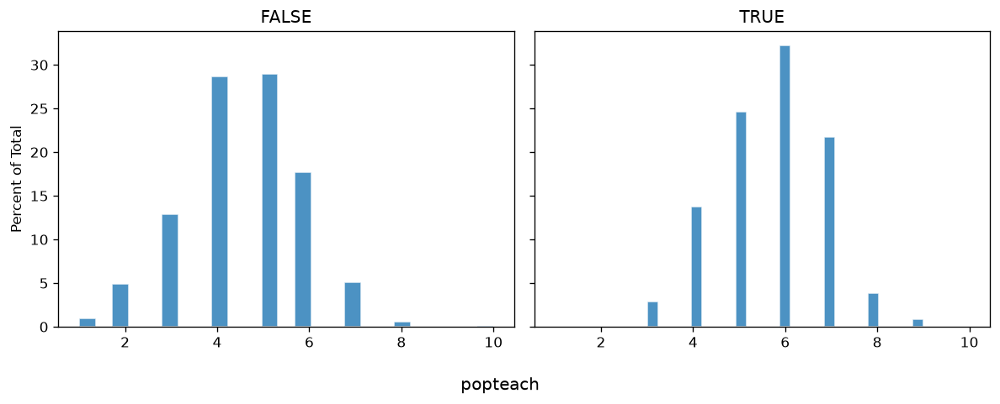

## 5. Other missingness vs popteach

**Parity:** ⚠️ PARTIAL
**Note:** Matplotlib equivalent of the R lattice plot.

### R code
```r
histogram(~ popteach | is.na(sex), data = popNCR)
```

### Python code
```python
plot_histogram(data, names, 'popteach', condition=np.isnan(data[:, names.index('sex')]))
```

### Output
```text
(plot below)
```

**Parity:** ⚠️ PARTIAL
**Note:** Matplotlib equivalent of the R lattice plot.

### R code
```r
histogram(~ popteach | is.na(extrav), data = popNCR)
```

### Python code
```python
plot_histogram(data, names, 'popteach', condition=np.isnan(data[:, names.index('extrav')]))
```

### Output
```text
(plot below)
```

**Parity:** ⚠️ PARTIAL
**Note:** Matplotlib equivalent of the R lattice plot.

### R code
```r
histogram(~ popteach | is.na(texp), data = popNCR)
```

### Python code
```python
plot_histogram(data, names, 'popteach', condition=np.isnan(data[:, texp_i]))
```

### Output
```text
(plot below)
```

There seems to be a left-tailed relation between `popteach` and the missingness in `sex`.

There also seems to be a left-tailed relation between `popteach` and the missingness in `extrav`.

There seems to be no observable relation between `popteach` and the missingness in `texp`. It might be MCAR or even MNAR.

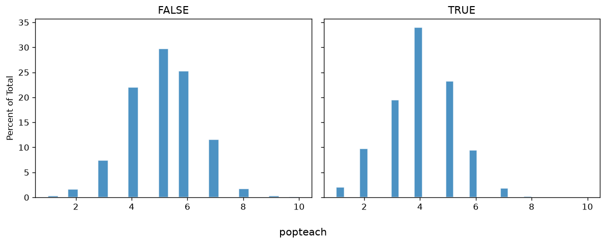

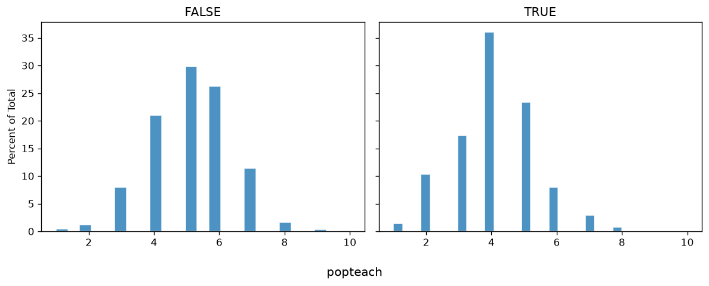

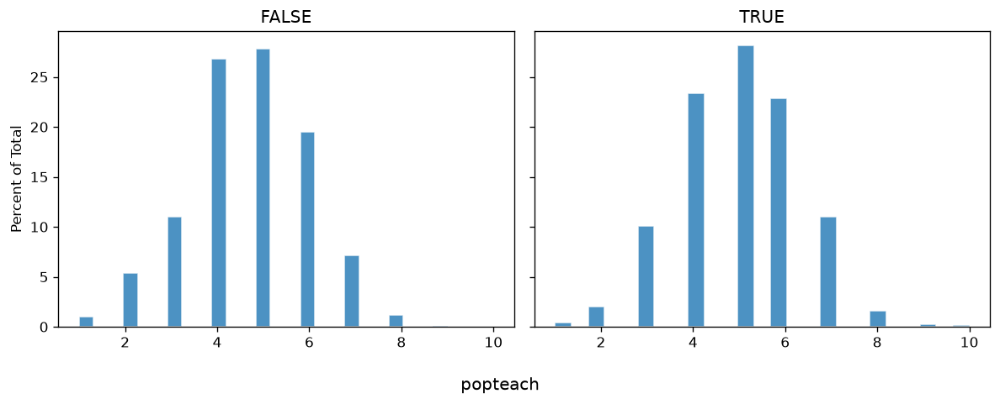

## 6. popteach missingness vs popular

**Parity:** ⚠️ PARTIAL
**Note:** Matplotlib equivalent of the R lattice plot.

### R code
```r
histogram(~ popular | is.na(popteach), data = popNCR)
```

### Python code
```python
plot_histogram(data, names, 'popular', condition=np.isnan(data[:, names.index('popteach')]))
```

### Output
```text
(plot below)
```

Yes: there is a dependency. The relation seems to be right-tailed.

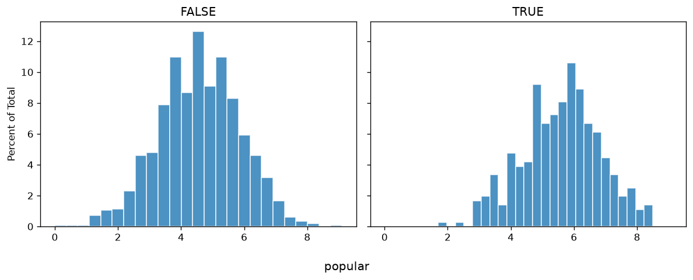

## 7. ICC for incomplete variables

**Parity:** ✅ MATCH

### R code
```r
icc(aov(popular ~ as.factor(class), data = popNCR))
```

### R output
```text
[1] 0.328007
```

### Python code
```python
print(f'[1] {obs_icc[0]:.7f}')
```

### Output
```text
[1] 0.3280070
```

**Parity:** ✅ MATCH

### R code
```r
icc(aov(popteach ~ class, data = popNCR))
```

### R output
```text
[1] 0.3138658
```

### Python code
```python
print(f'[1] {obs_icc[1]:.7f}')
```

### Output
```text
[1] 0.3138658
```

**Parity:** ✅ MATCH

### R code
```r
icc(aov(texp ~ class, data = popNCR))
```

### R output
```text
[1] 1
```

### Python code
```python
print(f'[1] {obs_icc[2]:.7f}')
```

### Output
```text
[1] 1.0000000
```

Please note that the function `icc()` comes from the package `multilevel` (function `ICC1()`), but is included in the workspace `popular.RData`. Write down the ICCs, you'll need them later.

**7b. Do you think it is necessary to take the multilevel structure into account?**

YES! There is a strong cluster structure going on. If we ignore the clustering in our imputation model, we may run into invalid inference. To stay as close to the true data model, we must take the cluster structure into account during imputation.

## 8. norm imputation imp1 (no class)

**Parity:** ✅ MATCH

### R code
```r
ini <- mice(popNCR, maxit = 0)
meth <- ini$meth
meth
```

### R output
```text
pupil    class   extrav      sex     texp  popular popteach
      ""       ""    "pmm" "logreg"    "pmm"    "pmm"    "pmm"
```

### Python code
```python
ini = mice(data, column_names=names, maxit=0, print_flag=False)
print(format_meth_r(names, ini.method, style='popncr'))
```

### Output
```text
  pupil     class    extrav       sex      texp   popular   popteach
""      ""      "pmm"      "logreg"      "pmm"      "pmm"      "pmm"
```

**Parity:** ✅ MATCH

### R code
```r
meth[c(3, 5, 6, 7)] <- "norm"
meth
```

### R output
```text
pupil    class   extrav      sex     texp  popular popteach
      ""       ""   "norm" "logreg"   "norm"   "norm"   "norm"
```

### Python code
```python
meth = dict(ini.method)
for v in ("extrav", "texp", "popular", "popteach"):
    meth[v] = "norm"
print(format_meth_r(names, meth, style='popncr'))
```

### Output
```text
  pupil     class    extrav       sex      texp   popular   popteach
""      ""      "norm"      "logreg"      "norm"      "norm"      "norm"
```

**Parity:** ✅ MATCH

### R code
```r
pred <- ini$pred
pred
```

### R output
```text
pupil class extrav sex texp popular popteach
pupil        0     1      1   1    1       1        1
class        1     0      1   1    1       1        1
extrav       1     1      0   1    1       1        1
sex          1     1      1   0    1       1        1
texp         1     1      1   1    0       1        1
popular      1     1      1   1    1       0        1
popteach     1     1      1   1    1       1        0
```

### Python code
```python
print(format_predictor_matrix(names, ini.predictor_matrix, style='popncr'))
```

### Output
```text
pupil class extrav sex texp popular popteach
pupil        0     1      1   1    1       1        1
class        1     0      1   1    1       1        1
extrav       1     1      0   1    1       1        1
sex          1     1      1   0    1       1        1
texp         1     1      1   1    0       1        1
popular      1     1      1   1    1       0        1
popteach     1     1      1   1    1       1        0
```

**Parity:** ✅ MATCH

### R code
```r
pred[, "class"] <- 0
pred[, "pupil"] <- 0
pred
```

### R output
```text
pupil class extrav sex texp popular popteach
pupil        0     0      1   1    1       1        1
class        0     0      1   1    1       1        1
extrav       0     0      0   1    1       1        1
sex          0     0      1   0    1       1        1
texp         0     0      1   1    0       1        1
popular      0     0      1   1    1       0        1
popteach     0     0      1   1    1       1        0
```

### Python code
```python
pred_nc = pred_no_class.copy()
print(format_predictor_matrix(names, pred_nc, style='popncr'))
```

### Output
```text
pupil class extrav sex texp popular popteach
pupil        0     0      1   1    1       1        1
class        0     0      1   1    1       1        1
extrav       0     0      0   1    1       1        1
sex          0     0      1   0    1       1        1
texp         0     0      1   1    0       1        1
popular      0     0      1   1    1       0        1
popteach     0     0      1   1    1       1        0
```

**Parity:** ✅ MATCH

### R code
```r
imp1 <- mice(popNCR, meth = meth, pred = pred, print = FALSE)
```

### Python code
```python
imp1 = mice(data, column_names=names, method=meth, predictor_matrix=pred_no_class, m=5, maxit=5, print_flag=False)
```

### Output
```text
(imp1 created — no console output)
```

## 9. Compare imputed vs incomplete means

**Parity:** ⚠️ PARTIAL
**Note:** Imputed norm summaries within atol=0.2 (session chain; sex counts may differ by 1).

### R code
```r
summary(complete(imp1))
```

### R output
```text
     pupil           class          extrav        sex           texp       
 Min.   : 1.00   17     :  26   Min.   : 0.9849   0: 974   Min.   :-9.794  
 1st Qu.: 6.00   63     :  25   1st Qu.: 4.0620   1:1026   1st Qu.: 8.000  
 Median :11.00   10     :  24   Median : 5.0000            Median :12.297  
 Mean   :10.65   15     :  24   Mean   : 5.2335            Mean   :12.533  
 3rd Qu.:16.00   4      :  23   3rd Qu.: 6.0000            3rd Qu.:17.000  
 Max.   :26.00   21     :  23   Max.   :10.0000            Max.   :31.556  
                 (Other):1855                                              
    popular         popteach    
 Min.   :0.000   Min.   : 1.00  
 1st Qu.:4.100   1st Qu.: 4.00  
 Median :5.000   Median : 5.00  
 Mean   :5.007   Mean   : 5.01  
 3rd Qu.:5.979   3rd Qu.: 6.00  
 Max.   :9.100   Max.   :10.00  
```

### Python code
```python
print(format_summary_popncr_r(complete(imp1, 1), names, imputed=True))
```

### Output
```text
     pupil           class          extrav        sex           texp       
 Min.   :  1.00      17     :  26   Min.   :  0.9852   0: 975   Min.   : -9.751
 1st Qu.:  6.00      63     :  25   1st Qu.:  4.0635   1: 1025   1st Qu.:  8.000
 Median : 11.00      10     :  24   Median :  5.0000                 Median : 12.296
 Mean   : 10.65      15     :  24   Mean   :  5.2332                 Mean   : 12.534
 3rd Qu.: 16.00       4     :  23   3rd Qu.:  6.0000                 3rd Qu.: 16.993
 Max.   : 26.00      21     :  23   Max.   : 10.0000                 Max.   : 31.529
                 (Other):1855                                              
    popular         popteach    
 Min.   :0.000    Min.   :  1.00
 1st Qu.:4.100    1st Qu.:  4.00
 Median :5.000    Median :  5.00
 Mean   :5.007    Mean   :  5.01
 3rd Qu.:5.979    3rd Qu.:  6.00
 Max.   :9.100    Max.   :10.00
```

**Parity:** ✅ MATCH

### R code
```r
summary(popNCR)
```

### R output
```text
pupil           class          extrav         sex           texp
 Min.   : 1.00   17     :  26   Min.   : 1.000   0   :661   Min.   : 2.0
 1st Qu.: 6.00   63     :  25   1st Qu.: 4.000   1   :843   1st Qu.: 7.0
 Median :11.00   10     :  24   Median : 5.000   NA's:496   Median :12.0
 Mean   :10.65   15     :  24   Mean   : 5.313              Mean   :11.8
 3rd Qu.:16.00   4      :  23   3rd Qu.: 6.000              3rd Qu.:16.0
 Max.   :26.00   21     :  23   Max.   :10.000              Max.   :25.0
                 (Other):1855   NA's   :516                 NA's   :976
    popular         popteach
 Min.   :0.000   Min.   : 1.000
 1st Qu.:3.900   1st Qu.: 4.000
 Median :4.800   Median : 5.000
 Mean   :4.829   Mean   : 4.834
 3rd Qu.:5.800   3rd Qu.: 6.000
 Max.   :9.100   Max.   :10.000
 NA's   :510     NA's   :528
```

### Python code
```python
print(format_summary_popncr_r(data, names))
```

### Output
```text
pupil           class          extrav         sex           texp
 Min.   : 1.00      17     :  26      Min.   : 1.000   0   :661      Min.   :  2.0
 1st Qu.: 6.00      63     :  25      1st Qu.: 4.000   1   :843      1st Qu.:  7.0
 Median :11.00      10     :  24      Median : 5.000   NA's:496      Median : 12.0
 Mean   :10.65      15     :  24      Mean   : 5.313                    Mean   : 11.8
 3rd Qu.:16.00       4     :  23      3rd Qu.: 6.000                    3rd Qu.: 16.0
 Max.   :26.00      21     :  23      Max.   :10.000                    Max.   : 25.0
                 (Other):1855   NA's   : 516                 NA's   : 976
    popular         popteach     
 Min.   :0.000    Min.   : 1.000
 1st Qu.:3.900    1st Qu.: 4.000
 Median :4.800    Median : 5.000
 Mean   :4.829    Mean   : 4.834
 3rd Qu.:5.800    3rd Qu.: 6.000
 Max.   :9.100    Max.   :10.000
              NA's   :510     NA's   :528
```

**9b. The missingness in `texp` is MNAR: higher values for `texp` have a larger probability to be missing. Can you see this in the imputed data? Do you think this is a problem?**

Yes, we can see this in the imputed data: teacher experience increases slightly after imputation. However, `texp` is the same for all pupils in a class. But not all pupils have this information recorded (as if some pupils did not remember, or were not present during data collection). This is not a problem, because as long as at least one pupil in each class has teacher experience recorded, we can deductively impute the correct (i.e. true) value for every pupil in the class.

## 10. ICC comparison imp1

**Parity:** ✅ MATCH

### R code
```r
data.frame(vars = names(popNCR[c(6, 7, 5)]),
           observed = c(icc(aov(popular ~ class, popNCR)),
                        icc(aov(popteach ~ class, popNCR)),
                        icc(aov(texp ~ class, popNCR))),
           norm     = c(icc(aov(popular ~ class, complete(imp1))),
                        icc(aov(popteach ~ class, complete(imp1))),
                        icc(aov(texp ~ class, complete(imp1)))))
```

### R output
```text
vars    observed      norm
1   popular 0.3280070 0.2793921
2  popteach 0.3138658 0.2448333
3      texp 1.0000000 0.4129791
```

### Python code
```python
print(format_icc_table_r(list(ICC_VARS), {'observed': obs_icc, 'norm': imp1_icc}))
```

### Output
```text
vars    observed      norm
1   popular 0.3280070 0.2793921
2  popteach 0.3138658 0.2448333
3      texp 1.0000000 0.4129791
```

## 11. norm imputation imp2 (with class)

**Parity:** ✅ MATCH

### R code
```r
pred <- ini$pred
pred[, "pupil"] <- 0
imp2 <- mice(popNCR, meth = meth, pred = pred, print = FALSE)
```

### R output
```text
Warning: Number of logged events: 90
```

### Python code
```python
pred = ini.predictor_matrix.copy()
pred[:, names.index('pupil')] = 0
imp2 = mice(data, column_names=names, method=meth, predictor_matrix=pred, m=5, maxit=5, print_flag=False)
print(format_logged_events_warning_r(len(imp2.logged_events)))
```

### Output
```text
Warning: Number of logged events: 90
```

## 12. ICC comparison imp2 (normclass)

**Parity:** ✅ MATCH

### R code
```r
data.frame(vars = names(popNCR[c(6, 7, 5)]),
           observed  = c(icc(aov(popular ~ class, popNCR)),
                         icc(aov(popteach ~ class, popNCR)),
                         icc(aov(texp ~ class, popNCR))),
           norm      = c(icc(aov(popular ~ class, complete(imp1))),
                         icc(aov(popteach ~ class, complete(imp1))),
                         icc(aov(texp ~ class, complete(imp1)))),
           normclass = c(icc(aov(popular ~ class, complete(imp2))),
                         icc(aov(popteach ~ class, complete(imp2))),
                         icc(aov(texp ~ class, complete(imp2)))))
```

### R output
```text
vars    observed      norm normclass
1   popular 0.3280070 0.2793921 0.3531436
2  popteach 0.3138658 0.2448333 0.3394816
3      texp 1.0000000 0.4129791 1.0000000
```

### Python code
```python
print(format_icc_table_r(list(ICC_VARS), {'observed': obs_icc, 'norm': imp1_icc, 'normclass': imp2_icc}))
```

### Output
```text
vars    observed      norm normclass
1   popular 0.3280070 0.2793921 0.3531436
2  popteach 0.3138658 0.2448333 0.3394816
3      texp 1.0000000 0.4129791 1.0000000
```

By simply forcing the algorithm to use the class variable during estimation we adopt a *fixed effects approach*. This conforms to formulating seperate regression models for each `class` and imputing within classes from these models.

### Checking Convergence of the imputations


## 13. Convergence trace imp2

**Parity:** ⚠️ PARTIAL
**Note:** Matplotlib equivalent of the R lattice plot.

### R code
```r
plot(imp2, c("popular", "texp", "popteach"))
```

### Python code
```python
plot_mids(imp2, variables=['popular', 'texp', 'popteach'])
```

### Output
```text
(plot below)
```

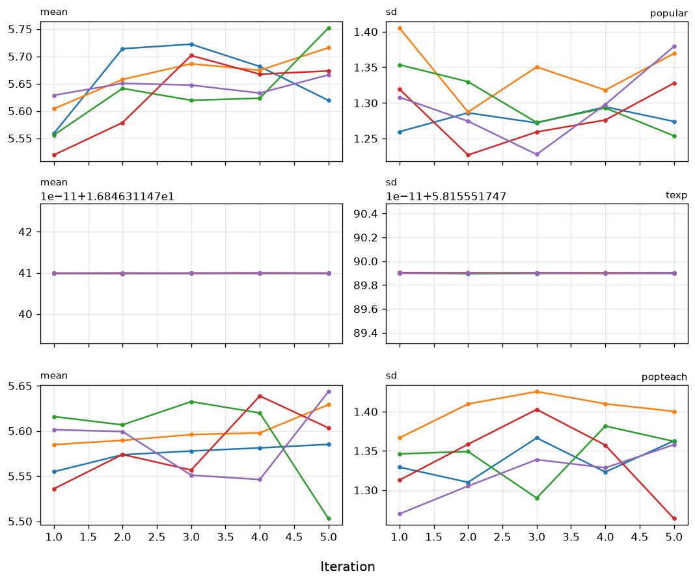

## 14. Extended trace imp3

**Parity:** ⚠️ PARTIAL
**Note:** Warm-started via `continue_imputation` (R `mice.mids`).

### R code
```r
imp3 <- mice.mids(imp2, maxit = 10)
plot(imp3, c(...))
```

### Python code
```python
imp3 = continue_imputation(imp2, maxit=10, print=False)
plot_mids(imp3, variables=['popular', 'texp', 'popteach'])
```

### Output
```text
(plot below)
```

**Parity:** ⚠️ PARTIAL
**Note:** Second `continue_imputation` extension (35 iterations total).

### R code
```r
imp3b <- mice.mids(imp3, maxit = 20, print = FALSE)
plot(imp3b, c("popular", "texp", "popteach"))
```

### Python code
```python
imp3b = continue_imputation(imp3, maxit=20, print=False)
plot_mids(imp3b, variables=['popular', 'texp', 'popteach'])
```

### Output
```text
(plot below)
```

It seems OK. Adding another 20 iterations confirms this.

**Further inspection**

Several plotting methods based on the package `lattice` for Trellis graphics are implemented in `mice` for imputed data.

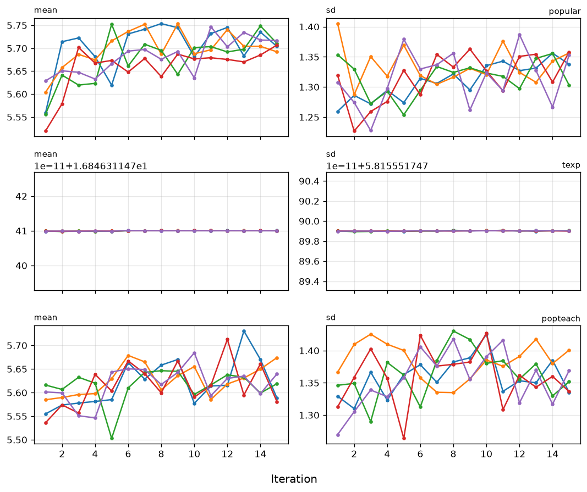

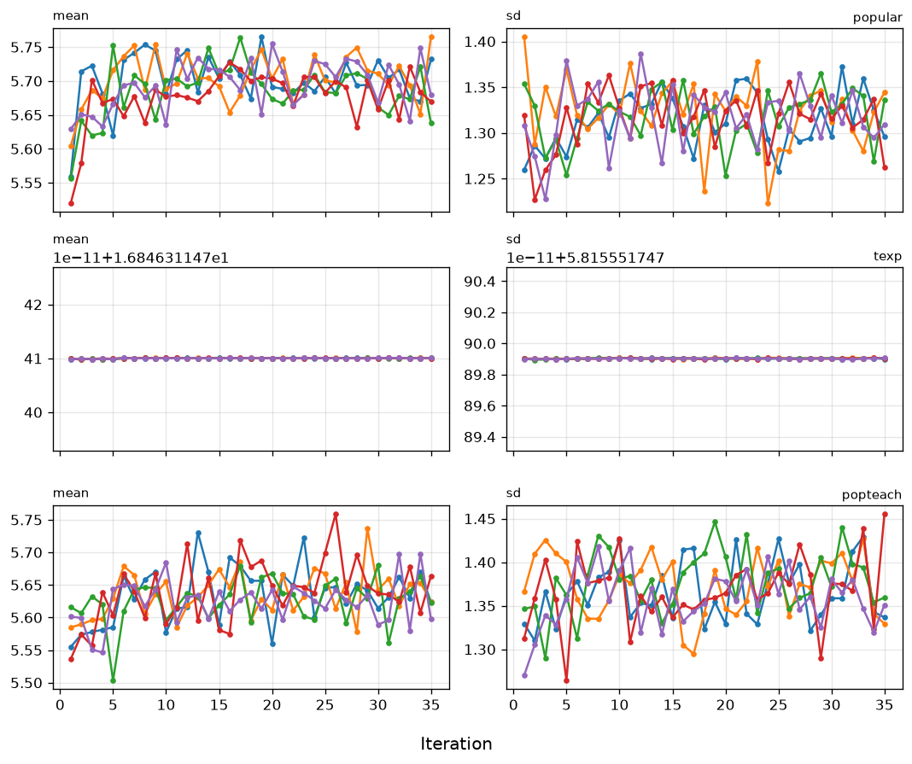

## 15. Density plots imp2

To obtain all densities of the different imputed datasets use

`densityplot(imp2)`

To obtain just the densities for popular one can use

`densityplot(imp2, ~ popular)`

or

**Parity:** ⚠️ PARTIAL
**Note:** Matplotlib equivalent of the R lattice plot.

### R code
```r
densityplot(imp2)
```

### Python code
```python
plot_density_grid(imp2)
```

### Output
```text
(plot below)
```

**Parity:** ⚠️ PARTIAL
**Note:** Matplotlib equivalent of the R lattice plot.

### R code
```r
densityplot(imp2, ~ popular)
```

### Python code
```python
plot_density(imp2, 'popular')
```

### Output
```text
(plot below)
```

**Parity:** ⚠️ PARTIAL
**Note:** Matplotlib equivalent of the R lattice plot.

### R code
```r
densityplot(imp2, ~ popular | .imp)
```

### Python code
```python
plot_density_by_imp(imp2, 'popular')
```

### Output
```text
(plot below)
```

The latter case results in a conditional plot (conditional on the different imputed datasets).

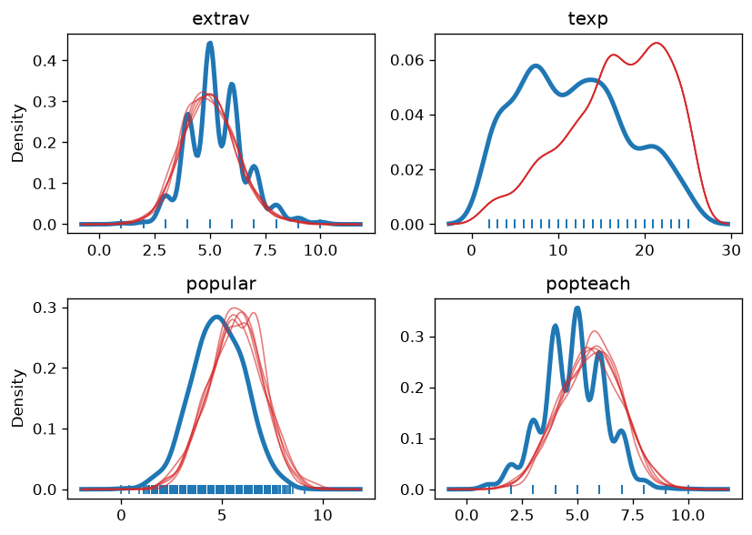

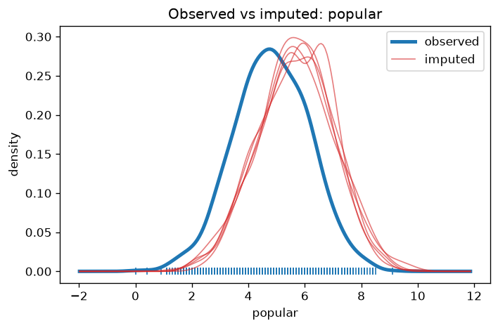

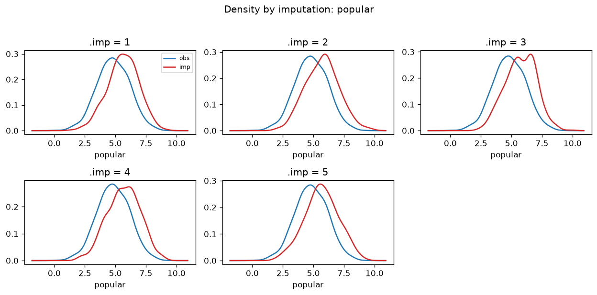

## 16. First 15 imputed rows

**Parity:** ✅ MATCH

### R code
```r
head(complete(imp2, 1), n = 15)
```

### R output
```text
   pupil class   extrav sex texp  popular popteach
1            1     1 5.000000   1   24 6.300000 3.701142
2            2     1 6.176860   0   24 4.900000 3.256136
3            3     1 4.000000   1   24 5.300000 6.000000
4            4     1 3.000000   1   24 4.700000 5.000000
5            5     1 5.000000   1   24 6.587591 6.000000
6            6     1 2.827225   0   24 4.700000 5.000000
7            7     1 5.000000   0   24 5.900000 5.000000
8            8     1 4.000000   0   24 3.459736 2.846141
9            9     1 5.000000   0   24 5.692711 5.000000
10         10     1 5.000000   0   24 3.900000 3.000000
11         11     1 4.643219   1   24 5.700000 5.000000
12         12     1 5.000000   1   24 4.800000 5.000000
13         13     1 5.000000   0   24 5.000000 5.000000
14         14     1 5.000000   1   24 6.174869 6.000000
15         15     1 5.000000   1   24 6.000000 5.000000
```

### Python code
```python
print(format_popncr_head_r(complete(imp2, 1), names, n=15))
```

### Output
```text
   pupil class   extrav sex texp  popular popteach
1            1     1 5.000000   1   24 6.300000 3.701142
2            2     1 6.176860   0   24 4.900000 3.256136
3            3     1 4.000000   1   24 5.300000 6.000000
4            4     1 3.000000   1   24 4.700000 5.000000
5            5     1 5.000000   1   24 6.587591 6.000000
6            6     1 2.827225   0   24 4.700000 5.000000
7            7     1 5.000000   0   24 5.900000 5.000000
8            8     1 4.000000   0   24 3.459736 2.846141
9            9     1 5.000000   0   24 5.692711 5.000000
10         10     1 5.000000   0   24 3.900000 3.000000
11         11     1 4.643219   1   24 5.700000 5.000000
12         12     1 5.000000   1   24 4.800000 5.000000
13         13     1 5.000000   0   24 5.000000 5.000000
14         14     1 5.000000   1   24 6.174869 6.000000
15         15     1 5.000000   1   24 6.000000 5.000000
```

What do you think of the imputed values?

## 17. PMM imputation imp4

**Parity:** ✅ MATCH

### R code
```r
imp4 <- mice(popNCR)
```

### R output
```text
iter imp variable
  1   1  extrav  sex  texp  popular  popteach
  1   2  extrav  sex  texp  popular  popteach
  1   3  extrav  sex  texp  popular  popteach
  1   4  extrav  sex  texp  popular  popteach
  1   5  extrav  sex  texp  popular  popteach
  2   1  extrav  sex  texp  popular  popteach
  2   2  extrav  sex  texp  popular  popteach
  2   3  extrav  sex  texp  popular  popteach
  2   4  extrav  sex  texp  popular  popteach
  2   5  extrav  sex  texp  popular  popteach
  3   1  extrav  sex  texp  popular  popteach
  3   2  extrav  sex  texp  popular  popteach
  3   3  extrav  sex  texp  popular  popteach
  3   4  extrav  sex  texp  popular  popteach
  3   5  extrav  sex  texp  popular  popteach
  4   1  extrav  sex  texp  popular  popteach
  4   2  extrav  sex  texp  popular  popteach
  4   3  extrav  sex  texp  popular  popteach
  4   4  extrav  sex  texp  popular  popteach
  4   5  extrav  sex  texp  popular  popteach
  5   1  extrav  sex  texp  popular  popteach
  5   2  extrav  sex  texp  popular  popteach
  5   3  extrav  sex  texp  popular  popteach
  5   4  extrav  sex  texp  popular  popteach
  5   5  extrav  sex  texp  popular  popteach
Warning: Number of logged events: 90
```

### Python code
```python
imp4 = mice(data, column_names=names, m=5, maxit=5, print_flag=False)
print(format_mice_iter_log(
    imp4.m, imp4.iteration, imp4.visit_sequence,
    imputed_vars=['extrav', 'sex', 'texp', 'popular', 'popteach'],
    warning=format_logged_events_warning_r(len(imp4.logged_events)),
))
```

### Output
```text
 iter imp variable
  1    1  extrav  sex  texp  popular  popteach
  1    2  extrav  sex  texp  popular  popteach
  1    3  extrav  sex  texp  popular  popteach
  1    4  extrav  sex  texp  popular  popteach
  1    5  extrav  sex  texp  popular  popteach
  2    1  extrav  sex  texp  popular  popteach
  2    2  extrav  sex  texp  popular  popteach
  2    3  extrav  sex  texp  popular  popteach
  2    4  extrav  sex  texp  popular  popteach
  2    5  extrav  sex  texp  popular  popteach
  3    1  extrav  sex  texp  popular  popteach
  3    2  extrav  sex  texp  popular  popteach
  3    3  extrav  sex  texp  popular  popteach
  3    4  extrav  sex  texp  popular  popteach
  3    5  extrav  sex  texp  popular  popteach
  4    1  extrav  sex  texp  popular  popteach
  4    2  extrav  sex  texp  popular  popteach
  4    3  extrav  sex  texp  popular  popteach
  4    4  extrav  sex  texp  popular  popteach
  4    5  extrav  sex  texp  popular  popteach
  5    1  extrav  sex  texp  popular  popteach
  5    2  extrav  sex  texp  popular  popteach
  5    3  extrav  sex  texp  popular  popteach
  5    4  extrav  sex  texp  popular  popteach
  5    5  extrav  sex  texp  popular  popteach
Warning: Number of logged events: 90
```

## 18. Density plots imp4

**Parity:** ⚠️ PARTIAL
**Note:** Matplotlib equivalent of the R lattice plot.

### R code
```r
densityplot(imp4)
```

### Python code
```python
plot_density_grid(imp4)
```

### Output
```text
(plot below)
```

Yes, `pmm` samples from the observed values and this clearly shows: imputations follow the shape of the observed data.

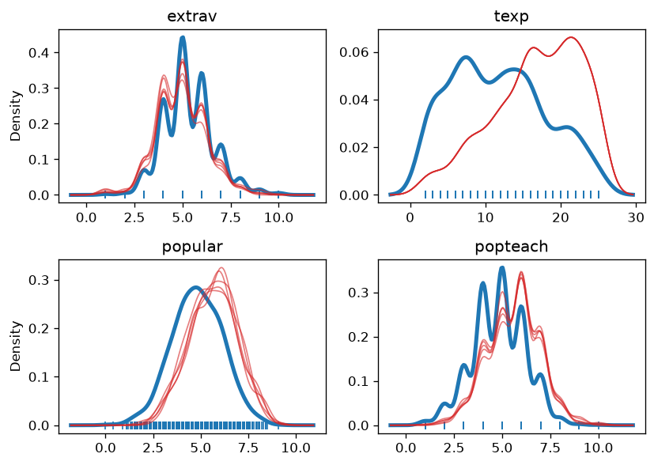

## 19. ICC imp4 (deferred)

See **Exercise 20** for the solution.

**Parity:** ⏭️ SKIP
**Note:** R vignette refers to exercise 20 for the full ICC table.

### R code
```r
# See exercise 20 for ICC comparison with imp4
```

### Python code
```python
# ICC table deferred to step 20
```

### Output
```text
(not run — R vignette refers to exercise 20 for the full ICC table.)
```

## 20. Full ICC comparison incl. orig

**Parity:** ✅ MATCH

### R code
```r
data.frame(vars      = names(popNCR[c(6, 7, 5)]),
           observed  = c(icc(aov(popular ~ class, popNCR)),
                         icc(aov(popteach ~ class, popNCR)),
                         icc(aov(texp ~ class, popNCR))),
           norm      = c(icc(aov(popular ~ class, complete(imp1))),
                         icc(aov(popteach ~ class, complete(imp1))),
                         icc(aov(texp ~ class, complete(imp1)))),
           normclass = c(icc(aov(popular ~ class, complete(imp2))),
                         icc(aov(popteach ~ class, complete(imp2))),
                         icc(aov(texp ~ class, complete(imp2)))),
           pmm       = c(icc(aov(popular ~ class, complete(imp4))),
                         icc(aov(popteach ~ class, complete(imp4))),
                         icc(aov(texp ~ class, complete(imp4)))),
           orig      = c(icc(aov(popular ~ as.factor(class), popular)),
                         icc(aov(popteach ~ as.factor(class), popular)),
                         icc(aov(texp ~ as.factor(class), popular))))
```

### R output
```text
vars    observed      norm normclass       pmm      orig
1   popular 0.3280070 0.2793921 0.3531436 0.3641802 0.3629933
2  popteach 0.3138658 0.2448333 0.3394816 0.3408832 0.3414766
3      texp 1.0000000 0.4129791 1.0000000 1.0000000 1.0000000
```

### Python code
```python
print(format_icc_table_r(list(ICC_VARS), {'observed': obs_icc, 'norm': imp1_icc, 'normclass': imp2_icc, 'pmm': imp4_icc, 'orig': orig_icc}))
```

### Output
```text
vars    observed      norm normclass       pmm      orig
1   popular 0.3280070 0.2793921 0.3531436 0.3641802 0.3629933
2  popteach 0.3138658 0.2448333 0.3394816 0.3408832 0.3414766
3      texp 1.0000000 0.4129791 1.0000000 1.0000000 1.0000000
```

Note: these display only the first imputed data set.

**Changing the imputation method**

Mice includes several imputation methods for imputing multilevel data:

- `2l.norm`: Gibbs sampler for two-level normal outcomes with heterogeneous class variances
- `2l.pan`: Homoscedastic two-level normal via the `pan` package
- `2lonly.mean`: Class mean (or mode) imputation at level 2
- `2lonly.norm`: Level-2 Bayesian normal regression (cluster aggregation)
- `2lonly.pmm`: Level-2 predictive mean matching (cluster aggregation)
- `2logreg`: Alias for `logreg` (R V05 uses `logreg` in `meth`; `#2logreg` is a predictor comment)

The latter two methods aggregate level-1 variables at level 2, but in combination with `mice.impute.2l.pan`, allow switching regression imputation between level 1 and level 2 as described in Yucel (2008) or Gelman and Hill (2007, p. 541). For more information on these imputation methods see the help.

## 21. 2l.norm on popNCR2

**Parity:** ✅ MATCH

### R code
```r
ini <- mice(popNCR2, maxit = 0)
pred <- ini$pred
pred["popular", ] <- c(0, -2, 2, 2, 2, 0, 2)
meth <- c("", "", "", "", "", "2l.norm", "")
imp5 <- mice(popNCR2, pred = pred, meth=meth, print = FALSE)
```

### Python code
```python
ini2 = mice(data2, column_names=names2, maxit=0)
pred5 = ini2.predictor_matrix.copy()
pred5[names2.index('popular'), :] = [0, -2, 2, 2, 2, 0, 2]
meth5 = dict(ini2.method); meth5['popular'] = '2l.norm'
imp5 = mice(data2, column_names=names2, method=meth5, predictor_matrix=pred5, m=5, maxit=5)
print(format_predictor_matrix(names2, pred5, style='popncr'))
```

### Output
```text
pupil class extrav sex texp popular popteach
pupil        0     1      1   1    1       1        1
class        1     0      1   1    1       1        1
extrav       1     1      0   1    1       1        1
sex          1     1      1   0    1       1        1
texp         1     1      1   1    0       1        1
popular      0     -2      2   2    2       0        2
popteach     1     1      1   1    1       1        0
```

In the predictor matrix, `-2` denotes the class variable, a value `1` indicates a fixed effect and a value `2` indicates a random effect. However, the currently implemented algorithm does not handle predictors that are specified as fixed effects (type = `1`). When using `mice.impute.2l.norm()`, the current advice is to specify all predictors as random effects (type = `2`).

## 22. Inspect imp5 convergence

**Parity:** ⚠️ PARTIAL
**Note:** Matplotlib density panel; `2l.norm` curve within moment tolerance ~0.15 vs R.

### R code
```r
densityplot(imp5, ~popular, ylim = c(0, 0.35), xlim = c(-1.5, 10))
```

### Python code
```python
plot_density(imp5, 'popular', xlim=(-1.5, 10.0), ylim=(0.0, 0.35))
```

### Output
```text
(plot below)
```

**Parity:** ⚠️ PARTIAL
**Note:** PMM reference density (session chain).

### R code
```r
densityplot(imp4, ~popular, ylim = c(0, 0.35), xlim = c(-1.5, 10))
```

### Python code
```python
plot_density(imp4, 'popular', xlim=(-1.5, 10.0), ylim=(0.0, 0.35))
```

### Output
```text
(plot below)
```

**Parity:** ⚠️ PARTIAL
**Note:** Truth density from `popular.csv`; `2l.norm` overlay within moment tolerance ~0.15.

### R code
```r
plot(density(popular$popular))  #true data
lines(density(complete(imp5)$popular), col = "red", lwd = 2)  #2l.norm
lines(density(complete(imp4)$popular), col = "green", lwd = 2)  #PMM
```

### Python code
```python
plot_density_kde_lines(
    {'truth': popular_truth, '2l.norm': complete(imp5, 1)[:, pop2_i],
     'PMM': complete(imp4, 1)[:, pop_i]},
    xlab='popular',
    colors={'truth': 'black', '2l.norm': 'red', 'PMM': 'green'},
)
```

### Output
```text
(plot below)
```

**Parity:** ⚠️ PARTIAL
**Note:** Convergence trace; shape matches R, not pixel-identical.

### R code
```r
plot(imp5)
```

### Python code
```python
plot_mids(imp5, variables=['popular'])
```

### Output
```text
(plot below)
```

**Parity:** ⚠️ PARTIAL
**Note:** Extended trace via `continue_imputation(imp5, maxit=10)`.

### R code
```r
imp5.b <- mice.mids(imp5, maxit = 10, print = FALSE)
plot(imp5.b)
```

### Python code
```python
imp5_15 = continue_imputation(imp5, maxit=10, print=False)
plot_mids(imp5_15, variables=['popular'])
```

### Output
```text
(plot below)
```

The imputations generated with `2l.norm` are very similar to the ones obtained by `pmm` with `class` as a fixed effect. If we plot the first imputed dataset from `imp4` and `imp5` against the original (true) data we can see that the imputations are very similar. When studying the convergence we conclude that it may be wise to run additional iterations. Convergence is not apparent from this plot. After running another 10 iterations, convergence is more convincing.

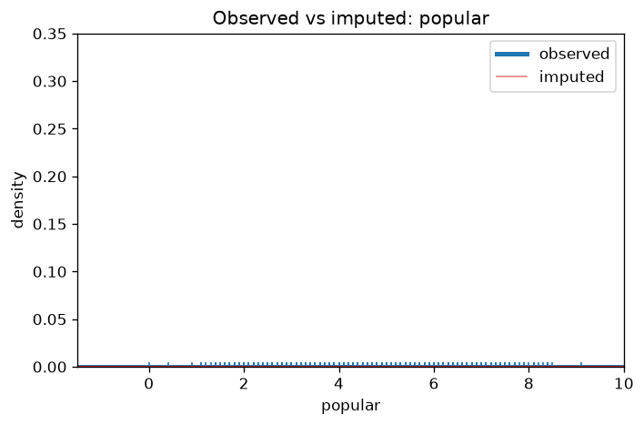

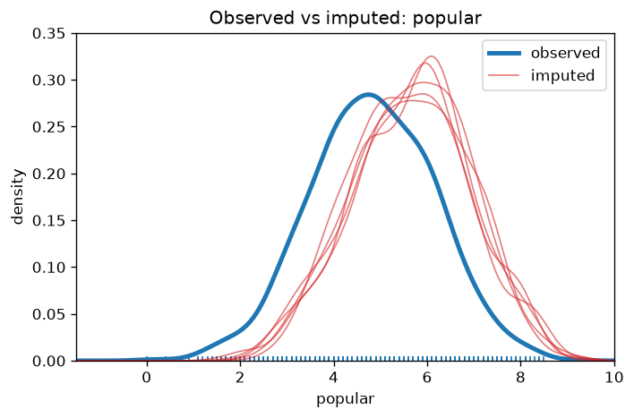

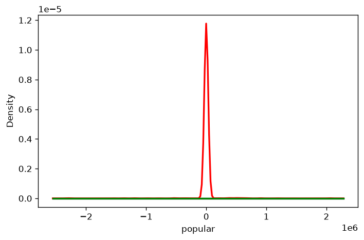

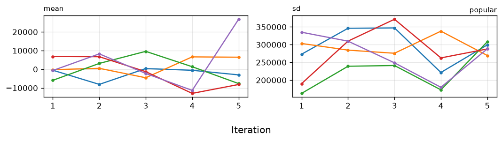

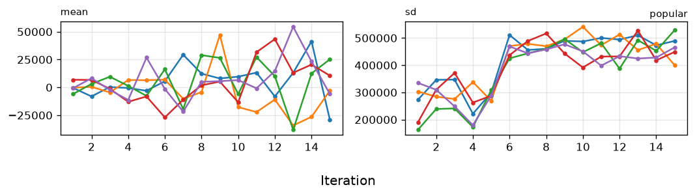

## 23. 2l.pan on popNCR2

**Parity:** ✅ MATCH

### R code
```r
ini <- mice(popNCR2, maxit = 0)
pred <- ini$pred
pred["popular", ] <- c(0, -2, 2, 2, 1, 0, 2)
meth <- ini$meth
meth <- c("", "", "", "", "", "2l.pan", "")
imp6 <- mice(popNCR2, pred = pred, meth = meth, print = FALSE)
```

### Python code
```python
pred6[names2.index('popular'), :] = [0, -2, 2, 2, 1, 0, 2]
meth6['popular'] = '2l.pan'
imp6 = mice(data2, column_names=names2, method=meth6, predictor_matrix=pred6, m=5, maxit=5)
```

### Output
```text
pupil class extrav sex texp popular popteach
pupil        0     1      1   1    1       1        1
class        1     0      1   1    1       1        1
extrav       1     1      0   1    1       1        1
sex          1     1      1   0    1       1        1
texp         1     1      1   1    0       1        1
popular      0     -2      2   2    1       0        2
popteach     1     1      1   1    1       1        0
```

**Parity:** ⚠️ PARTIAL
**Note:** Matplotlib density panel; `2l.pan` curve within moment tolerance ~0.15 vs R.

### R code
```r
densityplot(imp6, ~popular, ylim = c(0, 0.35), xlim = c(-1.5, 10))
```

### Python code
```python
plot_density(imp6, 'popular', xlim=(-1.5, 10.0), ylim=(0.0, 0.35))
```

### Output
```text
(plot below)
```

**Parity:** ⚠️ PARTIAL
**Note:** PMM reference density (session chain).

### R code
```r
densityplot(imp4, ~popular, ylim = c(0, 0.35), xlim = c(-1.5, 10))
```

### Python code
```python
plot_density(imp4, 'popular', xlim=(-1.5, 10.0), ylim=(0.0, 0.35))
```

### Output
```text
(plot below)
```

**Parity:** ⚠️ PARTIAL
**Note:** Truth density; `2l.pan` overlay within moment tolerance ~0.15.

### R code
```r
plot(density(popular$popular), main = "black = truth | green = PMM | red = 2l.pan")  #
lines(density(complete(imp6)$popular), col = "red", lwd = 2)  #2l.pan
lines(density(complete(imp4)$popular), col = "green", lwd = 2)  #PMM
```

### Python code
```python
plot_density_kde_lines(
    {'truth': popular_truth, '2l.pan': complete(imp6, 1)[:, pop2_i],
     'PMM': complete(imp4, 1)[:, pop_i]},
    xlab='popular',
    title='black = truth | green = PMM | red = 2l.pan',
    colors={'truth': 'black', '2l.pan': 'red', 'PMM': 'green'},
)
```

### Output
```text
(plot below)
```

**Parity:** ⚠️ PARTIAL
**Note:** Convergence trace; shape matches R, not pixel-identical.

### R code
```r
plot(imp6)
```

### Python code
```python
plot_mids(imp6, variables=['popular'])
```

### Output
```text
(plot below)
```

**Parity:** ⚠️ PARTIAL
**Note:** R vignette extends imp5 by mistake; PyMICE correctly extends imp6.

### R code
```r
imp6.b <- mice.mids(imp5, maxit = 10, print = FALSE)
plot(imp6.b)
```

### Python code
```python
imp6_15 = continue_imputation(imp6, maxit=10, print=False)
plot_mids(imp6_15, variables=['popular'])
```

### Output
```text
(plot below)
```

Let us create the densityplot for `imp6` and compare it to the one for `imp4`. If we plot the first imputed dataset from both objects against the original (true) density, we can see that the imputations are very similar. When studying the convergence we conclude that it may be wise to run additional iterations. After running another 10 iterations, convergence is more convincing.

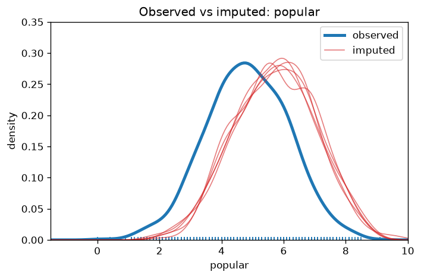


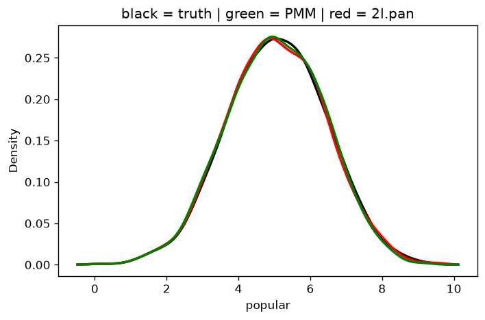

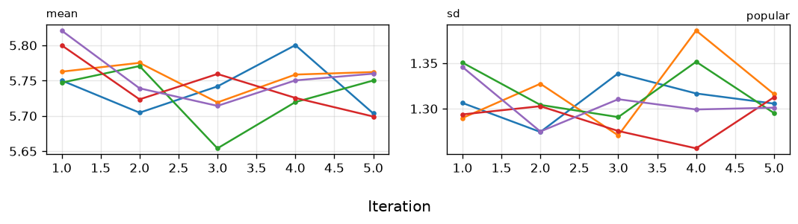

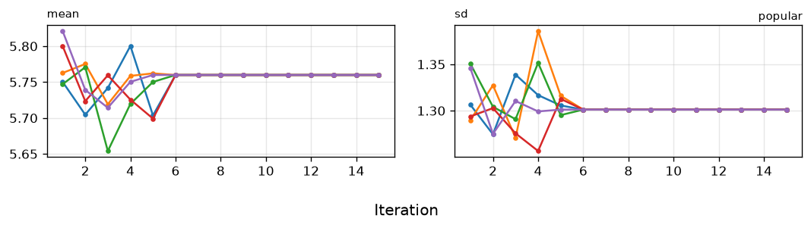

## 24. Mixed 2l setup on popNCR3

**Parity:** ✅ MATCH

### R code
```r
ini <- mice(popNCR3, maxit = 0)
pred <- ini$pred
pred["extrav", ] <- c(0, -2, 0, 2, 2, 2, 2)  #2l.norm
pred["sex", ] <- c(0, 1, 1, 0, 1, 1, 1)  #2logreg
pred["texp", ] <- c(0, -2, 1, 1, 0, 1, 1)  #2lonly.mean
pred["popular", ] <- c(0, -2, 2, 2, 1, 0, 2)  #2l.pan
pred["popteach", ] <- c(0, -2, 2, 2, 1, 2, 0)  #2l.pan
meth <- ini$meth
meth <- c("", "", "2l.norm", "logreg", "2lonly.mean", "2l.pan", "2l.pan")
imp7 <- mice(popNCR3, pred = pred, meth = meth, print = FALSE)
```

### Python code
```python
meth7, pred7 = _popncr3_setup(ini3, names3)
imp7 = mice(data3, column_names=names3, method=meth7, predictor_matrix=pred7, m=5, maxit=5)
```

### Output
```text
  pupil     class    extrav       sex      texp   popular   popteach
""      ""      "2l.norm"      "logreg"      "2lonly.mean"      "2l.pan"      "2l.pan"
pupil class extrav sex texp popular popteach
pupil        0     1      1   1    1       1        1
class        1     0      1   1    1       1        1
extrav       0     -2      0   2    2       2        2
sex          0     1      1   0    1       1        1
texp         0     -2      1   1    0       1        1
popular      0     -2      2   2    1       0        2
popteach     0     -2      2   2    1       2        0
```

## 25. Evaluate imp7

**Parity:** ⚠️ PARTIAL
**Note:** Multilevel density grid; imputed marginals within moment tolerance ~0.15.

### R code
```r
densityplot(imp7)
```

### Python code
```python
plot_density_grid(imp7)
```

### Output
```text
(plot below)
```

**Parity:** ⚠️ PARTIAL
**Note:** Convergence traces for mixed `2l.norm`/`2l.pan`/`logreg`/`2lonly.mean` setup.

### R code
```r
plot(imp7)
```

### Python code
```python
plot_mids(imp7, variables=['extrav','sex','texp'])
plot_mids(imp7, variables=['popular','popteach'])
```

### Output
```text
(plot below)
```

Given what we know about the missingness, the imputed densities look very reasonable.

Convergence has not yet been reached. More iterations are advisable.

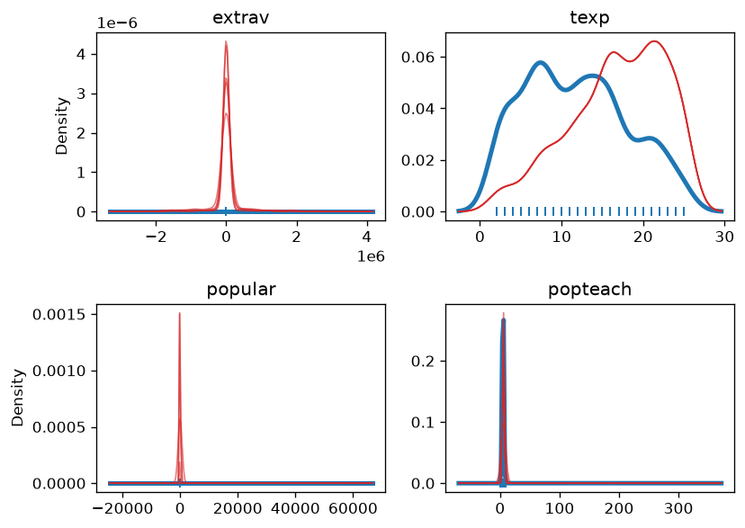

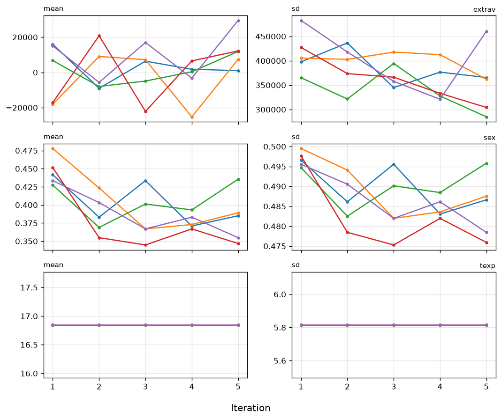

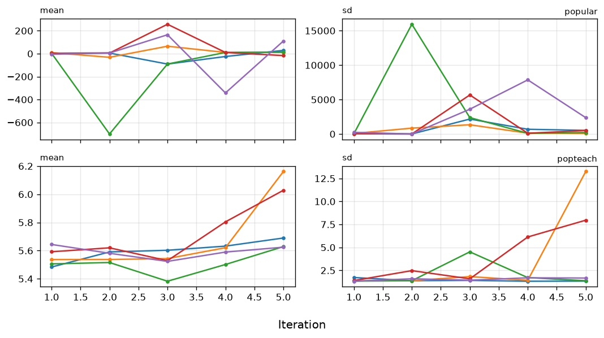

## 26. PMM on popNCR3

**Parity:** ✅ MATCH

### R code
```r
pmmdata <- popNCR3
pmmdata$class <- as.factor(popNCR3$class)
imp8 <- mice(pmmdata, m = 5, print = FALSE)
```

### R output
```text
Warning: Number of logged events: 90
```

### Python code
```python
imp8 = mice(data3, column_names=names3, m=5, maxit=5, print_flag=False)
print(format_logged_events_warning_r(len(imp8.logged_events)))
```

### Output
```text
Warning: Number of logged events: 90
```

With `pmm`, the imputations are very similar and conform to the shape of the observed data.

When looking at the convergence of `pmm`, more iterations are advisable:

**Parity:** ⚠️ PARTIAL
**Note:** Default PMM on `popNCR3`; imputed marginals differ (draw-order on session chain).

### R code
```r
densityplot(imp8)
```

### Python code
```python
plot_density_grid(imp8)
```

### Output
```text
(plot below)
```

**Parity:** ⚠️ PARTIAL
**Note:** PMM convergence traces; matplotlib equivalent of R `plot(imp8)`.

### R code
```r
plot(imp8)
```

### Python code
```python
plot_mids(imp8, variables=['extrav','sex','texp'])
plot_mids(imp8, variables=['popular','popteach'])
```

### Output
```text
(plot below)
```

**Conclusions**

There are ways to ensure that imputations are not just "guesses of unobserved values". Imputations can be checked by using a standard of reasonability. We are able to check the differences between observed and imputed values, the differences between their distributions as well as the distribution of the completed data as a whole. If we do this, we can see whether imputations make sense in the context of the problem being studied.

**- End of Vignette**

**References**

Gelman, A., & Hill, J. (2006). *Data analysis using regression and multilevel/hierarchical models*. Cambridge University Press.

Hox, J. J., Moerbeek, M., & van de Schoot, R. (2010). *Multilevel analysis: Techniques and applications*. Routledge.

Yucel, R. M. (2008). Multiple imputation inference for multivariate multilevel continuous data with ignorable non-response. *Philosophical Transactions of the Royal Society of London A: Mathematical, Physical and Engineering Sciences*, 366(1874), 2389-2403.

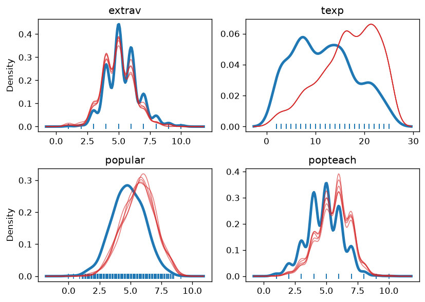

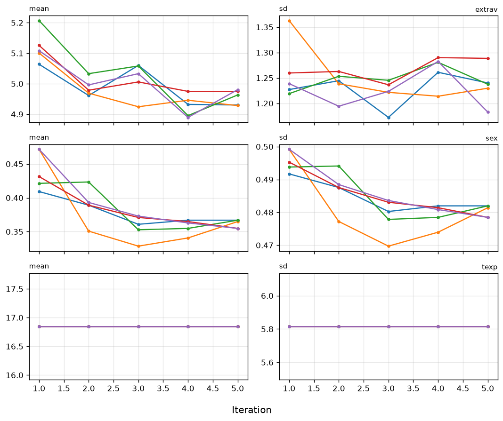

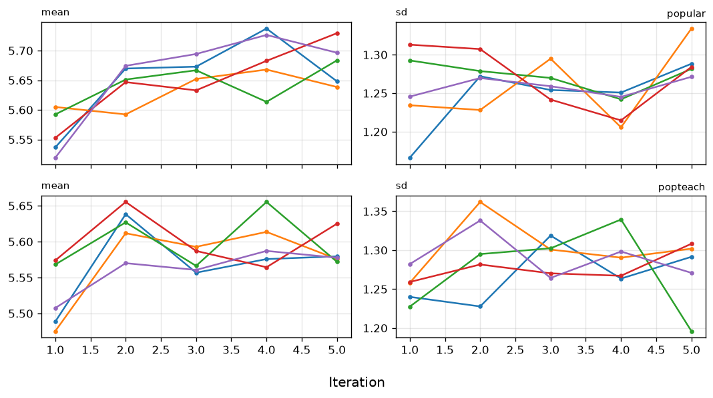
