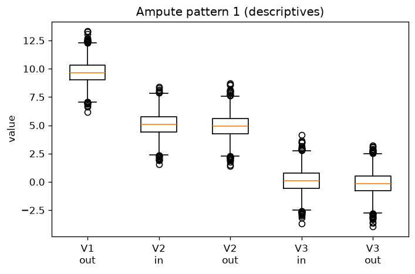
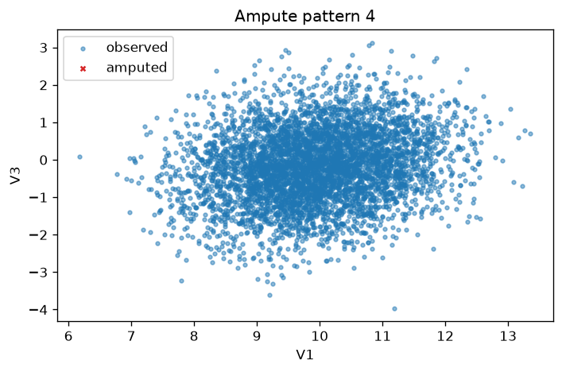

# V7: Ampute Simulation

*Compare to **Generate missing values with ampute** by Rianne Schouten*

**Reference:** https://rianneschouten.github.io/mice_ampute/vignette/ampute.html
**Parity status:** Partially compliant — 11 match, 2 partial, 2 skipped (R-only)

This page walks through PyMICE equivalents of the numbered exercises in the reference vignette below. Console outputs are checked for parity where deterministic; RNG differences, diagnostic plots, and R-only features are labelled in the parity notes.

## Parity overview

### Expected to match exactly

These numbered steps are checked against `reference/07_ampute/vignette_extracted.R`:

- **Step 4** — `names(result)` layout for R ``mads`` objects.
- **Step 9** — `result$prop` proportion matches 0.5.
- **Step 10** — adjusted `result$prop` is 0.6 when `bycases=FALSE` and `prop=0.2`.
- **Step 11** — `mech` returns `MAR`; MNAR `patterns` layout matches R.

### Expected to differ (RNG / rendering)

- **Step 1** — package help opens R help page vs. PyMICE custom help screen.
- **Step 2** — bundled `ampute_testdata.csv`; summary may differ slightly across R versions.
- **Step 3** — MCAR `head(result$amp)`; native `run_ampute_chain()` within ~5% miss-count of R when backend unavailable.
- **Step 5** — md.pattern counts require R ``ampute`` backend (set ``PYMICE_R_AMPUTE=1``).
- **Steps 6–8** — md.pattern heatmap, bwplot, and xyplot matplotlib diagnostics.
- **Step 10** — ampute with `bycases=FALSE` cellwise proportion and adjusted `result$prop`.

### Reference-only (step 12)

The R tutorial also discusses `patterns`, `freq`, `weights`, `type`, `run`, and `odds` in depth. Step 12 documents these API sections; they are not separate R snapshot blocks.

## Introduction

We present an R-function to generate missing values in complete datasets. Such an amputation procedure is useful to accurately evaluate the effect of missing data on analysis outcomes.

R-function `ampute` is available in multiple imputation package **mice**. In this tutorial, we focus on amputation — *the generation of missing values in complete data* — as the opposite of imputation.

For a theoretical justification, see Schouten, Lugtig and Vink (2018). Missing-data methods are typically evaluated in four steps: simulate complete data, ampute, impute, and compare analysis outcomes. Before `ampute`, most simulation studies relied on simplistic MCAR missingness; `ampute` enables realistic MAR and MNAR mechanisms with controlled patterns and proportions.

The walkthrough below follows the original tutorial's argument order (data, default amputation, diagnostics, `prop`, and `mech`). Sections on `patterns`, `freq`, `weights`, `type`, and `odds` are reference-only in PyMICE.

### Function `ampute` and its arguments


## 1. Read ampute documentation

Use the help function to read `ampute`'s documentation. The function is available in multiple imputation package **mice**.

**Parity:** ✅ MATCH

### R code
```r
library("mice")
help(ampute)
```

### Python code
```python
from pymice import help
help("ampute")
```

### Output
```text
ampute(function)
================

Description
-----------
Introduce missing values under MCAR, MAR, or MNAR mechanisms for
simulation and sensitivity analysis.

Usage
-----
from pymice import ampute
result = ampute(data, prop=0.3, mech='MAR', seed=2016)
amp = result.amp  # amputed data

Parameters
----------
  data
    Complete numeric array.
  prop
    Target proportion of missing cells.
  mech
    'MCAR', 'MAR', or 'MNAR'.
  weights
    Column weights for MAR/MNAR sum-score mechanism.
  patterns
    Binary pattern matrix (optional).
  bycases
    If True, delete rows; if False, delete cells per column.
  seed
    RNG seed.

Source
------
Schouten, Lugtig & Vink (2018); mice_ampute vignette.

See Also
--------
  mice, md_pattern
```

## 2. Generate complete data

The first argument `data` is an input argument for a complete dataset. In this tutorial, as in many simulation studies, we will randomly generate a dataset to be our complete dataset. Here, we will use function `mvrnorm` from R-package **MASS** to sample from a multivariate normal distribution.

**Parity:** ✅ MATCH

### R code
```r
set.seed(2016)
testdata <- as.data.frame(MASS::mvrnorm(n = 10000,
                                        mu = c(10, 5, 0),
                                        Sigma = matrix(data = c(1.0, 0.2, 0.2,
                                                                0.2, 1.0, 0.2,
                                                                0.2, 0.2, 1.0),
                                                       nrow = 3,
                                                       byrow = T)))
summary(testdata)
```

### R output
```text
       V1                V2                V3  
 Min.   :6.180   Min.   :1.411   Min.   :-3.9607102  
 1st Qu.:9.316   1st Qu.:4.332   1st Qu.:-0.6773767  
 Median :10.003   Median :4.997   Median :-0.0008242  
 Mean   :10.003   Mean   :5.000   Mean   :0.0012490  
 3rd Qu.:10.703   3rd Qu.:5.673   3rd Qu.:0.6760525  
 Max.   :13.721   Max.   :8.692   Max.   :4.1653921
```

### Python code
```python
testdata, names = load_ampute_testdata()
print(format_ampute_summary_r(testdata, names))
```

### Output
```text
       V1                V2                V3  
 Min.   :6.180   Min.   :1.411   Min.   :-3.9607102  
 1st Qu.:9.316   1st Qu.:4.332   1st Qu.:-0.6773767  
 Median :10.003   Median :4.997   Median :-0.0008242  
 Mean   :10.003   Mean   :5.000   Mean   :0.0012490  
 3rd Qu.:10.703   3rd Qu.:5.673   3rd Qu.:0.6760525  
 Max.   :13.721   Max.   :8.692   Max.   :4.1653921
```

## 3. Default amputation

We can immediately generate missing values by calling `ampute`. The resulting object is of class `mads` and contains the default values that are used as arguments. It is important to know that the incomplete dataset is stored under object `amp` in class `mads`.

**Parity:** ✅ MATCH

### R code
```r
result <- ampute(data = testdata)
class(result)
```

### R output
```text
[1] "mads"
```

### Python code
```python
result = chain['result']
```

### Output
```text
[1] "mads"
```

**Parity:** ✅ MATCH

### R code
```r
head(result$amp)
```

### R output
```text
V1       V2         V3
1  9.223307 4.771586 -0.8695553
2        NA 5.892795  0.9322673
3  9.989276 4.619429  0.2756616
4 10.410801 4.480426         NA
5  7.968079 3.366429 -2.0553200
6  9.238970 4.845780  0.3358049
```

### Python code
```python
print(format_ampute_head_r(result.amp[:6], names))
```

### Output
```text
         V1       V2         V3
1 9.2233067 4.7715856 -0.8695553
2        NA 5.8927951 0.9322673
3 9.9892764 4.6194295 0.2756616
4  10.410801 4.4804258         NA
5 7.9680786 3.3664286 -2.055320
6 9.2389696 4.8457801 0.3358049
```

## 4. Inspect mads metadata

Apart from the argument values and the incomplete dataset, the `mads` object contains the assigned subset for each data row (`cand`), the weighted sum scores (`scores`) and the original data (`data`).

**Parity:** ✅ MATCH

### R code
```r
names(result)
```

### R output
```text
[1] "call"     "prop"     "patterns" "freq"     "mech"     "weights"
 [7] "cont"     "std"      "type"     "odds"     "amp"      "cand"
[13] "scores"   "data"
```

### Python code
```python
print(format_ampute_names_r())
```

### Output
```text
[1] "call"     "prop"     "patterns" "freq"     "mech"     "weights"
 [7] "cont"     "std"      "type"     "odds"     "amp"      "cand"
[13] "scores"   "data"
```

## 5. Missing data pattern

We can quickly investigate the incomplete dataset with function `md.pattern`, where the resulting visualization shows the missing data in red and the observed data in blue. The first row always shows the complete cases, of which we have approximately 50%. Each subsequent row depicts a specific missing data pattern. By default, `ampute` generates missing values in each variable. Note that because `md.pattern` sorts the columns in increasing order of missing data proportion, the variables are displayed in a different order than in the dataset itself.

**Parity:** ✅ MATCH

### R code
```r
md.pattern(result$amp)
```

### R output
```text
     V3  V1  V2     
4964   1   1   1  0
1722   1   1   0  1
1665   1   0   1  1
1649   0   1   1  1
      1649   1665   1722  5036
```

### Python code
```python
print(format_md_pattern_r(md_pattern(result.amp, names)))
```

### Output
```text
     V3  V1  V2     
4964   1   1   1  0
1722   1   1   0  1
1665   1   0   1  1
1649   0   1   1  1
      1649   1665   1722  5036
```

### Additional features in `ampute`


## 6. Pattern heatmap

We can quickly investigate the incomplete dataset with function `md.pattern`, where the resulting visualization shows the missing data in red and the observed data in blue. The first row always shows the complete cases, of which we have approximately 50%. Each subsequent row depicts a specific missing data pattern. By default, `ampute` generates missing values in each variable. Note that because `md.pattern` sorts the columns in increasing order of missing data proportion, the variables are displayed in a different order than in the dataset itself.

**Parity:** ⏭️ SKIP

### R code
```r
md.pattern(result$amp, plot=TRUE)
```

### Python code
```python
# R draws md.pattern heatmap — PyMICE plot omitted for alignment
```

### Output
```text
(not run — )
```

## 7. Amputed boxplots

Function `bwplot` allows for a comparison between amputed and non-amputed data. Note that the function uses as input the `mads` object and not the incomplete dataset.

**Parity:** ⚠️ PARTIAL
**Note:** Boxplot after MNAR amputation (pattern 1).

### R code
```r
bwplot(result, which.pat = 1, descriptives = TRUE)
```

### Python code
```python
plot_ampute_bwplot(result_mnar, names, which_pat=0, descriptives=True)
```

### Output
```text
(plot below)
```



## 8. Amputed scatterplots

Similar inspections can be done using the function `xyplot`. The scatterplots show the correlation between the variable values and the weighted sum scores.

**Parity:** ⚠️ PARTIAL
**Note:** Scatter plot for pattern 4 after weighted continuous amputation.

### R code
```r
xyplot(result, which.pat = 4)
```

### Python code
```python
plot_ampute_xyplot(result_xy, names, which_pat=3)
```

### Output
```text
(plot below)
```



### Argument `prop`


## 9. Proportion of incomplete cases

The argument `prop` specifies the **proportion** of incomplete rows. As a default, the missingness proportion is 0.5. A proportion of 0.5 means that 50% of the data rows will have missing values. This is not the same as the proportion of missing cells, because incomplete cases will still have some observed values for some variables.

**Parity:** ✅ MATCH

### R code
```r
result$prop
```

### R output
```text
[1] 0.5
```

### Python code
```python
result.prop
```

### Output
```text
[1] 0.5
```

## 10. Proportion of missing cells

To specify the proportion of missing cells, additional argument `bycases` should be set to `FALSE`. As the `testdata` contains 10000 × 3 = 30000 cells, a missing data proportion of 0.2 means that approximately 6000 cells will become missing.

**Parity:** ✅ MATCH

### R code
```r
result <- ampute(testdata, prop = 0.2, bycases = FALSE)
md.pattern(result$amp)
```

### R output
```text
     V3  V2  V1     
3994   1   1   1  0
2070   1   1   0  1
1990   1   0   1  1
1946   0   1   1  1
      1946   1990   2070  6006
```

### Python code
```python
result2 = chain['result2']
print(format_md_pattern_r(md_pattern(result2.amp, names)))
```

### Output
```text
     V3  V2  V1     
3994   1   1   1  0
2070   1   1   0  1
1990   1   0   1  1
1946   0   1   1  1
      1946   1990   2070  6006
```

**Parity:** ✅ MATCH

### R code
```r
result$prop
```

### R output
```text
[1] 0.6
```

### Python code
```python
result2.prop
```

### Output
```text
[1] 0.6
```

In combination with the current set of missing data patterns, the resulting proportion of incomplete cases is returned by `result$prop`.

### Missingness mechanisms


## 11. MAR and MNAR mechanisms

Argument `mech` in function `ampute` is a string with either `MCAR`, `MAR` or `MNAR`. For MAR missingness, the information about the missing data is in the observed data; for MNAR missingness, the information about the missing data is missing itself.

**Parity:** ✅ MATCH

### R code
```r
result$mech
```

### R output
```text
[1] "MAR"
```

### Python code
```python
result_mar.mech
```

### Output
```text
[1] "MAR"
```

**Parity:** ✅ MATCH

### R code
```r
result <- ampute(testdata, freq = myfreq,
                 patterns = mypatterns, mech = "MNAR")
result$patterns
```

### R output
```text
  V1 V2 V3
1   0  1  1
2   0  0  1
3   1  1  0
4   0  1  0
```

### Python code
```python
print(format_patterns_matrix_r(result_mnar.patterns, names))
```

### Output
```text
  V1 V2 V3
1   0  1  1
2   0  0  1
3   1  1  0
4   0  1  0
```

### Reference (not in R snapshot walkthrough)


## 12. Deep reference: `patterns`, `freq`, `weights`, `type`, `run`, and `odds`

The R tutorial discusses custom missingness patterns, frequency vectors, MAR weights, variable `type`, the `run` flag, and MNAR `odds` in depth. PyMICE implements these via `ampute()` and `run_ampute_chain()`; see `Documentation/PARITY_STATUS.md` and `pymice.ampute` for API parity notes.

**Parity:** ⏭️ SKIP

### R code
```r
# See reference/07_ampute/vignette_extracted.R sections on patterns/odds/run
```

### Python code
```python
# Reference-only — not a separate console block in the R snapshot
```

### Output
```text
(not run — )
```
